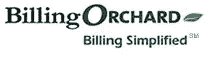

# 20 多种在线发票服务帮助您获得付款

> 原文：<https://www.sitepoint.com/online-invoicing-services/>

根据你的工作量、与多少客户合作以及你如何管理你的业务，你可能不需要一个成熟的会计软件来管理你的账目。事实上，许多独立工作者只是需要一种简化的方式来向客户发送和跟踪发票，而不会被更高级和功能更强大的应用程序所困扰。

我已经使用 QuickBooks 全桌面版本很多年了，所以我从来没有研究过在线发票服务。我很惊讶有这么多！这里有一个列表，对每一项进行了快速分类，以帮助您选择最好的工具来管理您的发票和账单流程。

**1。 [ Bill4Time](http://www.bill4time.com/)** 

*   客户和项目的数量是有限制的。
*   你可以跟踪时间和管理项目。
*   它包括移动接入。

成本:每个用户每月 40 美元

**2。 [ BillMyClients](http://www.billmyclients.com/)** 

*   两个可用的帐户选项都提供重复发票和付款跟踪。
*   您可以向多个收件人发送发票。
*   功能包括客户跟踪和报告。

费用:每月 12 美元，或每张邮寄发票 0.94 至 2.50 美元

**3。 [计费经理](https://billingmanager.intuit.com/billing/welcome.url)(来自 Intuit)**

*   它允许你发送和跟踪无限的发票。
*   您可以选择发送账单提醒。
*   您可以在发票上添加您的徽标和条款。
*   它可以移动访问。

费用:免费

**4。 [开单果园](http://www.billingorchard.com/)**

*   为一些计划提供无限的发票和客户。
*   一些计划包括自动开票和重复计费。
*   您可以使用 PayPal 帐户直接接受电子支付。

费用:每月 10 到 70 美元

**5。 [ Blinksale](http://blinksale.com)** 

*   根据计划，每月可以发送 3-1500 张发票。
*   客户端的数量总是无限的。

费用:免费到每月 49 美元

**6。 [钱柜](http://www.getcashboard.com/)**

*   它包括时间跟踪。
*   您可以生成发票和评估。

成本:每月 140 美元(根据活动项目和可以登录的员工数量定价)

7 .**。 [易比尔](http://www.simplifythis.com/easybilloverview.htm)**

*   您可以自定义您的发票和估价。
*   该服务为打印和记录保存创建 pdf。
*   它包括自动计费选项。

费用:每月 9 至 29 美元

**8。 [自由球员](http://www.freeagentcentral.com/)**

*   它允许无限的客户端，用户和项目。
*   你可以跟踪时间，费用和里程。
*   您可以上传银行对账单进行分析。
*   数据可以导出并在其他应用程序中使用。

费用:每月 20 美元

**9。 [小清新](http://www.freshbooks.com/)**

*   无限承包商可以跟踪时间，并向您发送任何计划的发票。
*   所有计划都提供时间跟踪。
*   您可以管理的客户数量以及可以访问您的帐户的员工数量是有限制的。

费用:免费到每月 149 美元
 **10。 [发票机](http://invoicemachine.com)**

*   每个月可以发 3-3，000 张发票。
*   它集成了 PayPal 和 Basecamp。
*   提供时间跟踪能力。
*   它允许所有级别的无限客户端。

费用:免费到每月 48 美元

**11。 [发票开具地](http://www.invoiceplace.com/)**

*   它允许无限数量的客户记录，但对每月的发票/报价数量有限制。
*   该服务支持多币种发票。

费用:每月 20 美元(按年支付比按月支付有折扣)

**12。 [发票易](http://www.invoicesmadeeasy.com)**

*   通过该服务，您可以创建、通过电子邮件发送、打印和管理您的客户发票。
*   您可以打印发票并邮寄，但需要额外付费。
*   它允许你通过贝宝或 Authorize.Net 接受付款。

费用:每月 5 美元

13。 [ Invotrak](http://invotrak.com) 

*   有许多发票模板可供选择。
*   客户可以登录并查看他们的帐户。
*   付费账户不限制客户或员工的数量。
*   发票数量有限制。

费用:免费到每月 45 美元

**14。 [少会计](http://lessaccounting.com)**

*   您可以跟踪费用和发票。
*   你可以直接从网站上创建提案。
*   随着每月费用的增加，他们提供越来越强大的报告。

费用:免费到每月 24 美元

15。 [ LiteAccounting](http://liteaccounting.com/) 

*   根据计划，您可以每月向 unlimited 发送 5 张发票。
*   它允许无限的客户。
*   您可以生成客户对帐单。
*   它允许你通过贝宝接受付款。

费用:免费到每月 18 美元

16。 [贝宝](https://www.paypal.com/us/cgi-bin/webscr?cmd=_profile-comparison)

*   让您的客户轻松付款。
*   你可以一键发送提醒。

成本:定价是基于交易费的百分比。大多数选项没有安装费或月租费，尽管商家帐户或网站支付集成可能会附加费用。

**17。 [干脆比尔](http://www.simplybill.com/)**

*   您可以通过该服务创建报价。
*   它通过桌面小工具提供时间跟踪。
*   它有 Flickr 图像集成的发票品牌。
*   您可以每月向无限公司发送 25 张发票。
*   你可以有 10 个客户每月无限。

费用:每月 5 到 25 美元

18。 [简单地发票](http://www.simplyinvoices.com/)

*   提供所有计划的无限发票。
*   模板的数量有限制。
*   发票以 pdf 格式生成。

费用:免费到每月 25 美元

**19。 [时间 59](https://www.time59.com)** 

*   它提供时间和费用跟踪。
*   发票以 pdf 格式制作。
*   您可以使用它来维护客户余额/信托会计。
*   它可以通过手机浏览器访问。

费用:每年 50 美元

20。 [温比尔](http://www.winkbill.com/)

*   您可以在您的帐户中创建子帐户。
*   每月的发票数量有限制。
*   您可以发送付款提醒和感谢信息。

费用:免费到每月 40 美元

**21。 [塞罗](http://www.xero.com/)**

*   您可以拥有无限的用户和事务。
*   你可以上传你的银行对账单。
*   您可以生成实时报告。

费用:每月 29 美元

**22。 [ Zoho 发票](https://invoice.zoho.com/)**

*   每月可以发送 5 到 1，500 张发票。
*   你可以拥有无限的顾客。
*   它提供多种货币支持。
*   它包括发票和付款跟踪以及经常性发票。
*   它集成了 Zoho 项目。

费用:免费到每月 35 美元

你使用这些服务吗？你会推荐它吗？

*所有价格均以美元列出。
图片来源:[凯瑟琳·麦卡勒姆](http://www.sxc.hu/photo/281222)*

## 分享这篇文章