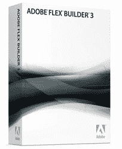

# 用 Flex 为您的 PHP 应用拉皮条…并赢得胜利！

> 原文：<https://www.sitepoint.com/pimp-your-php-app-with-flex-and-win/>

 **我们最新的 Adobe 赞助赠品现已上线，这次公开发售的是 Flex Builder 3 的副本。请阅读我们的全新文章，[用 Flex](https://www.sitepoint.com/article/pimp-php-app-flex/) 为你的 PHP 应用拉皮条——然后[参加测验](https://www.sitepoint.com/quiz/adobe/pimp-php-app-flex/)参加抽奖！**

您有 7 天时间来参加测验。输入您的详细信息，您将有机会赢得三份 **Adobe Flex Builder 3** 中的一份。

Flex Builder 3 价值 249 美元，是在 Flex 中构建富互联网应用程序的最佳方式。原因如下:

*   这是一个基于 Eclipse 平台的**简单、功能全面的编辑器**——具有语法着色、代码完成、清晰而有用的调试等等
*   它允许使用 Adobe AIR 平台为 Mac、PC 和 Linux 快速、轻松地开发桌面应用程序
*   有**堆内置组件**来帮助您更快地构建您需要的东西
*   它与 Adobe Creative Suite 完美集成，使用 Illustrator、Fireworks、Photoshop 或 Flash 创建您的应用程序的视觉外观，并立即将其导入 Flex Builder！

欲了解更多功能信息，请访问 [Flex Builder 产品页面。](https://www.sitepoint.com/blog/)

非常感谢 Adobe 为我们提供了这个奖项。

您必须在美国太平洋时间(或旧金山时间)5 月 6 日下午 6 点之前报名。我们将于 5 月 7 日联系并宣布获奖者，请密切关注论坛和博客中的公告！

作为额外奖励，完成测验还将解锁一个用于 [Tour de Flex](https://www.sitepoint.com/blog/) 应用程序的安装程序，这是一个非常棒的学习工具，包含 200 多个 Flex 示例，您可以运行这些示例，每个示例都有源代码、文档链接等等。

就像他们说的，你必须参与进来才能赢——幸运的是，这次有 3 次赢的机会！

## 分享这篇文章