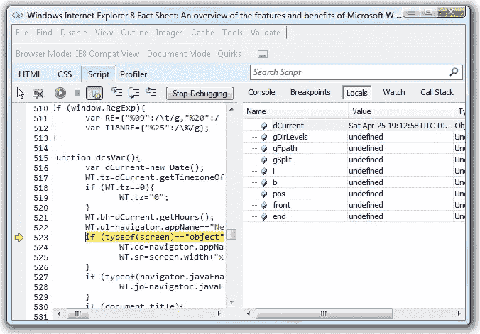

# Internet Explorer 8.0:一个月回顾，第 2 部分

> 原文：<https://www.sitepoint.com/ie8-review-2/>

这是我的 IE8 复习的第二部分。[第 1 部分介绍了安装、界面和新特性](https://www.sitepoint.com/ie8-review-1/),但在这里我们来看看浏览器为开发者提供了什么…

## 页面渲染

这里有一个好消息:IE8 的 HTML 和 CSS 渲染非常出色。在我有限的测试中，它的表现几乎与 Firefox 和其他主流浏览器一样。也许几年前就应该是正确的，但让我们心存感激。

IE8 比 IE7 更符合标准，但是为了帮助人们升级，它提供了三种渲染模式:

*   **IE8 模式:**浏览器运行为 IE8 —耶！
*   **IE7 模式:**浏览器像 IE7 一样运行，并返回该浏览器的用户代理。
*   **IE8 兼容模式:**浏览器运行为 IE8，但行为类似 IE7。

我不确定为什么微软会为最后一个选项而烦恼，但在我测试的所有页面中，IE7 渲染看起来都很准确。然而，该公司错过了一个技巧，没有提供 IE6 模式:这将对升级产生更大的影响，并对扼杀 8 岁的浏览器做出更大的贡献。

## JavaScript 性能

所有浏览器制造商都声称他们的 JavaScript 引擎是最快的。IE8 在大量使用 JavaScript 的网站上运行速度并不快，我最终使用 SunSpider 基准测试套件对它进行了测试。结果并不令人印象深刻:在我的电脑上，IE8 比 Firefox 3.0.9 慢了 60%以上——众所周知，Firefox 3 . 0 . 9 并不是最快的浏览器。

IE8 仍然有可怕的模态 JavaScript 错误窗口。默认情况下，浏览器不会显示它，但是错误控制台会有用得多。

## 开发者工具

最后，IE 为我们提供了一些很棒的内置开发工具。按 F12，您会看到一个窗口，允许您检查 HTML、修改 CSS、单步执行 JavaScript 代码以及分析瓶颈。

该工具提供了一个混合的特性，公然抄袭了 Firefox[Web Developer Toolbar](https://addons.mozilla.org/en-US/firefox/addon/60)和 [Firebug](https://addons.mozilla.org/en-US/firefox/addon/1843) 扩展。它不如这两个版本好，看起来像一个测试版产品，但它是一个受欢迎的补充，将极大地帮助 IE 开发。

## 结论

我一直对 IE8 颇有微词，但它正朝着正确的方向前进，而且比 IE7 好得多。我当然会推荐只升级页面渲染和开发工具。

作为一个浏览器，IE8 并不是特别令人兴奋。新功能有点噱头，界面有点不一致和未完成的感觉。为什么 IE 开机时打不开最后一个会话？为什么我不能选择标签颜色？为什么提供三种不同的渲染模式？

微软努力使他们的应用程序适合各种体验的用户，IE8 也不例外。不幸的是，尽管他们从其他浏览器中吸取了最好的特性，但他们对新手隐藏了这些特性，并使专家感到尴尬。IE8 经常给人一种它知道什么最适合你的印象。

对于新手或想要快速、无障碍浏览的人来说，谷歌 Chrome、苹果 Safari 或基本的 Firefox 安装可能会提供更好的体验。对于专业用户来说，Opera 或扩展版 Firefox 将是更好的选择。说 IE8 适合“普通”用户很有诱惑力，但我不相信它是这样。

总的来说，IE8 对于一个健康且日益拥挤的浏览器市场来说是一个受欢迎的补充。我很高兴微软已经恢复了产品，Windows 用户应该毫不犹豫地升级。然而，这不太可能动摇许多人对当前浏览器的选择。很少有人会认为 IE8 是最好的浏览器；它的用户份额可能更多地归因于严格的公司政策和用户的不作为。

另请参见:

*   [IE8:一个月回顾，第一部分](https://www.sitepoint.com/ie8-review-1/)

你会安装 IE8 吗？你喜欢吗？它有没有说服你放弃竞争对手的浏览器？

## 分享这篇文章