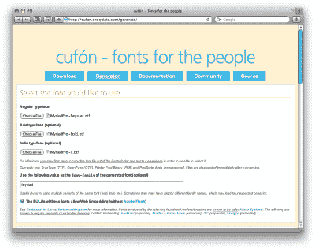

# 修复花哨字体的缺陷

> 原文：<https://www.sitepoint.com/fixing-fancy-font-frustrations/>

这是一种悲伤的声音:当平面设计师意识到他们不能简单地在网上选择任何字体时，你会听到这种声音。是的，类型控制一直是网页设计的一大局限，尤其是字体的选择。

这些年来，有一些零星的磕磕绊绊，但我们仍在等待那一次巨大的飞跃。当谈到文本替换时，可能有四种思想流派:让我们快速回顾一下当前可用的选项，然后看看您可以用最新的玩家 cuf an 做什么。

*本文最初发表在《设计视图》的第 58 期。[立即订阅](https://www.sitepoint.com/newsletters/)，将它收进您的收件箱！*

##### 经典图像替换

经典图像替换 (CIR)是我在这里用来描述一系列相关技术的术语。这是第一次真正尝试用一种没有样式限制的方法来替换标准 HTML 文本。

大多数技术利用 CSS 背景图像来代替 HTML 文本，HTML 文本要么被隐藏起来，要么隐藏在包含背景图像的`span`后面。

优点:

*   实施、使用和查看的低 fi

缺点:

*   大多数方法都有某种可访问性问题
*   多行文本流通常是一个问题
*   为每个标题生成新图像是有问题的
*   使用动态内容时，需要服务器生成的图像
*   有限的缓存和可重用性
*   不可扩展

几年前，戴夫·谢伊写了一篇关于不同风格的经典图像替换的权威概要，,如果你正在考虑 CIR，你应该读一读。虽然偶尔还会看到(CSS Zen Garden 是一个突出的例子)，但 CIR 的缺点意味着它在 2009 年是一种有限使用的技术。

##### sIFR(或可扩展因曼闪存替代品)

早在 [2004](http://www.mikeindustries.com/blog/archive/2004/08/sifr) 年，迈克·戴维森、肖恩·因曼和马克·沃本为打字爱好者带来了第一个真正的突破——[可扩展因曼闪存替代。](http://www.mikeindustries.com/blog/sifr/)

该技术依赖于 Macromedia(现在的 Adobe) Flash 在 Flash 电影中安全嵌入字体的能力。然后 JavaScript 被用来用包含样式文本的 SWF 电影来代替 HTML 文本。聪明的东西，真的。

五年过去了， [sIFR](http://wiki.novemberborn.net/sifr3/) 已经是成熟健壮的技术的第三个版本，并且是定制文本的默认技术。sIFR 早期的许多性能和可访问性问题已经得到缓解甚至消除——文本是可选择和可链接的。

最大的问题仍然是它对 JavaScript 和 Flash 的依赖。尽管许多支持者认为没有 Flash 的用户比例微不足道，但 iPhone 目前缺乏对 Flash 的支持对许多人来说是一个问号。

对于一些开发人员来说，另一个缺点是对 Flash 创作软件的要求。这个问题已经得到了解决，像[sifr fault](http://www.sifrvault.com/)这样的网站现在提供了一些预嵌入字体供下载。

优点:

*   几乎无限的字体选择
*   安全字体嵌入意味着更少的许可问题

缺点:

*   需要 Flash 创作软件来嵌入原始字体文件
*   杂乱和高度复杂意味着多点潜在故障，包括浏览器版本、JavaScript 和 Flash 支持
*   旧系统、超负荷系统或低规格系统的潜在性能问题

简而言之，取决于你听谁的，sIFR 介于对一个有缺陷的系统的务实解决方案和令人费解的肮脏的黑客之间。

##### `@font-face`

很久以前，在一个很远很远的星系里，他们有完美的字体支持，他们使用`@font-face`。

在那个辉煌的世界里，鸟儿欢快地鸣叫着，阳光温暖地照耀着，设计师们只用一行代码就可以将字体附加到他们的页面上，而不用担心许可的影响。

不幸的是，我们不住在那里。

《宣言》背后的理论坚如磐石，自 1998 年以来已经以各种形式出现。简单地使用`@font-face` CSS 将字体附加到页面上，如下所示:

```
@font-face { 

  font-family: Echelon; 

  src: url('echelon.otf'); 

}
```

然后使用`font-family`声明调用它:

```
h3 { 

  font-family: Echelon,sans-serif; 

}
```

这是容易的部分。问题是，在您的服务器上提供该字体的行为违反了大多数最终用户许可协议。

自 IE4 时代以来，微软一直在推广和支持一种叫做[嵌入式 OpenType (EOT)](http://msdn.microsoft.com/en-us/library/ms533034.aspx) 的嵌入式字体格式。通过一个名为[纬](http://www.microsoft.com/typography/web/embedding/weft3/)的免费客户端应用程序，从 TrueType 字体生成 EOT 字体文件非常简单。

如果在 Internet Explorer 之外有任何支持，EOT 将是一个非常可行的解决方案。不幸的是，没有。

优点:

*   优雅且易于理解和实现
*   优雅的降级，因为较老的浏览器通常忽略@font-face 声明

缺点:

*   非嵌入字体存在严重的许可问题
*   目前只在 Safari 3 中运行，但在不久的将来可能会在 Opera 和 Firefox 中运行
*   有人猜测,@font-face 可能会让用户暴露于下载字体附带的病毒

这就是矢量文本出现之前的情况。

##### 矢量文本:typeface.js 和 cufÃ

最新的文本替换方法借鉴了 sIFR 的一些想法，但成功避免了对 Flash 的依赖。相反， [typeface.js](http://typeface.neocracy.org/) 和[cufn](http://wiki.github.com/sorccu/cufon/about)略有不同，但都采用了相同的基本思想:使用 JavaScript 将 HTML 文本替换为以矢量格式呈现文本的`canvas`元素。

每种方法都要求你使用免费的在线工具将字体转换成矢量 JavaScript 文件。令人高兴的是，这是一个相对无痛的过程。这些矢量化的字体然后链接到您的页面，呈现到画布区域，并在 JavaScript 可用时动态交换到您的页面。

优点:

*   不像 sIFR 那样依赖技术(不需要闪存)
*   优雅地降级

缺点:

*   依赖 JavaScript
*   许多字体的许可问题不明确

当然，sIFR 的拥护者会争辩说，任何使用足够现代的浏览器来支持 canvas 元素的人肯定也能处理 Flash 文件。

这在除了一个重要的用户案例之外的所有情况下都是正确的——目前没有 iPhone 或 Android 手机可以呈现 Flash 内容。对于许多开发商来说，这是 sIFR 的一大亮点。然而,`canvas`元素已经在 WebKit 中得到很好的支持，WebKit 是 Safari 的渲染引擎。

##### 试穿 cufà n

好了，让我们看一个在设计中使用矢量文本的简单例子。这里我将使用 cufÃ，因为它稍微小一点，但是大多数关键概念也适用于 [typeface.js](http://typeface.neocracy.org/) 。

我将从一个粗略的博客概念开始，它没有试图定制或替换标题。不可避免地，一些用户会在没有 JavaScript 的情况下浏览，所以你的页面仍然需要很好地工作*没有* groovy 字体。


**第一步:抓取 cufn**

下载 cufÃ脚本的副本，并将其附加到您的文档中。该文件处理您的类型的所有交换、缩放、定位和样式:

```
<script type="text/javascript" src="cufon-yui.js"></script>
```

**第二步:转换你的字体**

和字体 JS 一样，cufÃ需要你把你的文件转换成它所使用的向量，但是这是一个免费且简单的过程。只需上传你的字体——支持 TrueType (TTF)、OpenType (OTF)、Printer Font Binary (PFB)和 PostScript 字体——它们的生成器会给你一个新的 JavaScript 文件。



显然，这是考虑许可限制的好时机。虽然每种类型的代工厂都有自己的观点——通常需要为每台服务器或每个站点申请新的许可证——但 Adobe 已经清楚地表明了自己的立场:

Adobe Systems 制作的所有字体都可以嵌入到可移植文档格式(PDF)文件以及其他类型的文件中。

这使得你所有的 Adobe 字体(如 Albertus、Bodoni、Caslon 等)成为试用这种方法的首选。

一旦选择并上传了合适的字体，就会出现一个 JavaScript 文件，其名称类似于“your_font_400.font.js”。这个文件将需要附加到您的页面后的 cufÃ脚本。例如，我已经转换并附加了两种字体——[尖头字体](http://www.dafont.com/pointy.font)和[鹰钩线字体](http://www.abstractfonts.com/font/11569):

```
<script src="Pointy_400.font.js" type="text/javascript"></script>  

<script src="AquilineTwo_500.font.js" type="text/javascript"></script>
```

请注意，生成器上有两个*复选框*,在允许您继续之前，必须选中*:一个确认您选择的字体的 EULA 允许字体嵌入，另一个确认您已经阅读并理解了转换器的使用条款。一定要找到他们。*

 ***第三步:定位标题以替换**

让我们明确一下:所有的文本替换方法(除了`@font-face`，可以说)都是为了只替换标题文本而设计的。替换大块的正文将会很慢，而且会适得其反。我们将坚持只替换标题。

要替换任何标题，只需使用 cufÃ的`replace`函数来定位元素，然后用`fontFamily`定义字体。在下面的例子中，我将所有的`h1`和`h2`替换为尖头，将`h3`替换为鹰钩线二:

```
<script type="text/javascript">  

  Cufon.replace('h1', { fontFamily: 'Pointy' });  

  Cufon.replace('h2', { fontFamily: 'Pointy' });  

  Cufon.replace('h3', { fontFamily: 'AquilineTwo' });  

</script>
```

简单。

**第四步:IE 修复**

正如 Internet Explorer 经常出现的情况一样，我们需要添加额外的代码来使它在浏览器中工作。未经修改，IE 用户将看到原始文本加载，然后在文本被替换之前出现可见的闪烁。谢天谢地，修复很容易，虽然有点难看。

就在结束的`body`标签之前，您需要添加以下脚本元素:

```
<script type="text/javascript"> Cufon.now();  

</script>
```

添加这一行并测试您的页面。

正如你将在[演示页面中看到的，](https://www.sitepoint.com/examples/cufon/index2.html)最终的渲染在大多数系统上都非常快速和干净。


CufÃ对象从您的 CSS 中获取它们的位置，并自动继承任何`font-size`、`font-style`、`font-weight`、`line-height`、`text-shadow`和`word-spacing`值。非常酷的东西。

你还会看到每个单词都是独立的、透明的`canvas`，允许背景、图像和其他文本显示出来，单词可以从一行自由地流向下一行。

有没有不好的一面？嗯，文本选择似乎是一个问题，尽管修复它似乎是开发人员的优先事项。我还遇到了偶尔的溢出问题和大小不一致的问题。关于已知问题和支持浏览器的完整列表可以在 cufÃ项目网站上找到——如果你留意的话，你会第一个知道这些问题何时被修复。

但是总的来说——这是新的、原始的、还有点实验性的——cufn 对于网络爱好者来说是一个令人兴奋的、非常有前途的发展。* 

## *分享这篇文章*