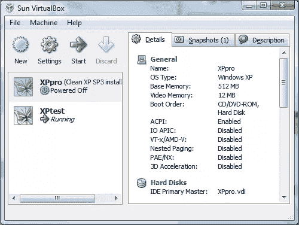
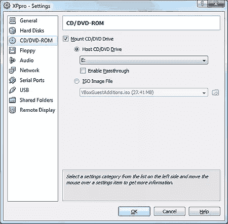

# VirtualBox 虚拟机软件:实践回顾

> 原文：<https://www.sitepoint.com/virtualbox-review/>

虚拟机可以让生活变得更容易。IT 部门可以在服务器硬件上节省大量资金，桌面开发人员可以在干净的环境中进行测试，web 开发人员可以在不同的操作系统上安装多种浏览器。

网站测试应该很容易，但是有一款浏览器比其他浏览器更让人伤心。Internet Explorer 与 Windows 的紧密联系意味着只能安装一个版本，那么有良心的开发人员如何测试 IE8、IE7、IE6 以及可能的 IE5.0/5.5。有变通办法，但都有缺陷——尤其是在 Vista 上。最好的解决方案是用不同版本的 IE 运行干净的 Windows，而这正是虚拟机软件可以提供帮助的地方。

## 选择

我用了 [VMware](http://www.vmware.com/) 很多年了。这是第一个也是最著名的虚拟机解决方案之一。然而，我最近在 Vista 上遇到了性能问题，VMware Workstation v6 似乎有点臃肿(500Mb 下载)。另一个选择是[微软虚拟个人电脑](http://www.microsoft.com/virtualpc/)，虽然它更基本，并且已经几年没有更新了。

最后，我们有 [VirtualBox](http://www.virtualbox.org/) ，一个由 Sun Microsystems ( [暂时，无论如何](https://www.sitepoint.com/where-next-for-sun-microsystems/))运营的开源项目。几年前，我测试了版本 1，虽然它已经足够了，但还是比不上 VMware。现在在 2.2 版本中，我认为该产品值得再看一眼。

## 下载和安装

VirtualBox 2.2 的 62MB 下载文件比 2.1 版本大(36MB)，但是与 VMware 不同，它的安装速度非常快，而且不会安装太多占用内存的设备驱动程序和服务。

VirtualBox 虚拟机管理器

## 创建虚拟机

提供了一个分步向导来创建您的第一个虚拟机。您输入一个名称，选择 RAM 的大小，然后创建或选择一个现有的虚拟硬盘。然后可以在你第一次启动之前调整设置，例如在虚拟光驱中选择一个操作系统安装盘镜像(我推荐使用优秀的 [nLite](http://www.nliteos.com/) 来准备一个精简的 XP SP3 ISO)。

虚拟机配置

操作系统安装与在真实硬件上安装完全相同，只是每个虚拟机都在自己的窗口中打开。完成后，您可以单击来宾操作系统窗口，并正常运行它。默认情况下，右 Ctrl 键将控制权返回给主机。与其他解决方案一样，VirtualBox 提供了安装各种设备驱动程序和自动鼠标捕获/释放的来宾操作系统软件(选择“设备”>“安装来宾附件”)。

虚拟磁盘映像保存为。vdi 文件。您可以选择固定大小的驱动器，也可以根据来宾的需要动态扩展。不同寻常的是，VirtualBox 允许您从同一个磁盘映像运行多个虚拟机。因此，您可以尝试不同的硬件配置，但我想不出任何其他实际用途。虚拟磁盘也可以克隆，因此您可以轻松地从现有安装创建新的来宾操作系统。磁盘克隆需要命令行工具，但帮助中提供了完整的说明。

## 其他功能

其他有用的功能包括:

*   **共享文件夹:**永久或临时连接的文件夹，在来宾操作系统中显示为网络驱动器。
*   **快照:**可以在任何时间点拍摄客户操作系统的快照。这允许您试验软件安装或废弃整个系统，并立即恢复(如果 Windows 还原点做到这一点！)
*   **状态保存:**当您关闭操作系统窗口时，您可以选择发送关机信号、关闭电源或保存当前状态。
*   **速度:** VirtualBox 感觉比 VMware 或虚拟 PC 快得多，响应速度也快得多。
*   **无缝模式:**与 Mac 上的 Parallels 一样，这种模式将客户操作系统集成到您的标准桌面上。它运行得很好，尽管我无法让它在第二台显示器上运行——那会更实用。

VirtualBox 无缝模式:IE6 运行在 Vista 上

至于缺点，有些人可能更喜欢 VMware，因为:

*   更简单的虚拟机克隆
*   它的选项卡式界面(VirtualBox 在单独的窗口中打开每个来宾操作系统)
*   桌面之间的文件拖放(尽管 VirtualBox 的共享文件夹在操作上更快)
*   更小的虚拟磁盘映像和缩小的选项
*   更好的商业支持选项。

总的来说，VirtualBox 很优秀。它远远优于 VMware Server，并与商业工作站产品中的许多功能相匹配。它也很稳定，在 Vista 上运行良好，比竞争对手快得多。我从未想过有什么能打败 VMware，但我现在已经全职转向了 VirtualBox。在这个价位，强烈推荐给所有 web 开发者。

另请参见:

*   [如何构建最好的浏览器测试套件](https://www.sitepoint.com/building-the-best-browser-test-suite/)
*   微软 SuperPreview:测试网站的新方法
*   [VirtualBox 网站](http://www.virtualbox.org/)

你试过 VirtualBox 或其他虚拟机解决方案吗？

## 分享这篇文章