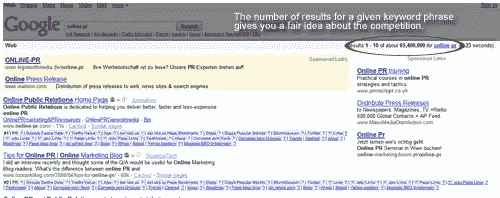
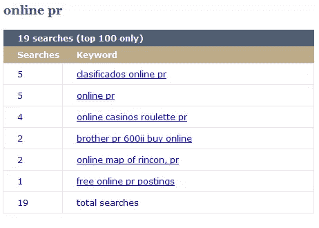
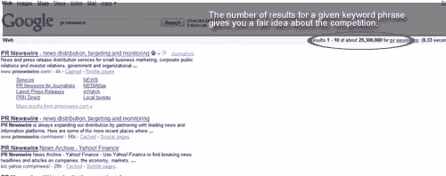
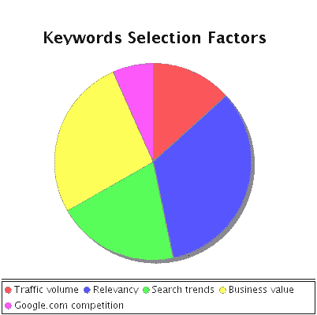

# 关键词研究精要第二部分:如何选择正确的关键词

> 原文：<https://www.sitepoint.com/keywords-selection-factors/>

在关键词研究要点的第一部分，我列出了我认为最好的免费工具[T2，帮助初学者和熟练的 SEO 为 SEO 活动选择正确的关键词。坦白地说，拥有合适的工具，却没有正确的方法来使用它们，是浪费时间。]( https://www.sitepoint.com/keyword-research-tools/)

##### 不要优化人们不搜索的关键词:流量 vs . Google.com 竞争

研究工具很棒，但它们永远无法取代人类的智慧——毕竟，你的目标是人类访客，而不是机器人。许多 SEO 承诺给定的关键字短语在 24 小时或更短的时间内获得高 SERP 结果，但是这个短语相关吗？有时候 point 里的关键词短语听起来很“好听”，但是如果没人搜；它的高排名几乎没有任何用处。从长远来看，它可能会带来一两个访问者，但在短期内，你会面临这样的情况:“我有很多关键词的顶级位置，但搜索引擎的流量很低。”重点是: ***对于人们从来不用*** 的关键词，不要期待流量。

这就是我上周提到的[关键词研究工具](https://www.sitepoint.com/keyword-research-tools/)派上用场的地方。在选择对某个词条进行优化之前，先用各种关键词流行度工具进行测试，看看有多少访问者可能会对它感兴趣；然后用 Google AdWords 建议工具测试这个短语，以获得 Google 广告网络中的一些性能指标。这有助于您收集一些性能数据，但是请注意，如果没有一些“改进”，研究是不完整的

只要在谷歌的搜索查询框中输入关键词，你就可以看到有多少网站在争夺同一个关键词。如果你的目标是国际排名，请使用 Google.com，如果你的目标是你所在的地理区域，请使用当地版本的谷歌。

例如，对于在线公关这一术语，Google.com 提供了超过 65，000，000 个结果。这意味着超过 6500 万可能的竞争对手，包括一些最强大的网络公关网站。

为一个竞争如此激烈的术语优化网站可能很有诱惑力，看到你的网站在 Google.com 的第一页上出现这个术语当然是一种“自我提升”，但是这个术语转换得好吗？我在上一篇文章中提到的 WordTracker 工具估计这个词每天会被搜索 5 次。

假设你的网站在 Google.com 的 SERPs 搜索结果中排名前三，在某一天可能寻找“在线公关”的 5 个用户中，有多少会真正登陆你的网站？

##### 流行不代表合适！–商业价值与流量

从上面的例子开始，让我们看看哪个是与“PR”相关的最流行的关键词短语

WordTracker 还表示，“美通社”是最受欢迎的术语，每天有超过 400 次搜索。很明显，如果你经营一个公关网站，你会想为这个术语获取一些潜在的流量。

Google.com 说只有 29，300，000 个网站在竞争这个词——显然比超过 65，000，000 个网站竞争“在线公关”要好得多

但是，为美通社优化合适吗？不会。美通社是一个知名的新闻发布供应商，或者说是一个知名品牌。除非你是美通社的会员，否则优化这个词是没有意义的:你可能会得到流量，但它不会转化。当你选择一个关键词的时候，请记住你的用户想要什么，以及这个关键词是否与你的网站相关。

很难“猜测”用户想要什么，但是关键词研究工具确实提供了很多关于用户正在寻找什么的信息。对美通社的搜索清楚地表明，用户想要找到 www.prnewswire.com 或关于该公司的评论。搜索“在线公关”太模糊了:搜索者可能在寻找一般信息、定义，甚至是这个领域的专业公司。相比之下，搜索“公关价格”可能表明用户希望购买公关服务，或公关学徒研究公关行业。

从这个简短的分析中，我们可以得出结论，选择关键词时最重要的因素之一是“商业价值”，即该术语如何转化为你的业务 。

##### 具体而全面:相关性

当用户在网上搜索特定产品时，他们试图通过输入更长的关键词来细化搜索，从行为角度来看，更接近“语义搜索”的理想状态。这些“更长”的关键短语比一般术语具有更高的相关性。让我们来看一个包含“PR”的搜索的“精炼”版本——我们今天的“根”关键词。

一个经营律师事务所的客户很可能会输入“律师事务所公关”——这是一个“长尾”关键词，假设你为律师事务所提供公关。

这句话是非常具体的你卖什么，它可能会转化为客户的访客。转换依赖于大量的因素，不仅仅是关键词的选择——但我们将在另一个时间讨论这个问题。

相关的和高度具体的关键词短语比一般的关键词短语排名更快更容易，而且竞争通常不那么令人生畏。通用关键词确实带来了更多的流量，但是转化率很低。除非你依靠流量统计来赚钱，否则追求相关性可能比市场价值更好。

##### 没有什么是永恒的:搜索趋势

很难预测下一季搜索用户会找什么。有时，搜索流量的波动是基于受经济变化、季节、时尚等影响的趋势。它总是一个好主意，检查出一个关键字趋势工具，以确定什么是热门，什么不是。推荐: [Google Insights for Search](http://www.google.com/insights/search/) 。

要查看我们的“根”术语的“热门”，只需在 Google Insights 查询框中键入您的术语，然后通过选择适当的时间范围和相关类别来细化搜索。对于 2009 年的“商业公关”，我们注意到最热门的搜索是营销公关、工作公关、公关公司、媒体公关等，而一个非常重要的“上升”搜索是**社交媒体公关**。考虑到实际的网络趋势，“社交媒体公关”的兴起绝非偶然。尽管 WordTracker 和其他关键词建议工具显示大多数“上升”搜索词的日流量估计值较低，但请记住，在许多情况下，软件无法取代人类智能。时刻关注市场趋势，使用对你有利的关键词短语。

##### 结论

所以，工具对于优化搜索引擎优化价值的关键词的选择是必不可少的，但它们只有在正确使用的情况下才有效。理解搜索引擎相关性是双向的也很重要。谷歌试图提供最相关的结果，搜索用户想要这些相关的结果，可行的企业希望与潜在客户“相关”。没有相关性的排名只能产生“访客”，而不是长期客户。基于人的逻辑和经验的关键字选择，用正确的工具提炼和缩小，是选择最合适的关键字的正确方法。

## 分享这篇文章