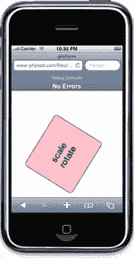

# iPhone 开发:让您入门的 12 个技巧文章

> 原文：<https://www.sitepoint.com/iphone-development-12-tips-3/>

##### 9:手势

在 iPhone 上，手势是两个手指的动作:缩放(放大和缩小)和旋转。我们在上面了解到，`touches`和`targetTouches`事件包含关于触摸设备的每个手指的信息。也可以使用这些事件来处理缩放和平移等手势。但是为了这个目的，还有更方便的`gesture`事件。您可以收听以下事件:

*   `gesturestart`
*   `gestureend`
*   `gesturechange`

在下一个例子中，我们将监听`gesturechange`事件，然后使用 WebKit 专用的`webkitTransform`样式属性缩放和旋转一个`div`。像往常一样，事件监听器接受一个`event`对象参数。`event`对象具有以下属性:

*   `event.scale`–无缩放时值为 1，缩小时小于 1(如使我们的`div`变小)，放大时大于 1。
*   `event.rotate`–以度为单位的旋转角度。

该代码与前面示例中的触摸-拖动代码非常相似:

```
window.addEventListener('load', function() {   

  var b = document.getElementById('box'),   

      bstyle = b.style;   

  b.addEventListener('gesturechange', function(event) {   

    event.preventDefault();   

    bstyle.webkitTransform = 'scale(' + event.scale + ') ' +   

                             'rotate('+ event.rotation + 'deg)';   

  }, false);   

}, false);
```

[例 12](https://www.sitepoint.com/examples/iphone-development-12tips/gesture.html) 展示了这段代码的运行——缩放和旋转一个 div。

如果你正在 iPhone 模拟器中查看这个例子，按住 Option 键:两个灰色的点将出现代表两个手指，当你拖动鼠标时，你可以将这些点移进移出。



##### 10:特殊链接

当你浏览一个有电话号码的网页时，不需要打出来，只需点击就可以拨打电话号码，这很好。电话号码成为自动提供的链接，当然，它们遵循电话号码格式。但是在某些情况下，您可能需要手动创建电话链接。在这种情况下，您可以使用`tel:`前缀(URI 方案)，例如:

```
<a href="tel:12345678900">Call me</a>
```

如果短信更符合你的风格，使用`sms:`方案启动 iPhone 的短信应用程序。

```
<a href="sms:12345678900">Send me a text</a>
```

一些其他链接可以在 iPhone 上执行特殊操作，尽管特殊的 URI 方案是不必要的:

*   iTunes Store 的链接将启动 iTunes。您可以通过使用 iTunes 搜索曲目，然后右键单击结果，并选择“拷贝 iTunes Store URL”来获得 iTunes Store 中曲目的链接另一种方法是使用 iTunes Link Maker 应用程序[，](https://web.archive.org/web/20090421175231/apple.com/itunes/linkmaker)来生成要使用的 HTML 标记，包括一个漂亮的小 iTunes 按钮图形。
*   链接到谷歌地图将启动地图应用程序。
*   YouTube 链接将启动本地 YouTube 应用程序，而不是 YouTube 网站。
*   链接到一个电子邮件地址将启动邮件应用程序。

##### 11:主页图标

希望访问者会非常喜欢你的网站，认为它应该出现在他们的主页上。当用户将您的页面添加到主屏幕时，iPhone 会使用您页面的截图作为图标。但是你可以通过提供你自己的图标做得更好。

为此，创建一个尺寸为 57x57px 的 PNG 文件，将其命名为`apple-touch-icon.png`，并将其放在 web 服务器的根目录下，就像处理 favicon 一样——这样就完成了。iPhone 会自动添加光泽效果和圆角-无需尝试自己重新创建！


您还可以通过一个`link`元素灵活地指定图标的位置和文件名。这允许您使用不同的 web 服务器(如内容分发网络(CDN ))来托管图标或在多个网站之间共享同一文件。要指定图标的位置，请使用 link 元素，如下所示:

```
<link rel="apple-touch-icon" href="http://www.example.com/my-filename.png" />
```

##### 12:调试:查看源代码和控制台

如何查看源代码——最受欢迎的学习和调试工具？这在 iPhone 上不可用。幸运的是，bookmarklet 可以在 iPhone 的 Safari 中工作，所以您可以使用 bookmarklet 来添加缺少的功能。你是怎么做到的？

在 JavaScript 中，你可以通过 document . document element . innerhtml 访问页面的源代码(也就是生成的源代码)。在你的 bookmarklet 中，唯一的问题就是以某种方式显示它，比如在一个新窗口中。但是好消息是，这个 JavaScript 练习可以由一个工作良好的 bookmarklet 来执行。iPhoneWebDev 已经打包了一些 bookmarklets，针对 iPhone 的显示进行了优化，可以免费获取。一旦你有了你需要的书签，只需在 iTunes 中将你的书签同步到你的 iPhone 上。

对于调试，iPhone 包括一个调试控制台。您可以在手机上启用它，方法是在“设置”应用程序中前往 Safari 的“设置”,选取“开发人员”,然后将“调试控制台”设置为“打开”。现在它出现在您的 Safari 浏览器的 URL 工具栏下。它会向您显示页面上可能出现的任何错误，您还可以使用 console 对象从您的 JavaScript 编写任何调试消息。例如:

```
console.log('Something');   

console.error('Oops');   

console.warning('Beware!');
```

##### 向前发展！

好了，在这篇介绍文章的最后，我想欢迎你来到 iPhone web 开发，它带来了新的令人兴奋的可能性和挑战。我希望到现在为止，你已经有了一些自己的想法，并且渴望尝试一下。

我们已经将所有代码放在了例 11 中。

**Go to page:** [1](https://sitepoint.com/iphone-development-12-tips) | [2](https://sitepoint.com/iphone-development-12-tips-2/) | [3](https://sitepoint.com/iphone-development-12-tips-3/)

## 分享这篇文章