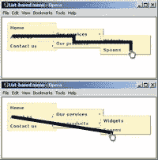

# 制作下拉菜单的正确方法

> 原文：<https://www.sitepoint.com/the-right-way-to-make-a-dropdown-menu/>

最近 SitePoint 上有很多关于下拉菜单的讨论，但并不完全准确。因此，当谈到各种形式的 JavaScript 菜单时，我觉得有必要插话进来，澄清一下最佳实践的问题。

首先，让我们看看影响良好可用性的关键问题:

*   鼠标悬停驱动的菜单应该有定时器来延迟它们的打开和关闭。开放定时器意味着鼠标的随意移动不会触发不需要的菜单。关闭定时器意味着如果你的鼠标暂时滑落或者移动到菜单之外，它不会突然关闭。两者的同步组合意味着你可以将鼠标从一个链接移动到另一个链接，而不会触发其他菜单
*   菜单应该能够在运行中重新定位，这样，如果它们接近或越过窗口的边缘，它们就会移动或反转位置来避免这种情况
*   菜单必须可以单独通过键盘操作来导航。能够在链接间切换并让子菜单按顺序打开是可以接受的；能够用箭头键导航是理想的

现在，这三件事共同决定了一个功能上可用的菜单，和一个灾难性的不可用的菜单，以及一个用户必须面对的噩梦。所有这三件事都需要脚本来实现，这让我想到了实现和后备内容的下一个关键问题:

*   菜单的顶级链接应该链接到提供所有相同内容访问的页面，这样从菜单可以访问的所有内容也可以在没有菜单的情况下访问。顶层链接是菜单的核心内容；子菜单是一种渐进的增强
*   如果脚本不可用，菜单就不能正常使用，因此**根本不应该工作**——不要使用纯粹的 <abbr title="Cascading Style Sheets">CSS</abbr> 菜单触发器

纯粹的 CSS 菜单是一个有趣的概念证明，但仅此而已。Eric Meyer 的发明让我们开始重新思考菜单应该如何构建(在那之前，菜单都是由无数的文档、书面表格和 div 组成的；Eric 展示了如何将语义结构转换成菜单)，但是就其本身而言，它们并不适合现实世界的产品使用。

我们还需要考虑如何实现菜单的显示/隐藏机制，以确保基于浏览器的屏幕阅读器的可访问性:

*   菜单不应该隐藏显示、可见性、溢出或剪辑，因为这样做也会对基于浏览器的屏幕阅读器隐藏它们。正确的方法是使用具有大的负左偏移的绝对定位(所谓的 <q>offleft 定位</q>)，这将它们移出屏幕，因此对于视力正常的用户来说显然是不可见的，但是不会将它们从渲染输出中移除，因此不会影响辅助设备

最后，还有菜单内容本身的细节，以及有助于更好的用户体验的设计细节:

*   下拉菜单不是网站地图；它不应该链接到一个网站的每个页面
*   一个单一的菜单不应该包含超过折叠的链接，也不应该要求用户滚动
*   菜单链接，或者最好是整个菜单结构，应该与字体大小成比例
*   菜单链接的翻转状态应该在树中保持，这样用户就可以一眼看到通过结构到当前位置的路径

在我结束之前，我想就菜单的风格和类型再提一点。所谓的<q>巨型菜单</q>与我们所知的下拉菜单没有什么不同。它们在子菜单中有不同的内容和样式，仅此而已。Jakob Neilson 的[最近关于这个主题的文章](http://www.useit.com/alertbox/mega-dropdown-menus.html)暗示这种类型的菜单本质上更容易使用和访问，这已经把水搅浑了，但这根本不是真的。为了证明他的观点，他将优秀的巨型菜单与糟糕的传统下拉菜单进行了比较，这不是一个公平或科学的比较，因为他没有进行同类比较。与一个实现良好的 dropdown 相比，他的论点显得平淡无奇。

在这篇简短的帖子中，我希望我已经阐明了制作一个菜单需要什么，它是可用的，可访问的，并且在头脑中建立了渐进增强的原则。为了说明这一点，这里有两个演示来举例说明所有这些要点:

*   [水平菜单](https://i2.sitepoint.com/examples/goodmenus/horizontal.html)
*   [垂直菜单](https://i2.sitepoint.com/examples/goodmenus/vertical.html)

您也可以[下载这两个示例](https://i2.sitepoint.com/examples/goodmenus/goodmenus.zip)

顺便提一下，这些菜单直接来自 SitePoint 的 [JavaScript 选集](https://www.sitepoint.com/books/jsant1/)，在第 15 章和第 16 章中有完整的记录，正如你可能猜到的，是我写的！

## 分享这篇文章