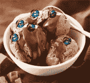

# 技术宝藏#5:在 Internet Explorer 中伪造 CSS 计数器

> 原文：<https://www.sitepoint.com/techy-treasures-5-fudging-css-counters-in-internet-explorer/>



请看这个例子，一个带有样式编号的有序列表:[https://www.sitepoint.com/examples/css-counters/](https://www.sitepoint.com/examples/css-counters/)

该示例中的列表项编号是使用 [CSS 计数器](https://www.w3.org/TR/CSS21/generate.html#counters)实现的，这是 [CSS2](https://www.w3.org/TR/CSS21/) 的一个特性，它允许您对特定元素(或由选择器标识的元素组)的实例进行计数，然后使用[伪元素](https://www.w3.org/TR/CSS21/generate.html#before-after-content)来显示数字。在最简单的情况下，它可以用来替换有序列表的编号，就像上面的例子一样，这给编号增加了一点额外的样式，只是为了说明它正在发生。随着它变得越来越复杂，它可以用来替换不推荐使用的[开始属性](https://reference.sitepoint.com/html/ol/start)，或者应用比本地列表编号支持更复杂的编号系统，例如，像 <q>1.1</q> 、 <q>1.2</q> 等等。

该示例的 <abbr title="Cascading Style Sheets">CSS</abbr> 如下所示:

```
#css-counters-test
{
	counter-reset: step;
}
#css-counters-test li::before
{
	counter-increment: step;
	content: counter(step) ": ";
	color: green;
	font-weight: bold;
}
```

现在，它被广泛接受的一个问题是，和通常的情况一样，它在 Internet Explorer 中不受支持；连 IE8 都没有。然而，通过使用 <abbr title="Internet Explorer's">IE 的</abbr> <abbr title="Cascading Style Sheets">CSS</abbr> 实现的专有特性，我们事实上毕竟可以实现计数器。怎么会？通过使用广为人知却很少使用的[表情](https://reference.sitepoint.com/css/expression)属性。

expression 的主要问题，以及表面上它对生成的内容没有用的原因，是它不断地重新评估——尽管它可以用来修改元素的 <abbr title="HyperText Markup Language">HTML</abbr> ,如果我们允许它不断地重新评估，那么我们将不断地改变 <abbr title="HyperText Markup Language">HTML</abbr> 。一点都不好。但是……我们可以通过使用 Jason Davis 发明的<q>一次性使用表达式</q>,以避免*重新求值的方式使用表达式。*

看看 <abbr title="Internet Explorer">IE</abbr> 中的示例页面，您会看到编号也在那里工作，这是用以下代码完成的:

```
#css-counters-test li
{
	zoom: expression(
		  (typeof step == "undefined" ? step = 1 : step++), 
		  this.innerHTML = (typeof this.processed == "undefined" 
				? ("<span class=before>" + step + ": </span>") 
				: "") 
			+ this.innerHTML, 
		  this.processed = true, 
		  this.runtimeStyle.zoom = "1"
		  );
}

#css-counters-test li span.before
{
	color: darkblue;
	font-weight: bold;
}
```

一次性使用表达式背后的理论很简单:一个表达式可以接受任意数量的语句，但是**只返回最后一个语句**。因此，在最后一条语句中，我们*通过写入 [runtimeStyle](http://msdn.microsoft.com/en-us/library/ms535889(VS.85).aspx) (这是 [currentStyle](http://msdn.microsoft.com/en-us/library/ms535231(VS.85).aspx) 、 <abbr title="Internet Explorer's">IE 的</abbr> computed-style 属性的可写版本)来覆盖*expression 属性，并且*移除*expression 属性，从而防止它重新求值——它不会重新求值，因为它不再存在了！

(实际上，出于我无法理解的原因，这些表达式中的每一个实际上都评估了*两次*，这就是为什么我使用了一个`processed`属性来防止数字被写入两次(如果我必须猜测，我会说 <abbr title="Internet Explorer">IE</abbr> 正在评估选择器的每个实例的开始标签*和结束标签*；但那只是猜测)。但无论如何，像这样一个简单的警告是没有问题的。这里对 [zoom](https://reference.sitepoint.com/css/zoom) 属性的使用是任意的——我们可以使用任何 <abbr title="Cascading Style Sheets">CSS</abbr> 属性，只要 <abbr title="Internet Explorer">IE</abbr> 支持它；我选择了`zoom`,这样我可以在末尾添加一个默认值，否则不会影响元素的外观。另一个不错的选择可能是值为`auto`的`height`。)

所以我们有它。虽然一个不断求值的普通表达式对于修改 <abbr title="HyperText Markup Language">HTML</abbr> 没有用，但是我们这里的*可以用*来修改，因此可以用来实现 <abbr title="Cascading Style Sheets">CSS</abbr> 计数器！

## 分享这篇文章