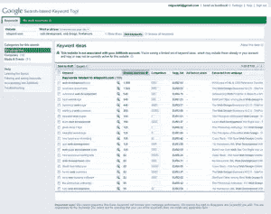
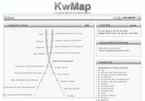
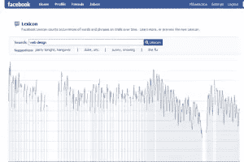

# 关键词研究要点第 1 部分:工具

> 原文：<https://www.sitepoint.com/keyword-research-tools/>

在学习撰写引人注目的 SEO 文案之前，你必须知道如何选择正确的关键词。正确的关键词并不总是如你所愿——搜索量、受欢迎程度、时机、利基等许多因素影响着 SEO 专家所说的“关键词研究”要进行好的研究，你需要合适的工具，幸运的是，一些非常好的工具是免费的。这些所提供的甚至对于顶级的 SEO 专业人士来说也足够了。今天我给你一份在你未来的关键词研究中使用的**工具清单，以及一些在你开始工作之前需要知道的小贴士。**

忘记关键词密度——这不再是决定你的网站在 SERPs 中的位置的因素。关键词密度太容易游戏了。不要关注数字，试着关注:

*   **质量和对读者的价值**——如果你写的东西不是人们想读的，关键词就没什么用了
*   **内容和谐**——许多作者倾向于过于频繁地重复关键词，试图说服搜索引擎对他们的网站进行排名。这种技术被称为关键词填充，效果是负面的:激怒读者，在搜索结果页面中排名靠后。解决方案:少即是多。保持关键词密度低于 3%
*   **与你试图呈现给读者的内容相关**——当你卖靴子时，不要写鞋子。两者都是对的，但是想买鞋的顾客会因为进错了商店而感到被误导和沮丧。不要为了排名而误导你的读者！这么说吧:如果流量不能转化为买家、回头客和/或社区，它就毫无意义。

那么，如果关键词密度不再是搜索引擎排名的一个因素，那么什么是呢？关键词对于 SEO 已经不再重要了吗？事实上，他们是。现在，你比以往任何时候都更需要一个好的关键词策略来写文章，让你的网站在 SERPs 中排名靠前。与其说是密度的问题，不如说是文本中关键词位置的问题:页面标题、元描述、文章标题、第一段、图片标题、外部链接等等。我们将在以后的文章中讨论如何选择最佳关键词以及如何撰写引人注目的 SEO 文案。今天我们从基础开始:一些最好的免费关键词研究工具。

[**【WordTracker】免费关键词建议工具**](http://freekeywords.wordtracker.com/)——它可以生成多达 100 个相关的关键词短语，并估计其每日搜索量。WordTracker 使用自己的公式来估计搜索量:WT 数据库中的搜索次数除以 WT 数据库中的搜索总数，再乘以所有搜索引擎上的每日搜索总数。为了估计所有搜索引擎上的搜索量，WT 从 Dogpile.com 和 Metacrawler.com 收集词汇(占所有搜索引擎搜索量的 0.63%)。这就是为什么你可能会看到 WT 建议的关键词和其他关键词研究工具(比如 Google)之间的主要区别。)

[**基于谷歌搜索的关键词工具**](http://www.google.com/sktool/#)——对所有用户免费，但旨在帮助谷歌 AdWords 客户，它根据实际的谷歌搜索提供关键词，并将其与网站的特定页面匹配。我发现这个工具比 WordTracker 的免费版本更有用，因为它提供了更多的数据，包括每月搜索、竞争、建议出价(让你知道某个关键词的财务价值)、目标关键词的建议类别、URL 中的关键词等。

[**SEO 图书关键词建议工具**](http://tools.seobook.com/general/keyword/)——免费，由 Wordtracker 的 API 提供支持。该工具为谷歌、雅虎和谷歌提供了粗略的每日搜索量建议。，MSN 以及 Topix、Google blog search 和 Del.icio.us 等垂直数据库的链接。它还链接到 Google Trends、Google Suggest 等，为您提供更深入的分析。

为了帮助你生成一个关键词列表，Aaron Wall 提供了一个免费的关键词列表生成器**，这是一个基于网络的软件，允许根据输入的关键词排列生成大量的关键词短语。**

 **[**好关键词 v3**](http://www.goodkeywords.com/products/gkw/gkwv3.php)——可下载的 Windows 软件(免费软件)，旨在帮助你从谷歌关键词研究中获得更多。开发商 Softnik Technologies 声称，该软件无论如何都没有滥用谷歌的资源。

[**Trellian keyword discovery**](http://www.keyworddiscovery.com/search.html )的免费搜索术语建议工具可以生成最多 100 个关键词，它是作为 Overture 的替代产品开发的。数据收集自全球 200 多个搜索引擎。关键字发现还提供特定语言的数据库。

[**【SEM rush】**](http://www.semrush.com/ )是一个更强大的工具，它可以帮助你发现具有常见谷歌关键词的竞争对手网站，获得任何网站的谷歌关键词列表，调查长尾关键词等。在其免费版本中，该工具只为每个查询提供 10 个列表。另一个缺点是，它只使用 Google.com-不理想的本地关键字研究。

KGen 是火狐的一个插件 ，它可以让你看到哪些关键词在被访问的网页上很强。这是分析竞争对手网站的一个很好的工具。它允许你选择一些单词，并把它们转移到你的剪贴板上，粘贴到你最喜欢的社交网络的标签栏上，或者填充你的网页的元关键词。

[**人口统计预测**](http://adlab.msn.com/Demographics-Prediction/DPUI.aspx) 是微软设计的一款工具，帮助你根据用户的在线行为(搜索查询和访问过的网站)收集用户的年龄、性别和其他人口统计信息。

在文章的开始，我告诉你忘记关键词密度是有原因的:Google 现在正在分析关键词所在的上下文，查看语义相关的术语，如同义词和其他与搜索中使用的关键短语相关的词。这个过程被称为潜在语义索引，它从 2005 年就出现了。针对某个关键词过度优化的页面通常会因为“过度优化”而被谷歌过滤掉，而使用大量相关术语的页面对核心关键词的排名更稳定，也可能对相关术语进行排名。

下面是一些帮助你选择语义相关术语的工具:

[**关键词图谱**](http://www.kwmap.net/) 帮助你找到同义词和一些流行的关键词短语。

[**都市词典**](http://www.urbandictionary.com/) 让你找到俚语术语，以及志愿者写的定义。

一个好的同义词查找工具是[**【synonym.com】**](http://www.synonym.com/)。

[**关键词问题**](http://labs.wordtracker.com/keyword-questions/ )——人们在搜索引擎中输入问题，这是一个帮助你找到它们的工具。回答这些问题很可能会给你的网站带来更多的流量。该工具非常适合长尾优化。

社交媒体可以帮助你看到当下的关键词:使用 [**Twitter 搜索**](http://search.twitter.com/) 和 [**Twitscoop**](http://www.twitscoop.com/) 查看实时关键词， [**Deli.cio.us**](http://del.icio.us/ ) 会向你展示一系列相关术语。甚至 [**脸书**](http://www.facebook.com/lexicon/) 也可以通过向你展示某个术语隔着 FB 墙被提及的频率来帮助你追踪关键词在网络中的受欢迎程度。

不要忘记 [**字典**](http://www.thefreedictionary.com/ ) 、百科全书和 [**词库**](http://thesaurus.reference.com/ ) 也能对你的关键词研究有很大帮助。例如， [**MetaGlossary**](http://www.metaglossary.com/ ) 从整个 web 中获取定义。

好的研究是在准备任何 SEO 任务时使用正确的方法和工具的结果。对于关键字插入来说尤其如此。根据我提供的建议，花一点时间开发正确的策略和工具组合，任何人不仅可以写出成功的 SEO 文案，还可以为他们的读者写出引人注目的内容。

如果你知道更多免费的关键词研究工具，请在下面的评论中分享。** 

## **分享这篇文章**