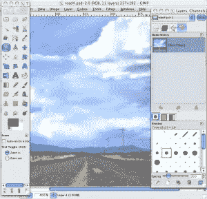
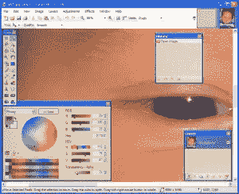
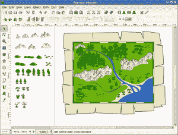

# 面向设计师的开源图像编辑器？

> 原文：<https://www.sitepoint.com/open-source-image-editorsfor-designers/>

很难让我相信有一个开源的图像编辑应用程序可以取代 Photoshop 或 Illustrator。我只是太习惯于 Adobe 了，我不认为自己能够永久地转换到一个开源的替代品。但话虽如此，我相信开源图像编辑器还是有一席之地的，即使是设计师。这里有三个例子说明为什么你会有这种情况。

情况 1:你刚刚开始成为一名自由职业者，还没有资金购买顶级软件。当你这样做的时候，根据你所接受的教育和培训的类型，可能会有一个非常陡峭的学习曲线来快速掌握如何使用它们。当你学习 Photoshop 的细节时，你的工作不能嘎然而止。

情况 2:你是一个不怎么做图形工作的开发人员或设计师。您的图像编辑器只需要有限的功能，并且您不想投资购买 Adobe 产品。

情况 3:你有一台 PC 和一台 Mac，你偶尔使用其中一台，但偶尔需要在另一台机器上做一些简单的图形工作。你可以花钱买另一个版本的 Photoshop/Illustrator，或者你可以找到一个开源应用程序来满足你的需求。这其实就是我的情况。我有一台 PC 和一台 Mac，我 75%的时间都在使用 Mac，但由于各种原因，我确实需要不时切换到 PC。我一直在两台机器上维护 Adobe CS4 的版本，这很贵。

所以，你要给开源图像编辑器一个尝试。从哪里开始？这里有三个开源选项，以及您可以从中获得什么。

[**GIMP**](http://gimp.org)
可能是使用最多的开源图片应用之一，GIMP 有一个全面的功能列表，甚至还有一个关于[如何设置 GIMP 模仿 Photoshop 的配置的教程](http://laptoplogic.com/resources/configuring-gimp-2.6-to-replace-adobe-photoshop)。GIMP 的一些特性包括:

*   绘画工具包括刷子，铅笔，喷枪，克隆等。
*   渐变编辑器和混合工具
*   一次打开无限数量的图像
*   完整的 alpha 通道支持
*   层和通道
*   可编辑文本层
*   SVG 路径导入/导出
*   变换工具包括旋转、缩放、剪切和翻转
*   支持所有主要的文件格式

它是多平台的，尽管在 Mac 上你需要安装 Mac OS X 和 [X11](http://developer.apple.com/opensource/tools/X11.html) (它是在 UNIX 的 X11 下开发的)。我已经下载并试用了 Mac 版本。它确实有很多功能，但也有一点学习曲线。如果你是 Photoshop 和 Illustrator 用户，GIMP 中的一些工具是直观的，其他的就不那么直观了。GIMP 不支持 CMYK，这可能是一个主要的败笔，看你的需求了。但是广泛的功能平衡了这一点。

[**Paint.NET**](http://www.getpaint.net/index.html)

 **Paint.NET 是由一名大学毕业生作为微软指导的项目开始的，现在已经不再开源，所以它并不完全适合这个列表。但它是免费的，而且有很多特性，如果你在 Windows 机器上工作，它是一个很好的选择。功能包括:

*   简单、直观、创新的用户界面
*   层
*   模糊、锐化、消除红眼、变形、噪点和浮雕效果
*   可调亮度、对比度、色调、饱和度、曲线和色阶
*   绘制形状的简单工具
*   无限历史

它不是为 Mac 设计的，所以对一些人来说可能是负面的，但我在我的电脑上试了一下。它真的很容易使用……它提供的功能多得几乎让人难以置信。我特别喜欢无限历史功能和工具配置。来自 Photoshop 背景，几乎没有学习曲线，但我怀疑即使是那些图像编辑新手也能够没有太大困难地进入。

[**【inkscape】**](http://www.inkscape.org/)

Inkscape 是一个多平台(带有用于 Mac 的 X11)开源矢量图形应用程序，用于创建和编辑 SVG(可缩放矢量图形)文件。与 Illustrator 一样，Inkscape 提供了广泛的基于对象的工具和功能:

*   绘图工具包括铅笔、钢笔和书法
*   矩形、星形、螺旋形工具
*   文本工具
*   移动、缩放、旋转、倾斜变换
*   层
*   渐变和图案
*   PNG 和 PostScript 导出
*   完美兼容的 SVG 格式文件生成和编辑

我下载了 Inkscape，立刻就喜欢上了它。它有一个非常好的用户界面，可以与 Illustrator 相媲美的功能，以及一个包含教程、文章、展示和大量支持的非常广泛的网站。如果你想要一个全功能的 SVG 编辑器，我会把 Inkscape 添加到你的列表中。我不确定我会完全取代 Illustrator，但这是一个完美的替代方案。

你试过这些或者其他开源的图片编辑应用吗？我很想听听普通用户的意见。随着你对这些项目越来越有经验，你会发现它们比那些大公司更有竞争力吗？** 

## **分享这篇文章**