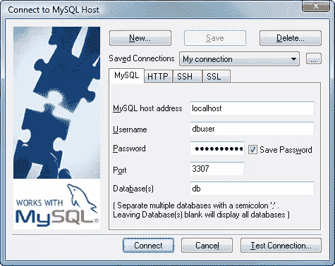

# 如何使用 SSH 隧道管理远程 MySQL 数据库

> 原文：<https://www.sitepoint.com/how-to-administer-a-remote-mysql-database-using-ssh-tunneling/>

大多数 MySQL 开发人员都有一份运行在本地电脑上的数据库副本。虽然 MySQL 命令行可能会有趣一阵子，但它不能替代体面的数据库设计应用程序，如[工作台](http://dev.mysql.com/downloads/workbench/5.1.html)或 [SQLyog](http://www.webyog.com/en/) 。

在 localhost 的端口 3306 上连接到本地数据库很容易。然而，当涉及到配置远程数据库时，许多开发人员求助于 SSH 或较慢的 web 应用程序，如 [phpMyAdmin](http://www.phpmyadmin.net/) 。幸运的是，SSH 隧道允许您使用自己喜欢的桌面设计应用程序来访问远程 MySQL 数据库。

## 什么是隧道？

维基百科对隧道挖掘有很好的描述，但是人生苦短，无法理解。简而言之，在你的 PC 和服务器之间建立了一个“隧道”，它*看起来*好像远程 MySQL 数据库在本地运行。如果您的 web 主机支持 SSH，您应该能够配置隧道。

## 隧道软件

Windows 用户可以从 [Putty 网站](http://www.chiark.greenend.org.uk/~sgtatham/putty/download.html)下载 **Putty** 和 **Plink** 。将这两个文件复制到您选择的文件夹中。

Mac 或 Linux 用户内置了 SSH 使用以下 Windows 说明作为指南，并参考您的文档。

## 挖掘隧道

启动命令行控制台，CD 到 Putty/Plink 文件夹，输入:
`plink -L 3307:localhost:3306 myusername@mydomain.com`

其中:

*   3307 是用于连接远程数据库的本地端口。您可以使用 3306，但是，这可能会与您的 PC 的 MySQL 安装冲突。
*   localhost 和 3306 是来自远程服务器的 MySQL 地址(大多数人不需要改变这一点)
*   我的用户名是您的 SSH 用户名
*   mydomain.com 是远程服务器的域或 IP 地址。

第一次连接时，会询问您是否可以将 SSH 密钥添加到缓存中。然后，在建立隧道之前，会要求您输入 SSH 密码。

(提示:将 Plink 命令复制到一个. bat 文件中，这样只需点击一下就可以启动它。)

## 连接到远程数据库

现在，您可以从 SQLyog 或任何其他数据库客户端连接到远程数据库:

连接详细信息如下:

*   MySQL 主机地址的“localhost ”(隧道的另一端)
*   “3307”表示远程数据库的本地端口(在 Plink 命令中指定)
*   远程数据库名称，以及
*   远程用户名和密码，即有权访问和配置数据库的 MySQL 帐户。

如果一切顺利，您现在应该能够像管理本地数据库一样轻松地管理远程数据库了。

关于远程 MySQL 管理，有人有进一步的提示或建议吗？

## 分享这篇文章