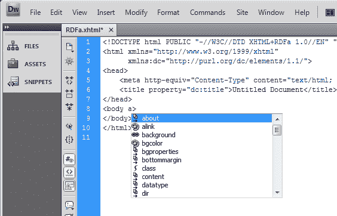
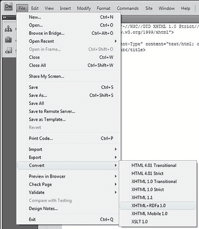

# 用 Dreamweaver 快速发布 RDFa

> 原文：<https://www.sitepoint.com/publish-rdfa-with-dreamweaver/>

采用任何新技术的最大障碍之一是好工具的可用性。RDFa 已经遭受了太长时间的痛苦。因此，今天早上我怀着极大的热情阅读了 Dreamweaver 版本 8 到 CS4 的 RDFa 扩展的[发布会](http://lists.w3.org/Archives/Public/public-rdf-in-xhtml-tf/2009Mar/0044.html)。这是一个好消息，因为手工发布 RDFa 并不容易。为这样一个受欢迎的开发者程序提供一个扩展肯定会改善这种情况。

[Martin McEvoy](http://weborganics.co.uk/) 刚刚发布了 **RDFa 文档扩展**，一旦获得批准，将(很快)通过 Adobe Exchange 提供。现在你可以直接从马丁的网站上下载: [v0.1](http://weborganics.co.uk/files/RDFa-Documents.mxp) 。

简短的功能列表:

*   *RDFa Documents* 包含一个带有 RDFa 属性的 HTML 标记库和一个 XHTML+RDFa 1.0 文档类型声明
*   该扩展使得 RDFa 可用于任何支持 HTML/XHTML 的布局或模板
*   还可以使用 Dreamweaver 转换实用程序将现有文档转换为 RDFa
*   该扩展目前支持通过下拉菜单在代码级别插入 RDFa 和预测文本

以下是 Martin 提供的简短步骤:

在 Dreamweaver 中使用 RDFa 最简单的方法是创建一个新文档

1.  文件= >新建
2.  您可以选择的页面类型有 HTML、ASP、HTML 模板、JSP 或 PHP
3.  选择任意布局，然后从文档类型中选择 XHTML+RDFa 1.0
4.  你完成了，在设计视图中继续，但是分割你的视图，这样你可以同时看到代码和设计视图，并在需要的地方插入 RDFa。
5.  或者，您可以通过选择 File => Convert => XHTML+RDFa 来转换现有的 web 页面。这将插入 RDFa 文档类型声明并将您的文档转换(如果还没有)为 XHTML。

## 分享这篇文章