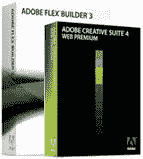

# 我们最新的 Adobe CS4 和 Flex Builder 3 Pro 赠品的获奖者是…

> 原文：<https://www.sitepoint.com/the-winner-of-our-latest-adobe-cs4-and-flexbuilder-3-pro-giveaway-is/>

在我们最近的 [Adobe 赞助竞赛](https://www.sitepoint.com/quiz/adobe/html-based-adobe-air/)中，我们对参赛作品的数量感到惊讶；这是一个非常酷的奖项，虽然我们私下里想为自己保留这个奖项，但我们已经到了使用随机数生成器来选择获胜者的程度。

获胜者是…

请击鼓…

#### 汤姆·布莱恩！

汤姆是一名 27 岁的网络开发人员，在英国一家制造公司学习设计。他创建网站和印刷材料来推广业务，包括小册子和海报。他还以自由职业者的身份创建网站，并对他的奖金和 SitePoint 发表了如下看法:

> “哇！！非常感谢！！！我希望有了 CS4 软件，我的工作流程将会增加，我可以变得更有效率。以及尝试所有的新功能。
> 
> 我最喜欢 SitePoint 的是它的社区。论坛里挤满了愿意友好地帮助解决哪怕是最琐碎的问题的人。SitePoint 的书籍对我来说也是无价之宝。"

**祝贺 Tom，感谢 Adobe 为本次测验捐赠奖品。**

如果你错过了，不要担心…将来可能有机会赢得其他大奖，所以请在这里关注它们。

顺便说一下，如果你有兴趣进一步提高你的空中技巧，你仍然可以[阅读文章](https://www.sitepoint.com/quiz/adobe/html-based-adobe-air/)和[来看看你的表现。](https://www.sitepoint.com/quiz/adobe/ajahtml-based-adobe-air/)

## 分享这篇文章