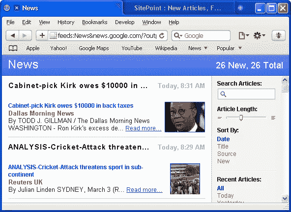
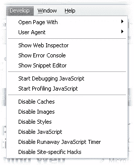
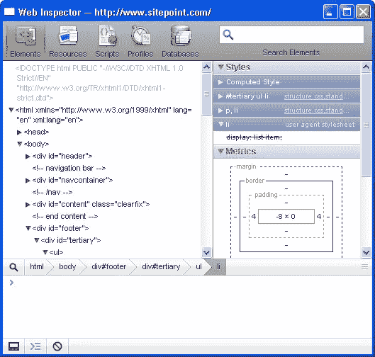
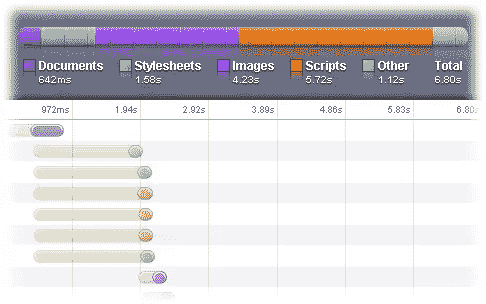

# Safari 4 初看

> 原文：<https://www.sitepoint.com/safari-4-first-look/>

在网络的早期，每隔几个月就会出现新的浏览器。历史正在重演，浏览器市场从未如此活跃或令人兴奋。最新的产品是苹果的 Safari 4 ，可以在 Mac 和 Windows 上进行测试下载。我试用了 Windows 版本，第一印象非常好。

## 安装和启动

基本的 Safari 下载 25MB 多一点；肯定远远大于火狐或者 Opera。然而，安装快速简单，浏览器几乎立即启动。如果有的话，感觉比 Chrome 快一点。

Safari 3 看起来非常像 Mac 应用程序，我怀疑它让一些 Windows 用户感到困惑。苹果已经解决了这个问题，Safari 4 看起来像一个标准的 XP/Vista 浏览器。标签现在以类似于谷歌浏览器的方式出现在标题栏中:

标签工作得很好，尽管拖动整个窗口而不是单个标签有点太容易了。我也想念鼠标中键点击关闭标签页，但这是一个小问题。

默认情况下使用 Microsoft 字体平滑，尽管您可以指定类似 Mac 的渲染。我发现它们有点模糊，但我肯定有些人会喜欢它们。

## 新功能

苹果宣布了 Safari 的 150 项新功能。许多帮助浏览器赶上竞争，但很高兴看到一些新的创新。

也许最吸引人的功能是[cover flow](http://www.apple.com/safari/whats-new.html)；一个类似 iTunes 的 3D 转盘，显示最近查看的网页。自您上次访问以来发生变化的内容用蓝色星号突出显示。虽然 Mac 用户将 CoverFlow 作为标准配置，但如果您使用低端显卡，它可能会在 Windows 中被禁用。希望苹果会在最终版本中解决这个问题。

该浏览器还集成了 RSS 阅读器。有点基础，不如 Opera 提供的好，但优于 IE 和 Firefox。“文章长度”滑块改变新闻条目显示的文本量。

## 网络标准支持和创新

Safari 和 [WebKit 项目](http://webkit.org/)继续实现最新的标准和特定于浏览器的功能，这些功能最终可能会被开发社区所采用。浏览器现在支持:

*   HTML 5，包括媒体和离线存储
*   HTML 画布和 SVG 1.1
*   CSS 动画、效果和网络字体
*   酸 2 和酸 3 合规性
*   ICC 颜色配置文件支持
*   插件和开发人员扩展
*   JavaScript/ECMA 版本 3

苹果声称他们的 Nitro JavaScript 引擎比 IE8 快 6 倍，比 Firefox 3.1 beta 快 4 倍。我自己使用 Webkit SunSpider 进行的测试显示，它的速度是 Firefox 3.0.6 的两倍。很快，但没有我希望的那么快。

## 开发者工具

Safari 的开发者工具一直很好，在版本 4 中有所改进。任何熟悉 Firefox 的 [Web 开发者工具栏](https://addons.mozilla.org/firefox/60/)和 [Firebug](https://addons.mozilla.org/firefox/1843/) 扩展的人都会有宾至如归的感觉。

Web 检查器显示 DOM 树、XPath、应用的样式、元素度量和其他有用的信息。它不像 Firebug 那样清晰，但对所有 web 开发人员来说都是一个必不可少的工具:

Inspector 还提供了一个 JavaScript 调试器、分析器、离线数据库查看器和一个极具吸引力的资源查看器:

## 你会用 Safari 吗？

Mac 用户转用 Safari 4 是必然的。我还怀疑会有更多的 Windows 用户尝试这款浏览器。预测采用率是不可能的，但 Safari 肯定配得上谷歌 Chrome 的增长。

Web 开发人员肯定需要安装 Safari。它提供了一些很棒的工具，浏览器拥有一个繁荣的扩展社区只是时间问题。

Firefox 仍然是我的首选浏览器，但 Safari 正在快速赶上，紧随其后。你觉得 Safari 4 怎么样？它会成为你的默认浏览器吗？

## 分享这篇文章