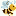
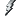

# 88 个杰出的图标和 6 个资源来帮助你创建你自己的

> 原文：<https://www.sitepoint.com/88-outstanding-favicons-and-6-resources-to-help-you-create-your-own/>

网站图标已经成为网页设计中的标准元素，它们可以对品牌识别产生巨大的影响(见马特·马加因的帖子， [*谷歌改变网站图标，挑战你做得更好*](https://www.sitepoint.com/google-changes-favicon-challenges-you-to-do-better) )。如果你不习惯为一个很小的区域(只有 16×16 像素)设计，那么创建一个与众不同的特定公司或网站品牌的图标会非常困难。并且根据 logo、颜色、文字等。你正在做的，这可能是一个挑战，创造一个实际上看起来很好。

在我不断寻找 favicon 灵感的过程中，我整理了一个列表，上面有 80 多个创意和设计良好的 favicon，它们成功地描绘了网站或品牌的外观和感觉。可能还有成千上万个适合这个列表，所以如果你有几个自己喜欢的，请在评论中分享。

| 
[99 设计](http://99designs.com "99designs") |  
[胶带营销](http://www.ducttapemarketing.com "Duct Tape Marketing") | [MODx](http://modxcms.com "MODx") |  
[站点点](https://www.sitepoint.com "SitePoint") |
|  
[采集](http://acquisitionx.com "Acquisition") |  
[享乐](http://www.epicurious.com "Epicurious") | 
Mozilla | 
[【Skype】](http://www.skype.com "Skype") |
|  
[公元&早餐](http://adandbreakfast.com "Ad and Breakfast") | 
[【ESPN】](http://www.espn.com "ESPN") |  
[MTV](http://www.mtv.com "MTV") |  
[小型设计公司](http://www.davidsmall.com "Small Design Firm") |
|  
[业余插画家](http://www.amateurillustrator.com "Amateur Illustrator") |  
[【脸书】](http://www.facebook.com "Facebook") |  
[脑袋](http://www.noggin.com "Noggin") | 
[SmartWebby](http://www.smartwebby.com "SmartWebby") |
|  
[亚马逊](http://www.amazon.com "Amazon") |  
[快公司](http://www.fastcompany.com "Fast Company") |  
[NY 豪门](http://www.giants.com "NY Giants") |  
[砸弹匣](http://www.smashingmagazine.com "Smashing Magazine") |
|  
[本和杰瑞](http://www.benjerry.com "Ben and Jerry") |  
[更精细的设计](http://www.finerdesign.com "Finer Design") |  
[名博](http://www.nymbler.com "Nymbler") |  
[栽跟头](http://www.stumbleupon.com "StumbleUpon") |
|  
[今日花开](http://bloomstoday.com "Blooms Today") | 
[flicker](http://www.flickr.com "Flickr") |  
[【纽约时报】](http://www.nytimes.com "New York Times") |  
[目标](http://www.target.com "Target") |
|  
[宝马](http://bmw.com "BMW") |  
[羊群](http://www.flock.com "Flock") | 
打开目录项目 |  
[Twhirl](http://www.twhirl.org "Twhirl") |
|  
Boho 杂志 |  
[美食&美酒杂志](http://www.foodandwine.com "Food and Wine Magazine") |  
[有机](http://www.organic.com "Organic") | 
[【Twitpic】](http://www.twitpic.com "Twitpic") |
|  
[脑糖](http://braincandyshop.com "Brain Candy") |  
[佐治亚水族馆](http://www.georgiaaquarium.org "Georgia Aquarium") |  
[恐慌](http://www.panic.com "Panic") |  
[推特](http://twitter.com "Twitter") |
| 
【Cars.com】T4 |  
[平面设计工作室](http://www.graphicdesignstudio.net "Graphic Design Studio") |  
[帕特里克·蒙克尔](http://www.patrickmonkel.nl "Patrick Monkel") |  
[一模一样](http://www.twopeasinabucket.com "Two Peas in a Bucket") |
|  
[CBS](http://www.cbs.com "CBS") |  
[绿茶图案](http://www.greenteadesign.ca "Green Tea Design") |  
[PBS 小孩](http://www.pbskids.org "PBS Kids") |  
[两点三十](http://twothirty.com "twothirty") |
|  
[基督教麻雀](http://www.christiansparrow.com "Christian Sparrow") | 
【Hawaii.gov】T4 |  
[百事](http://pepsi.com "Pepsi") |  
[美国邮政](http://www.usps.com "United States Postal Service") |
|  
[Ciplex](http://www.ciplex.com "Ciplex") |  
[HGTV](http://www.hgtv.com "HGTV") |  
[PETA](http://www.peta.org "PETA") |  
[可见论](http://www.visibletheory.com "Visible Theory") |
|  
[万里无云](http://cloudless.net/blog "Cloudless") |  
[葫芦](http://www.hulu.com "Hulu") |  
[Petco](http://www.petco.com "Petco") |  
[网猴](http://www.webmonkey.com "Webmonkey") |
|  
[恒触点](http://www.constantcontact.com "Constant Contact") |  
[针织](http://www.knitty.com "Knitty") |  
[彼得·赫尔利](http://www.peterhurley.com "Peter Hurley") |  
[婚礼蜜蜂](http://www.weddingbee.com "Wedding Bee") |
|  
[设计浮动](http://www.designfloat.com "Design Float") |  
[LightMix 设计工作室](http://www.lightmix.com "LightMix Design Studio") |  
[粉色蛋糕盒](http://www.pinkcakebox.com "Pink Cake Box") |  
[白宫](http://www.whitehouse.gov "The White House") |
|  
[神童](http://www.deviantart.com "deviantART") |  
[LinkedIn](http://www.linkedin.com "LinkedIn") |  
[普瑞纳](http://www.purina.com "Purina") |  
[全食超市](http://www.wholefoodsmarket.com "Whole Foods Market") |
|  
[开发清单](http://www.devlisting.com "Devlisting") | 
[LogoSauce](http://www.logosauce.com "LogoSauce") |  
[中环](http://www.ringcentral.com "RingCentral") | 
【Wine.com】T4 |
|  
[Digg](http://www.digg.com "Digg") | 
[MailChimp](http://www.mailchimp.com "MailChimp") |  
[圣地亚哥动物园](http://www.sandiegozoo.org "San Diego Zoo") |  
[Yelp](http://www.yelp.com "Yelp") |
|  
[数码](http://www.digileon.com "Digileon") |  
[玛莎·斯图尔特](http://www.marthastewart.com "Martha Stewart") | 
[service magic](http://www.servicemagic.com "ServiceMagic") |  
[YouTube](https://www.youtube.com "YouTube") |
|  
[迪特利网页设计](http://ditley.com "Ditley Web Design") |  
[这次遇到了](http://www.metmuseum.org "The Metropolitian Museum of Art") |  
[第七人](http://www.seventhman.com "Seventhman") | [ZAP](http://www.zapworld.com "ZAP Electric Cars") |

既然你有了灵感，是时候创建你自己的 favicon 了，就像上面的例子一样平滑。以下是一些您可能会觉得有用的资源:

*   CSSJuice 上的 20 个最佳网站在线生成器
*   詹妮弗·苹果如何在 Photoshop 中创建一个网站图标
*   用 Adobe Photoshop 和 GoLive 在 Amenco 上创建图标
*   [Favicon 教程](http://www.heavengraphics.com/favicon-tutorial.htm)关于天堂图形
*   [创建一个简单的 web 2.0 favicon–sankarandan 上的教程](http://www.sankaranand.com/blog/2007/05/30/creating-a-simple-web-20-fav-icon-tutorial)
*   在 Snook.ca 上制作一个好的 Favicon

## 分享这篇文章