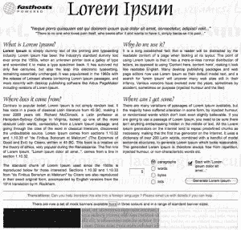
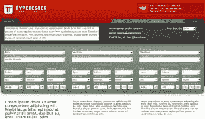
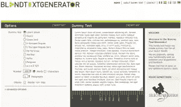
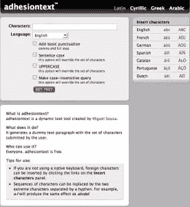

# 7 个虚拟文本生成器:你最喜欢哪一个？

> 原文：<https://www.sitepoint.com/7-dummy-text-generators-which-is-your-favorite/>

设计的一部分是给客户一个想法，他们的副本将如何与设计工作。你不想让他们难以想象最终的网站会是什么样子。当然，你可以从他们那里获取内容并插入，但这样你就迫使他们将注意力分散在内容和设计上。另外，他们可能还没有写完所有的内容。

文本生成器允许您创建填充文本(通常是拉丁文),这些文本通常没有意义，但可以完善设计的外观。大多数生成器允许您指定段落的数量，然后提供虚拟文本，您可以将其复制并粘贴到模型中。有许多这样的工具，它们的功能各不相同，我列出了七个:

**1。**

这种发电机是最受欢迎的。它非常简单，根据您指定的段落、单词、字节甚至列表的数量提供拉丁填充文本。他们还有一个页面，你可以在那里下载占位符[横幅广告](http://www.lipsum.com/banners)。你可以下载一个[插件](https://addons.mozilla.org/en-US/firefox/addon/2064)在 Firefox 中使用。

**2。[恶意软件文本生成器](http://www.malevole.com/mv/misc/text)**

这个允许您选择最多五个段落，然后生成非拉丁文本。提供的虚拟文本足够让你发笑。

**3 .[型测试仪](http://www.typetester.org)**

 这个文本生成器允许你指定字数、字符数和段落数，样式化文本，然后为你的设计复制 CSS。您还可以使用系统上安装的任何字体，这也使它成为打印工作的一个很好的工具。

**4。[FillerText.com](http://www.fillertext.com)**

这是一个很好的工具，允许你选择每个字符、单词或段落要生成的拉丁文本的数量。它将产生多达 50 段的虚拟文本，这可能比你一次所需要的还要多。

**5。[盲文本生成器](http://www.blindtextgenerator.com)**

 用这个可以选择文字量，改变文字类型(即 lorem ipsum，A-Z，actual copy)，创建和复制 CSS。一个非常酷的特性是能够拖动和调整`textarea`来适应特定的列大小。
 **6。 [Lorem Ipsum 生成器 3](http://www.lorem-ipsum.info/generator3)**

这个程序可以生成多种语言的文本，一次可以生成多达 100 个段落。你也可以选择让它插入随机的问号和感叹号。

**7。[粘附文字](http://www.adhesiontext.com)TM**

 这个生成器让你选择字符、语言和大小写。你甚至可以插入你自己的字符，它会把它们混在一起创建基于字符的虚拟文本。这种灵活性使 adhesiontext 成为字体设计者中流行的工具。

那么，在这些或这里没有列出的一个中，哪个是你最喜欢的？

## 分享这篇文章