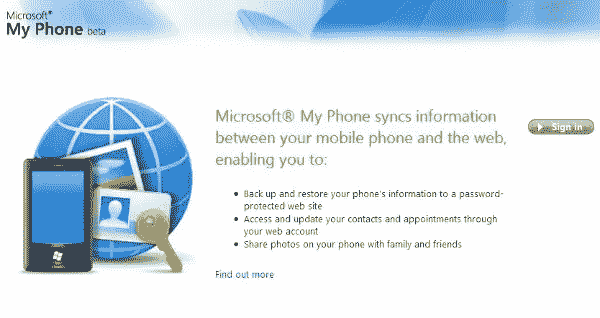
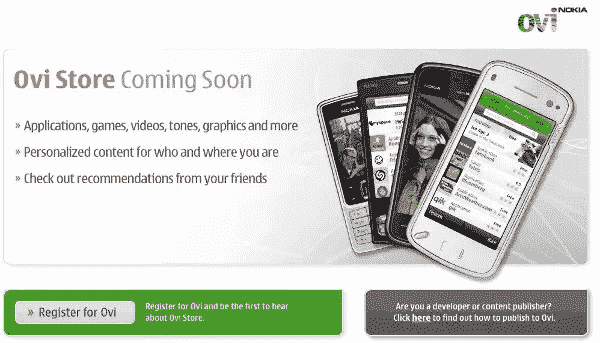

# 微软、诺基亚应用商店–即将开业！

> 原文：<https://www.sitepoint.com/more-app-stores/>

今天，微软和诺基亚[宣布](http://news.bbc.co.uk/2/hi/technology/7892863.stm)他们版本的苹果[应用商店](http://www.apple.com/iphone/appstore/)。苹果参与开发社区和他们庞大的用户群，被证明是一个真正的网络成功故事。现在，微软的 Windows Marketplace 计划于今年晚些时候推出，而诺基亚的 Ovi 商店将于 5 月推出。在一场明显的“追赶”游戏中，两家公司的变体都提供了基于一些最受欢迎产品的各种应用程序。从盈利的角度来看，苹果已经多次展示了品牌与创新产品和思维相结合是如何实现盈利的，这是许多网络公司应该学习的一课。

##### AppStore 成功

苹果的 AppStore 去年为史蒂夫·乔布斯和他的公司赢得了多次触地得分。该商店的首次亮相[仅第一个周末](http://blog.wired.com/gadgets/2008/07/apple-sells-one.html)就有 1000 万个应用程序被下载，超过 100 万部 iPhones 被售出。如果说曾经有过网络商务的淘金热，那就是应用商店。或许更相关的是来自 iPhone 应用程序开发者的苹果商店成功的故事[。这里的天才在于创造一个全球市场，以及对所有相关方的明显双赢。我只是很惊讶，其他人竟然花了这么长时间才开始效仿。](http://blog.wired.com/gadgets/2008/09/indie-developer.html)

##### 微软的观点

根据这一消息，微软的 Windows Marketplace 将为他们的新手机提供新的应用程序、服务和创新，这是一个包含 20，000 个现有 Windows Mobile 应用程序的库，以及允许用户将手机内容与 Windows Live 等其他微软产品同步的服务。虽然在这一点上，微软的移动产品可能没有苹果的强大，但在我看来，他们巨大的品牌认知度使他们的这一举动加倍明智。许多人[永远不会相信](http://www.computerworld.com/action/article.do?command=viewArticleBasic&articleId=9119552) MS 会模仿苹果，但显然这正在成为现实。

我的手机方面正在准备。

##### 诺基亚 Ovi 商店

像苹果的版本一样，诺基亚的 Ovi 商店将从开发者的应用中抽取 30%的版税。Ovi 商店将提供应用程序和广泛的多媒体内容，如游戏、图形、铃声和个性化。为了在竞争中脱颖而出，诺基亚已经与从 EA Games 到脸书的几家内容提供商达成了协议。诺基亚现有的下载服务、新的应用程序及其多媒体服务 [MOSH](http://mosh.nokia.com/) 将结合起来，形成 Ovi 商店体验。

Ovi 商店，即将开业。

##### 模范市场

在正确的时间和正确的地点定位一家公司是坚如磐石的生意。苹果公司，甚至它的追随者们在网上进行的“店面”社交实验就是典型的网络商业。通过在已经成熟的产品上创造一个创意市场，这些公司为每个人提供了近乎完美的商业解决方案。我不是移动技术的狂热爱好者，但将开发人才货币化，为他们自己的产品提供更多价值，并将其分发给最有针对性的受众，这已经是最好的了。这里的教训是在每一个可能的时机支付红利。

尽管脸书、MySpace、Twitter 和其它 100 家在线企业只是“承诺”会盈利，但似乎只有零售类企业才能接近利用互联网作为交易媒介。亚马逊、易贝和许多其他更传统的公司位于网络收入阶梯的顶端，而社交社区中拥挤的人群仍然存在，本质上是一个未实现的细分市场。就我个人而言，我不认为他们中的许多人有一个简单的退出策略。我想有人可以开发一个应用程序把脸书变成易贝？或许苹果的教训可以用在其他方面？如果在另一端有更实在的东西，比如我的 Facebook 数码相册之类的。无论如何，这个最新的消息对应用程序开发者和整个网络来说都是好消息。

## 分享这篇文章