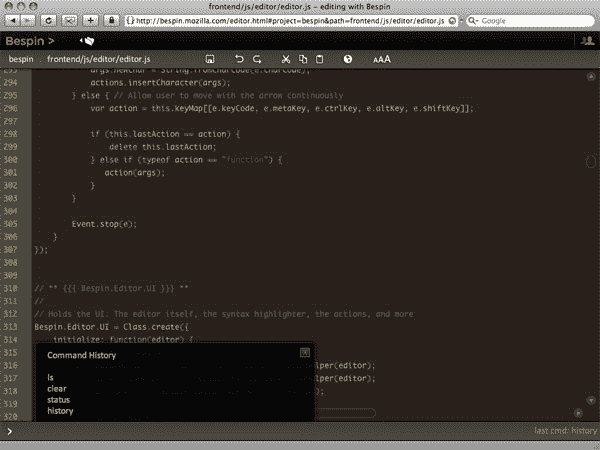

# Mozilla 推出非常漂亮的基于云的 IDE

> 原文：<https://www.sitepoint.com/mozilla-launches-very-slick-cloud-based-ide/>

随着其他软件都走上“服务”的道路，有人编写基于浏览器的 IDE 只是时间问题。昨晚，Mozilla 的开发者工具实验室发布了 [Bespin](https://bespin.mozilla.com/) 的公开测试版(被 Mozilla 称为“实验原型”)，它将桌面 IDE 的光滑与基于 web 的应用程序的便利结合在一起，该应用程序使用 JavasScript 和 HTML5 Canvas 元素，并带有 Python 后端。

因为编辑器使用 HTML5 元素，所以它只适用于支持 Canvas 的现代浏览器。它已经在最新的 Firefox 3 和 Webkit nightlies 上进行了测试——但我在使用 Firefox 3.06 时没有遇到任何问题。

在开发之前，Mozilla 为 Bespin 制定了一套标准。他们开始创建一个快速的编辑器，像 Textmate 一样简单易用，可以从任何地方访问，有一个集成的命令行，支持实时协作，并存在于“自托管”环境中。换句话说，Mozilla 雄心勃勃的计划是利用流行的编辑器，如 Textmate、vi、Emacs、SubEthaEdit，并在 web 应用程序中重新创建它们。

最终，Mozilla 与 Bespin 的目标是创建一个“开放 Web 开发的可扩展框架”。为此，编辑器的代码已经在开源 Mozilla 公共许可证下发布。

在下面的视频中，开发人员 Dion Almaer 介绍了 Bespin。

<object width="400" height="225"><param name="allowfullscreen" value="true"> <param name="allowscriptaccess" value="always"> <param name="movie" value="https://vimeo.com/moogaloop.swf?clip_id=3195079&amp;server=vimeo.com&amp;show_title=1&amp;show_byline=1&amp;show_portrait=0&amp;color=&amp;fullscreen=1"> <embed src="https://vimeo.com/moogaloop.swf?clip_id=3195079&amp;server=vimeo.com&amp;show_title=1&amp;show_byline=1&amp;show_portrait=0&amp;color=&amp;fullscreen=1" type="application/x-shockwave-flash" allowfullscreen="" allowscriptaccess="always" width="400" height="225"></object>

在我今天对 Bespin 的有限测试中，我留下了非常深刻的印象。几个月前，我和一个朋友开始研究一个项目，旨在创造一个非常相似的东西。除了一个自动编号的文本区，我们没有走多远。但是作为对这个概念的初步研究的一部分，我花了大量的时间寻找基于 web 的 ide。我找到了几个相当不错的，比如 [CodePress](http://codepress.sourceforge.net/) 和 [9ne](http://robrohan.com/projects/9ne/) ，但是在表达的巧妙性方面，没有什么能与 Mozilla 刚刚发布的内容相媲美。

对于一个“实验原型”，贝斯平是相当坚实的。它具有文本突出显示、行号、复制/粘贴和撤销/重做功能。协作功能尚未激活，但技术演示中包含了一些 UI 提示。Bespin 网站还暗示了一个即将到来的功能，它将允许人们从公共存储库中自动获取开源项目的代码，并自动建立一个项目。我在使用复制粘贴功能处理从外部来源复制的文本时确实遇到了一点麻烦，但考虑到这是 Bespin 的 0.1 版本，这基本上是个小问题。

试试吧，然后在下面的评论中告诉我们你对 Bespin 的看法。

## 分享这篇文章