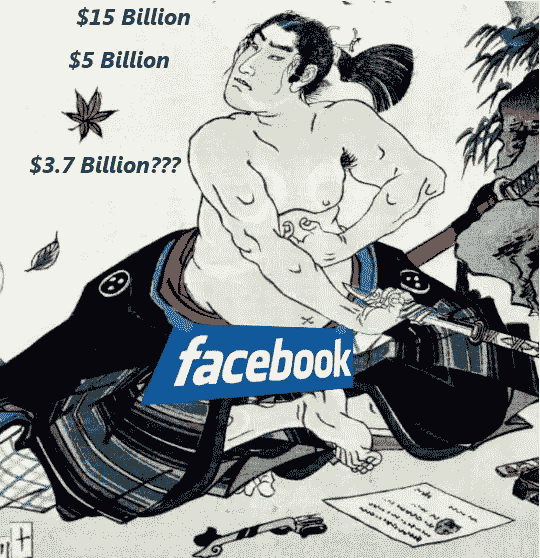

# 脸书失去了面值——切腹自杀是否迫在眉睫？

> 原文：<https://www.sitepoint.com/facebook-value-lost/>

Web 2.0 的宠儿脸书最近成为了比其他任何创业公司都要多的猜测对象。很多“猜测”都是针对这个世界上最受欢迎的社交平台的估值。美联社今天的新闻表明，给用户数量或创新贴上价格标签变得更加棘手。根据你使用的是谁的数据，脸书的价值会有很大的不同。脸书值 150 亿美元、50 亿美元、35 亿美元(正如今天的故事所暗示的)，或者有人知道吗？

根据美联社的报道，脸书与 ConnectU 的法庭和解的机密文件证实，脸书自己的估值比 2007 年的预测低 115 亿美元。显然，脸书也[非常坚决](http://news.cnet.com/8301-10784_3-9975282-7.html?tag=mncol;txt)不透露和解的细节，这是可以理解的。从每股 35.90 美元到每股 8.88 美元的贬值引起了恐慌，即使该公司是私有的。为了更好地理解这一切，让我们来看看更多的数字。

##### 你也可以在网上赚几百万！

早在 2008 年 10 月，迈克尔·阿灵顿就出色地“预测”了脸书即将到来的货币化灾难。根据阿林顿的说法(这位作家随后的阅读证实了他的观点)，脸书可能是在赔钱，而不是赚钱。脸书展会有 750 名员工，[巨大的带宽](http://www.businessweek.com/technology/content/may2008/tc2008059_855064.htm)，以及其他[的可扩展性问题](http://gigaom.com/2008/05/11/the-rising-cost-of-facebook-infrastructure/)，运营费用很可能超过他们每年 2.6 亿美元的估计收入。除此之外，最近的经济危机，广告网络面临的问题，脸书加入了一个可能站不住脚的互联网投资团体。

##### 还是可以？

在本月早些时候的一篇《每日电讯报》文章中，鲁珀特·尼特和冰雪睿·梅森或许透露了更多脸书绝望的证据。根据他们的说法，即使是现在，脸书也即将为了金钱而放弃用户数据。在接受《每日电讯报》采访时，脸书的全球市场总监兰迪·扎克伯格说；"跨国公司被从该网站数百万用户那里获得实时反馈的能力惊呆了。"

就他们而言，脸书反驳了《每日电讯报》的报道，并坚称他们没有计划这样的产品。鉴于脸书[之前灾难性的](http://www.techmeme.com/071201/p15#a071201p15)利用 Beacon 的用户数据的尝试，这可能是明智的。

脸书的选择范围很窄

##### 过了一段时间，便士变成了美元

因此，脸书投资者有 5 亿美元被套牢在一个可能永远赚不到一毛钱的东西上。数十亿美元被投资到主要基于访问量和天知道什么样的商业计划的公司。在严重的金融危机时期，脸书的价值必须由美联社记者挖掘出来？是只有我，还是这张图有问题？如果[不断借钱](http://www.businessinsider.com/2008/12/facebook-cant-find-buyers-for-employee-stock)是一个新的商业计划，我知道很多人会报名。1.5 亿脸书用户要多久才能还清 5 亿加利息？

##### 重要的数字

一家全球市场情报公司称，广告客户正在放弃社交网站，因为它们的“点击率”低于传统的在线广告。只有 57%的社交网站用户在点击广告后每年购买一次，远低于其他网站的 80%。德勤(Deloitte)技术和电信研究主管保罗李(Paul Lee)的这句话，几乎是把武士刀交给了脸书投资者:

> “如果资金枯竭，一些社交网络的账面价值可能会被减记，一些公司可能会彻底破产。一些最大的新媒体网站的平均每用户收入是以每月几便士来衡量的，而不是英镑。

脸书 50%的用户都是国际用户，正如阿灵顿指出的，从广告的角度来看，这几乎是无利可图的。根据上面提到的点击率，大约有 4000 万用户每年购买一次东西来维持这个平台。我只能说，微软最好希望他们从亚马逊购买办公套件，而不是书籍。搜索现在占据了所有互联网广告收入的 44 %,而在这次衰退中,( T2)谷歌损失了数亿美元。

我预计，对于精明的投资者来说，今天的新闻会引发对仪式牺牲以及某些行业更糟糕情况的思考。作为所有创新事物的粉丝，我希望脸书和其他人能尽快拿出一个更稳定的货币化计划。或者，至少是一个更好的自我评价。

## 分享这篇文章