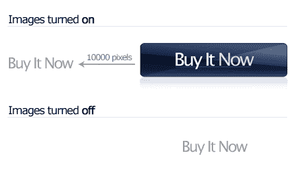

# 一种新的图像替换技术:状态范围法

> 原文：<https://www.sitepoint.com/image-replacement-state-scope/>

图像替换可以说是网页设计者可用的最重要的基于 CSS 的技术之一。虽然有些人认为图像替换仅仅是使用客户端计算机中没有的字体的一种方式，但我认为这是不正确的。图像替换几乎在每个网站上都有一席之地——它在显示各种页面元素时很有用:公司徽标、吸引人的导航栏和花哨的段落标题。然而最重要的是它对“行动号召”按钮的使用；这些必须突出，以吸引访问者的注意力，执行重要的任务(如注册，下载，或购买)。

## 为什么图像替换如此重要

如果您已经理解了映像替换的基本原理，您可以安全地跳过这一部分。要不，先说一会儿。

仅用 CSS 对文本进行样式化基本上仅限于选择一些字体和平面着色。考虑到当前使用的 web 浏览器的支持水平，向所有用户显示像反射、阴影和透视变换这样的效果是一项根本不可能完成的任务。对于网页设计者来说，唯一可靠的选择是显示包含这些效果的图像(在 Photoshop 等图形程序中创建)。显示这张图片的最基本的技术——这种技术在 CSS 得到广泛使用之前就很常见——是使用``标签将图片嵌入页面。

然而，使用`img`元素来显示本质上是文本的信息会带来很多复杂性。首先，当图像关闭时，页面有时会降级不够，尤其是在 Internet Explorer 中。其次，因为实际的文本与标记是分开的，所以屏幕阅读器和搜索引擎可能无法正确地阅读文本。最后，根据图像的创建方式，更新图像中的文本可能不太方便。

一个解决方案是使用**图像替换**，将文本放入 HTML 元素中，然后使用 CSS 将文本替换为*升级版*图像。不幸的是，因为有许多不同的方法([参见戴夫·谢伊的精彩总结](http://www.mezzoblue.com/tests/revised-image-replacement/)以获得全面的列表)，每一种实现这一点的方法都会产生自己的新的复杂性。

网页设计师需要一种不折不扣的图像替换方法——一种支持打印、当图像在客户端浏览器中关闭时优雅地降级、仅施加必要的标记并且简单到任何人都可以使用的方法。

## 其他方法的问题是

大多数其他图像替换技术(Fahrner，Phark，Gilder/Levin，Leahy/Langridge)在图像打开和关闭时使用相同的 CSS。我得出的结论是，当图像打开和关闭时，使用*不同的* CSS 是很重要的，否则结果会受到以下一个或多个副作用的影响:

*   这种技术很容易被破坏——例如，当图像被禁用或者被替换的图像有透明区域时。
*   它太复杂了，无法快速可靠地实现。
*   该技术使用 JavaScript 来遍历 DOM 树，这会在页面加载时导致不希望的闪烁(并且由于各种其他原因而变得脆弱)。
*   该技术可能与某些浏览器不兼容。

`@media`块让我们将 CSS 扩展到不同的媒体类型，但是当图像打开或关闭时，我们没有可用的构造来显示不同的 CSS。我不确定 W3C 是如何忽略这一点的，但是他们做到了，甚至在最新的 CSS3 媒体查询模块中。使用如下声明的能力是最理想的:

```
h1 { ... } /* This rule would theoretically only be displayed when images are on */ 

@media images-on { 

    h1 { .. } 

   } 
```

我相信这一缺点是迄今为止所提出的所有技术充其量都是薄弱的原因。好消息是:用一点小聪明就可以伪造这个语法。

## 一种新的图像替换方法

我提出了一种新的图像替换方法。我将我的技术命名为*State Scope image replacement*，因为该技术使用 JavaScript 在整个页面上设置“图像打开”状态。

状态范围图像替换需要 JavaScript，但是实现它很容易。在文档的`<head>`元素中包含一个小脚本([，可以在这里](https://i2.sitepoint.com/examples/image-replacement/state-scope-image-replacement.zip)下载)。

一旦这个脚本就绪，在你的网站上的任何 CSS 规则前添加`.images-on`将导致该规则仅在客户端浏览器中启用图像时才被应用。下面是一个在`h1`元素上使用状态范围图像替换的例子:

```
h1 { 

  width: 100px; 

  height: 50px; 

} 

@media screen {  

  .images-on h1 { 

    text-indent: -10000px; 

    background-image: url(image.png); 

    overflow: hidden;  

  } 

} 
```



上面的样式中使用了两个规则。第一个总是适用，第二个仅在图像启用时适用*。当图像打开时，由于`text-indent`规则，`h1`内的文本被推离屏幕的左边缘，并应用背景图像(见上图)。在 Firefox 中，如果使用了锚而不是标题，那么`overflow: hidden`属性可以防止焦点矩形远离屏幕的左边缘。*

 *您会注意到第二条规则被包装在一个`@media screen`块中。这是为了确保图像替换只发生在屏幕上，而不是在打印中。因为默认情况下，打印时浏览器的背景图像被排除在外，所以这一点很重要。如果遗漏了，页面打印出来，大部分人收到的将是一个很大的空白间隙，而不是有意义的信息。

正如您所看到的，这种技术实现起来非常快，并且对文档主体的标记更改是不必要的。因为文本被明显推离页面的左边缘，所以您的图像可以由透明区域组成，而文本不会从图像后面偷看。实现这一点的脚本非常短，即时执行(从用户的角度来看)，并利用了世纪之交之前已经存在的浏览器功能。

这就是开始运行坚如磐石的映像替换所需了解的全部内容。然而，如果你是那种喜欢偷窥的人，请继续读下去。

## 首先，一点背景…

在我们继续深入之前，我需要在这里讨论一个稍微跑题的问题:面向对象设计模式。设计模式是软件开发中的一个基本概念。对于那些不熟悉它们的人来说:它们是已经使用了几十年的常见软件架构问题的解决方案。你可能听说过一些更著名的模式，比如[模型-视图-控制器](http://en.wikipedia.org/wiki/Model-view-controller)、[单例模式](http://en.wikipedia.org/wiki/Singleton_pattern)和[工厂方法模式](http://en.wikipedia.org/wiki/Factory_method_pattern)。一般来说，理解并使用设计模式的软件架构师可以更有效地编写代码，因为他们能够将预先解决的解决方案应用到他们面临的问题中。

在 web 技术领域也存在类似的设计模式。我们发现的一种这样的模式被称为**状态范围**。在 web 文档的上下文中，状态范围是一种用于基于给定状态快速启用一组 CSS 规则的机制；这样做的同时，仍然保持网站的所有 CSS 逻辑分组在一起，同时避免扫描和操作 DOM 树的可怕过程。使用状态范围有两个原因:

1.  以响应用户动作来重新格式化页面的各部分，并且

3.  基于客户端的浏览器、设备或其他条件应用附加格式。

状态范围图像替换通过使用以下脚本将 CSS 类名追加到文档的`html`元素来工作:

```
 document.enableStateScope = function(scope, on) 

    { 

      var de = document.documentElement; 

      if (on) 

      de.className += " " + scope; 

      else 

      de.className = de.className.replace( 

        new RegExp("\b" + scope + "\b"), ""); 

    }; 
```

定义了该函数后，只需一次调用就可以打开和关闭作用域:

```
if (condition == true) document.enableStateScope("myScope", true);
```

最后，在样式表中，可以将作用域名添加到任何规则的选择器前面，只有在 state scope 为 on 时才应该应用这些规则。当上述条件评估为真时，以下样式规则将导致页面上的所有锚点由红色变为蓝色:

```
a { color: red; } .myScope a { color: blue; }
```

正如您可能怀疑的那样，状态范围图像替换通过检查图像是否被启用来工作，如果是，则激活一个“images on”状态范围。这是一个相当简单的过程，所以让我们看看这是如何完成的。

## 检查图像是否已启用

在我们的脚本中，我们将测试图像的存在。我想避免在服务器上的映像上进行测试，这将导致额外的 HTTP 请求。然而，似乎避免这种开销需要一点创造力。

在大多数浏览器中，`Image`对象可以被实例化并来源于无效的 URL ( `http://0`)。然后，我们可以很容易地确定图像是否被启用，因为如果它们被启用，将会触发`onerror`事件。在脚本的开始，我们设置了一个新的图像对象:

```
 var img = new Image(); 
```

然而，有两种古怪的浏览器使这种方法变得复杂；在基于 Gecko 的浏览器中，`onerror`事件总是被触发，不管图像是否启用，因此它无法工作。幸运的是，有一个变通办法。通过将无效的背景图像附加到文档的 HTML 元素，然后用`getComputedStyle`方法读回其样式，如果图像被禁用，背景图像 CSS 属性将读取`none`或`url(invalid-url:)`:

```
 if (img.style.MozBinding != null)  

  {  

    img.style.backgroundImage = "url(" + document.location.protocol + "//0)";  

    var bg = window.getComputedStyle(img, '').backgroundImage;  

    if (bg != "none" && bg != "url(invalid-url:)" || document.URL.substr(0, 2) == "fi")  

    {  

      document.enableStateScope("images-on", true);  

    }  

  } 
```

另一个具有挑战性的浏览器是 Safari。如果向无效的 URL 发出请求，Safari 会在状态栏中报告错误。布局不会受到影响，但是如果用户打开了状态栏，错误会尖叫*不专业*。同样，我已经创建了另一个解决方法。如果图像来源于编码为数据 URI 的 1×1 像素 GIF，则如果禁用图像，该图像的宽度将为零。下面是我们在 Safari 中测试它的方法:

```
 else  

  {  

    img.style.cssText = "-webkit-opacity:0";  

    if (img.style.webkitOpacity == 0)  

    {  

      img.onload = function()  

      {  

        document.enableStateScope("images-on", img.width > 0);  

      }  

      img.src =   

        "data:image/gif;base64," +  

        "R0lGODlhAQABAIAAAP///wAAACH5BAE" +  

        "AAAAALAAAAAABAAEAAAICRAEAOw==";  

    }  

 } 
```

最后，对于所有其他浏览器，我们可以简单地测试由我们在开始时实例化的`Image`对象触发的`onerror`事件:

```
 else  

    {  

      img.onerror = function(e)  

      {  

        document.enableStateScope("images-on", true);  

      }  

      img.src = "about:blank";  

    } 
```

即使用户与互联网断开连接，这一切都可以正常工作。不过，有一个小警告——在 Firefox 3 中，即使你关闭了图片，带有`file:///` URL 的图片也会被加载。在这种情况下，最好从可以使用 HTTP 访问的 web 服务器进行测试。

## 状态范围是可切换的

额外的好处是，因为状态范围可以打开和关闭，所以很容易创建一个系统，让您只需单击一下就可以在文本和图像替换之间切换(您将在示例文件中看到这一点)。根据你用什么软件来写你的 CSS，这在开发过程中会很有帮助。

将类名添加到`html`元素而不是`body`元素或其子元素的主要原因是，`body`元素需要完全加载后才能被操作。如果将`images-on`类名添加到除了`html`元素之外的任何元素中，那么在启用状态范围时会出现不希望的闪烁。此外，将 CSS 类名放在`body`元素上以限制特定页面的特定 CSS 规则也是一种流行的做法。如果在`body`元素上也设置了`images-on` CSS 类，这种做法可能会受到阻碍。

## 这对网络开发者意味着什么

对于任何一直想使用图像替换，但由于相关的复杂性而决定不使用它的网站设计者来说，这种技术可以极大地改变您构建网站的方式。对于其他人来说，这是提高网站健壮性的好方法。

当你考虑在图像中使用文本的原因时，应该尽可能多地使用图像替换——无论是公司徽标、花哨的标题还是“添加到购物车”按钮。图像标签只有一个合适的位置:当你真正描述一幅图像的时候！从语义上来说，图像是照片和图画，而不是 Photoshop 中生成的文本图片。当您考虑 CSS 精灵、搜索引擎优化和易于维护等技术时，使用 CSS 背景图像比使用图像元素更令人满意。

在我看来，图像替换是 CSS 构造中最关键的部分——这就是为什么我花了这么多时间试图找到一种更好的方法来实现它。我希望这些信息能帮助你建立一个更好的网站。

(图片鸣谢: [JR3](http://www.sxc.hu/profile/JR3) )

## 分享这篇文章*