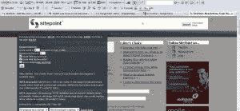
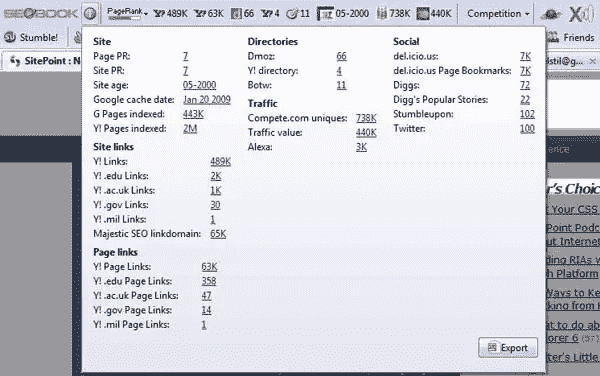
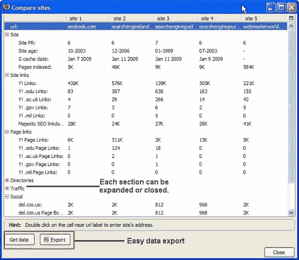

# 搜索引擎优化工具可以使搜索引擎优化软件变得不必要

> 原文：<https://www.sitepoint.com/aaron-wall-seo-toolbar/>

SEO 传奇人物 Aaron Wall 的新 [SEO 工具栏](http://tools.seobook.com/seo-toolbar/)可能会取代许多网络开发者的昂贵软件。对于经验丰富的 SEO 专业人士来说，没有！但是对于无法负担专业搜索引擎优化的 DIY 网站管理员，或者雇佣搜索引擎优化的网站管理员，只是想证明他在卖什么，这是肯定的。

在每个网站所有者的生活中，都有这样一个时期，搜索引擎站点优化、SEO 竞争分析和 SEO 软件的使用变得势在必行。如果没有搜索引擎优化，许多网站将被谴责为“谷歌地狱”——一个在谷歌搜索引擎服务区最黑暗角落的地方，任何搜索引擎用户都无法找到它们。没有搜索引擎优化软件的搜索引擎优化竞争分析变得无效，因为它是耗时和非结构化的。没有竞争分析，SEO 只是一个猜谜游戏。

竞争分析着眼于竞争对手站点，以确定:

*   他们的优势——使他们在谷歌首页排名的搜索引擎优化因素
*   他们的弱点——搜索引擎优化因素没有被这些竞争对手恰当地利用，这些因素可能会使挑战者网站在搜索引擎优化方案中排名更高

为了确定这些优势和劣势，需要调查竞争对手网站的以下 SEO 方面:

*   **基本内容分析:** meta 标签(标题、描述、关键词)、站点菜单、正文:针对哪些关键词，这些关键词的密度是否过高等。
*   **链接:**指向一个站点的链接有多少，有多好。有多少著名的目录列表(通常是 DMOZ，雅虎！竞争对手的网站有哪些？
*   站点页面:雅虎上列出了多少属于同一个站点的页面！而谷歌呢？
*   站点受欢迎程度:竞争对手的站点在 Alexa 和 competitor 中排名如何，该站点的流量价值如何？
*   最后但同样重要的是，因为我们生活在社交媒体时代，**有多少竞争对手网站的页面被包括 digg、StumbleUpon、Twitter 和 del.icio.us 在内的主要社交中心**收录？

为了快速确定这些因素，许多 SEO 使用像 Axandra 的 iBusinessPromoter 这样的软件。这种软件的问题是，它不是提供基本的 SEO 竞争分析数据“一目了然”，而是生成一份冗长的报告，很难在你的 PC 上阅读(太多的页面)。该软件也很贵——没有多少网站管理员能支付得起，比如说一个商业版就要 500 多美元。

当然，还有免费的替代品:免费的在线工具，可以分析上面列出的每一个 SEO 因素。然而，它们的过程既费时又乏味。

Aaron Wall 聪明地整合了一系列工具，让那些需要快速答案的人更容易进行 SEO 竞争分析。最新的工具是 [SEO 工具栏](http://tools.seobook.com/seo-toolbar/)，这是一个 Firefox 插件，它引入了一系列 SEO 和 SMO 数据点——为用户提供了决定网站搜索位置的竞争分析数据的整体视图。

这个工具栏非常容易使用。内置的 SEO Xray 工具允许您执行第一个 SEO 竞争分析任务:识别被分析站点的现场优势(元数据、页面标题、内部和外部链接)。

带有 SEO 工具栏的 SitePoint Xray。点击放大。

然而，我最喜欢的功能是高级信息按钮，它使用户能够导出有价值的数据指标，包括网站背景信息、网站链接、页面链接、目录列表、流量估计和社交媒体信息。

SEO 工具栏拉进的 SitePoint 高级信息。

SEO 工具栏可以一次比较多达五个站点，并为所有站点提供上述指标:

5 个 SEO 站点与 SEO 工具栏的比较。

##### 最后

不是每个网站管理员或网站所有者都有时间和/或资源进行深度搜索引擎优化。即使是那些这样做的人也会被建议使用 Wall 的新工具栏进行抽查、SEO 质量控制、关键词研究，当然还有速度排名检查。对于深度搜索引擎优化，我们不能忽视急需的专业知识，但是这种质量的免费工具对于搜索引擎优化来说总是一个受欢迎的补充。

## 分享这篇文章