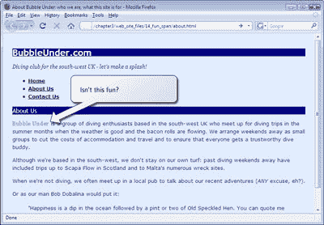

# 学习 HTML 和 CSS:绝对的初学者指南文章

> 原文：<https://www.sitepoint.com/html-css-beginners-guide-19/>

##### 类别选择器

到目前为止，我们已经讨论了样式化各种元素的方法，比如段落和标题；我们还看到了如何使用`id`属性对页面特定区域的元素进行样式化。然而，实现宽刷样式，比如将所有`p`元素的文本着色为海军蓝，是一种非常笼统的设计方法。如果您希望其中的一些段落(或任何元素，就此而言)看起来与其他段落略有不同，该怎么办？*班级选择器*就是答案。

一个类选择器允许你定义一个样式，这个样式可以被反复使用来设计许多不同的元素。例如，假设您想要突出文本的某些部分，使它们看起来比文档的其他部分更吸引人或更有趣。

您可以在 CSS 中这样做:

。趣味{
color:# 339999；
font-family: Georgia，Times，serif
字母间距:0.05em
}

这里，我们为名为“fun”的类创建了一个样式规则它是一个类选择器的事实由类名开头的句点表示。我们在这条规则中加入了另一个属性:`letter-spacing`定义了每个字母之间的间距。我们在这里设置了间距`0.05em`。`1em`是任意字体中 M 字符的高度，所以`0.05em`是该高度的 5%。这听起来没有太大的区别，但当涉及到排版时，微妙的变化通常比极端的修改更有效。

一旦样式被添加到您的样式表中，为了使用它，您需要做的就是将`class="fun"`属性添加到元素中:

一个男人走进一家酒吧；你可能会认为他已经预见到了！< /p >

让我们将一些类应用到我们的项目站点。首先，我们需要将上面显示的样式规则添加到我们正在处理的样式表中:

*   打开`style1.css`并将上面块中的 CSS 添加到该文件的底部。
*   保存`style1.css`，然后打开`about.html`。
*   找到包含在`blockquote`元素中的段落。
*   将`class="fun"`属性添加到段落的开始标记中。

您的标记现在应该是这样的:

**`about.html`(节选)**

> < p **class = "fun"** > "Happiness is a dip in the sea, followed by a cup or two of
> old spotted hens. You can quote me on
> ! " < /p > T6 < /block quote >

请注意，`class`属性应用于段落级别。如果我们的人 Bob 的引语中有几段话，可能是这样的:

> < p **class = "fun"** > "Happiness is a dip in the sea and then a cup or two of
> spotted old hens. You can quote me
> ! 

> < P **class = "fun"** > "Join us and spend a weekend at our favorite diving spot. You will soon make new friends. 

> < p **class = "fun"** > "Anyway, I should do something serious!" < /p > T15 < /block quote >

里面有很多重复。肯定有更整洁的方式来应用这种风格吗？肯定有:

快乐是在大海里泡一泡，然后喝一两杯有斑点的老母鸡。你可以引用我的话！< /p >
< p >“加入我们，在我们最喜欢的潜水点度过一个周末，你很快就会交到新朋友。“不管怎样，是时候我该开始做些正常的工作了！”
T8</block quote>

在这个例子中，我们将`fun`的`class`应用于`blockquote`元素，因此该元素中包含的所有内容都继承了父容器的样式。这使我们不必在整个页面上应用这些不同的类(这种苦恼被称为 class-itis——div-itis 的一个不太远的关系，我们在前面讨论过)。

##### 提示:`class` vs `id`

到目前为止，我们已经看了两个选择器(涉及句点: ".")和`id`选择器(涉及到井号或散列符号:“#”)。你被他们迷惑了吗？诚然，这些选择器是相似的，但有一个重要的区别: *一个特定的 id 只能应用于一个 XHTML 元素*。例如，在任何网页上，只能有一个元素的`id`为`mainnavigation`，并且只能有一个元素的`id`为`header`。另一方面，一个类可以根据需要出现多次。

*提示:将类限制到特定元素*

*假设您想要斜体化任何具有值为`fun`的`class`属性的`blockquote`元素，但不斜体化具有该类值的其他元素。觉得听起来很棘手？用 CSS 不行！看一看:*

。fun {
font-family: Georgia，Times，serif
颜色:# 339999；
字母间距:0.05em
}

block quote . fun {
font-style:italic；
}

 *现在，一对`<blockquote class="fun">`和`</blockquote>`标签内的任何文本都将以斜体显示。*

*通过在普通的类选择器前面加上一个元素名，我们告诉浏览器将下面的声明只应用于元素和类的组合。就像`*`element`* 一样简单。 *`class`*` ，但是一定不要留任何空格！*

*提示:具体来说*

*眼尖的人会注意到，上例中的`fun`风格并没有全部应用到报价中。`font-family`和`letter-spacing`声明生效，但颜色变化不会生效！其原因可以用*的概念*特异性*来解释。

*特殊性简单地说就是最具体的规则就是所应用的规则。确定哪个规则是最具体的有点复杂，但是可以理解。在我们的样式表中，特殊性很容易确定:`.fun`规则应用于`blockquote`元素，属性由`p`元素继承，但是属性值仅在没有任何其他声明的情况下被继承。在我们的项目站点中有另一个颜色声明——我们在本章开始时创建的声明，声明所有段落都应该是海军色:*

p {
颜色:藏青色；
}

*带有元素选择器`p`的规则对`p`元素有更大的特异性，因为选择器专门针对`p`元素，而`.fun`规则没有。然而，想象一下，如果我们像这样添加另一个规则:*

。趣味 p {
颜色:绿色；
}

*效果是这样的:除了带有`class` `fun`的元素内的段落是绿色的以外，所有的段落文本都是深蓝色的。这是因为`.fun p`选择器对于那些段落来说更加具体。请注意，与我们在“哪条规则有效？”一节中遇到的冲突规则不同样式规则之间的斗争与它们在样式表中出现的顺序无关。*

具体性可能会令人困惑，所以不要为此失去太多的睡眠——现在，仅仅意识到这个概念就足够了，因为这可能是你的一种风格在你确信它应该生效时却没有生效的原因。[如果您想进一步探索，SitePoint CSS 参考资料](https://reference.sitepoint.com/css/specificity/)中对特异性进行了深入介绍。

##### 使用`span`设置部分文本的样式

因此，一个类可以应用于许多不同的地方——也许是一个特定的段落，或者是包含在一个`blockquote`中的几个段落的块，或者是包含许多不同类型内容的一个`div`。但是，如果您想将该样式应用于一个非常小的文本部分，可能只是一个段落中的几个单词，甚至几个字母，您会怎么做呢？为此，您可以再次使用`span`元素。

在本章的前面，我展示了如何将`span`元素与内联样式结合使用来挑选段落中的特定单词并对其进行样式化。完全相同的技术可以用于类:我们简单地在我们希望样式开始的地方放置一个开始的``标签，在样式应该结束的地方放置一个结束的``标签。当然，这种技术相对于前面演示的内联样式的优势在于，使用这种技术，样式是在一个位置定义的，因此您可以轻松地将“fun”类添加到许多不同页面上的许多不同元素中。当你决定要有一种不同的乐趣时(可以这么说)，你只需要改变你的样式表(`style1.css`)，新的风格就能在你的站点上得到反映:

**Bubble Under**是一群住在英国西南部的潜水
爱好者，他们会在天气好、
培根卷流淌的夏季聚会潜水
旅行。我们以小组形式安排周末外出，以降低住宿和旅行成本，并确保每个人都有一个值得信赖的潜水伙伴。< /p >

尝试将 span 元素应用到“关于我们”页面，如上面的 XHTML 代码所示。如果您保存更改并在浏览器中检查它们(记得点击重新加载)，您的页面应该如下所示。

***注:不要把`span` s 扔进作品***

*`span`元素几乎总是与类属性一起使用。通常没有很好的理由将一个`span`元素单独应用到你的 XHTML 中，尽管你可能会看到一些网站这样做。*

*在你将`span`应用到网页上的任何给定元素之前，花点时间想想是否有另一个元素更适合这个任务。例如，不这样做是明智的:*

现在就做！

*更合适的选择是使用`strong`元素:*

现在就做**！**

 ***思考你所写内容的含义，并选择一个符合目的的 XHTML 元素。其他的例子可能是`em`、`cite`和`blockquote`。*

##### 摘要

又是忙碌的一章，但是我的天啊，我们的网站是多么的繁荣啊！一两章前，我们甚至还没有构建一个 web 页面，但是现在我们已经知道如何使用类选择器对页面上的任何类型的 XHTML 元素、web 页面的特定部分(取决于它的`id`)或页面的任意部分(有时在几个不同的位置)应用(虚拟的)绘画。

网站开始看起来更加丰富多彩，但是布局仍然相当简单。在下一章，我们将看看如何使用 CSS 改变页面上元素的布局——它们的位置、形状、大小等等。

样式文本？去过那里，做过那个。让我们进入下一个阶段！为此，你需要自己的一份 [*使用 HTML&【CSS*](https://www.sitepoint.com/books/html1/)建立自己的网站。在关于 CSS 的下一章之后，我们将探讨在网站上使用图像的任务、表格的适当使用、构建促进用户交互的表单、将网站发布到 web、在网站上添加博客，以及连接到现成的工具，如统计包、搜索功能和可以应用到网站的论坛。正如我提到的，这本书附带了一个完整的代码档案，所以您可以将我们在书中使用的文件直接应用到您自己的站点中(使生活变得简单，嗯？).

查看[这本书的目录](https://www.sitepoint.com/books/html2/toc.php)了解细节。我期待着很快在网上看到你的网站！

**Go to page:** [1](https://sitepoint.com/html-css-beginners-guide) | [2](https://sitepoint.com/html-css-beginners-guide-2/) | [3](https://sitepoint.com/html-css-beginners-guide-3/) | [4](https://sitepoint.com/html-css-beginners-guide-4/) | [5](https://sitepoint.com/html-css-beginners-guide-5/) | [6](https://sitepoint.com/html-css-beginners-guide-6/) | [7](https://sitepoint.com/html-css-beginners-guide-7/) | [8](https://sitepoint.com/html-css-beginners-guide-8/) | [9](https://sitepoint.com/html-css-beginners-guide-9/) | [10](https://sitepoint.com/html-css-beginners-guide-10/) | [11](https://sitepoint.com/html-css-beginners-guide-11/) | [12](https://sitepoint.com/html-css-beginners-guide-12/) | [13](https://sitepoint.com/html-css-beginners-guide-13/) | [14](https://sitepoint.com/html-css-beginners-guide-14/) | [15](https://sitepoint.com/html-css-beginners-guide-15/) | [16](https://sitepoint.com/html-css-beginners-guide-16/) | [17](https://sitepoint.com/html-css-beginners-guide-17/) | [18](https://sitepoint.com/html-css-beginners-guide-18/) | [19](https://sitepoint.com/html-css-beginners-guide-19/)**

## **分享这篇文章**