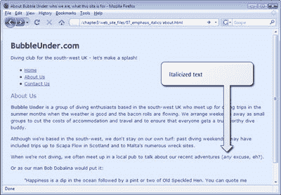
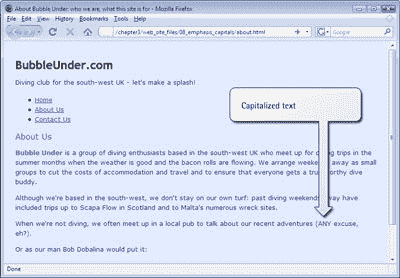
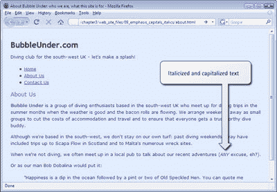

# 学习 HTML 和 CSS:绝对的初学者指南文章

> 原文：<https://www.sitepoint.com/html-css-beginners-guide-16/>

##### 初学者的风格选择调色板

我们已经看了一些可以通过 CSS 应用到你的网页上的样式的例子，但是我们看到的例子是一个大杂烩(而且是故意的)。你可以从中挑选更多的东西——事实上，可能性太多了，我们无法在这里一一列出。但是，本节列出了一些您可能想尝试的基本属性和值。请随意在您的 CSS 文件中尝试这些方法。请注意，我们将在后续章节中添加到这个列表中；绝非面面俱到！

**颜色，背景色**

正如我们所见，这两个属性都可以接受颜色关键字(例如，`red`、`blue`或`green`)或十六进制颜色规范，如`#ff0000`。

**font-family**

该属性接受一个字体名称列表，其中包含您按照偏好顺序选择的任何字体。确保提供用户计算机上可能有的选项(例如 Arial、Verdana 等。).这个列表应该使用任何支持 CSS 的浏览器都能识别的“通用”CSS 字体，如`serif`或`sans-serif`。

**字号**

该属性可以是以下任何一种:

*字号关键字*

*   `xx-small`
*   `x-small`
*   `small`
*   `medium`
*   `large`
*   `x-large`
*   `xx-large`

*相对字体大小*

*   百分比(例如`140%`)
*   电磁单位(如`1.2em`；`1em`等于 M 字体字符的高度)

*固定字体大小*

*   像素(如`20px`)
*   点(如`12pt`，您可能习惯在 Microsoft Word 中使用)

固定字体大小并不总是一个好主意，因为它们不容易放大或缩小以适应读者的需求。相对字体大小肯定是首选。

**字体粗细**

粗体或`normal`

**字体样式**

正常或`italic`

**文字装饰**

无、`underline`、`overline`或`line-through`

提示:备份它！
 *在您尝试使用上面的 CSS 属性之前，最好备份一下您的 CSS 文件，以防遇到困难。请记住，如果您不小心损坏了 CSS 文件，您可以从代码归档中下载本章中使用的所有示例。如果出现这种情况，不用担心！这都是学习过程的一部分，你可以确定没有动物会在这个过程中受到伤害。*

##### 回顾:到目前为止的时尚故事

让我们给自己一点时间思考。我们的网站现在拥有一个 CSS 文件，使用了一系列吸引人的样式。我们处在一个令人羡慕的位置，可以通过改变一个 CSS 文件来改变网站。让我们尝试在网页上设计更多的元素。

##### 改变重点

*   在文本编辑器中打开`about.html`。
*   Find the paragraph about meeting up in a local pub and add an emphasis element as shown here:

    `
And when we're not diving, we often meet up in a local pub                
       to talk about our recent adventures (**<em>**any**</em>** excuse,                
       eh?).
`

*   Save the page, then view it in your web browser; it should appear as shown below. As you can see, emphasis elements appear in italics by default. We’re going to use CSS to change that default style.

    

*   Open `style1.css` (if you haven’t already opened it for editing) and add the following rule below the others:

    `em {                
     font-style: normal;                
     text-transform: uppercase;                
    }`

*   Save the CSS file, then refresh your browser’s view of the About Us page. Does your page look like the figure below?

    

现在，无论何时你添加一个`em`元素到你站点的任何网页上(假设该网页链接到`style1.css`)，强调的文本将以大写字母出现，而不是斜体。但是这提出了一个有趣的问题:什么时候你应该为你自己选择的风格覆盖浏览器的默认风格？想必，浏览器使用的默认样式是经过精心挑选的；你如何确定重新定义风格是一个好主意？斜体不是一种适合强调的样式吗？他们可能是。正如他们在蜘蛛侠电影中所说，“权力越大，责任越大”，所以一定要小心谨慎。仅仅因为你*可以*改变默认的风格并不意味着你应该这样做。

也许妥协是必要的。让我们改变强调，使它仍然是斜体，但也出现在大写字母。我们需要做的就是删除`font-style`声明；然后,`em`元素将恢复到默认的斜体外观，如下所示:

em {
text-transform:大写；
}

提示:强调还是斜体？

*你可能会问自己，“如果我想要一个斜体字体，我不能使用斜体元素吗？”事实上，HTML 为此提供了一个`i`元素，但是不推荐使用它。为什么不呢？嗯，将文本标记为`i`并不能说明它的含义；`i`只传达应该如何在屏幕上呈现。这种元素被称为* *表示性* HTML 元素，应该避免使用。同样，另一个旧的 HTML 元素`b`也不应该使用。首选是使用`strong`，或者，如果你只想用粗体显示标题，使用 CSS。

 *这为什么重要？当你在网页浏览器中看到斜体文本时，这似乎没什么大不了的。但是想象一下，如果你是盲人，你用软件大声朗读网页给你听，而不是显示在屏幕上。这个程序(称为* *屏幕阅读器*)可能会稍微加重阅读用`em`元素标记的文本，用更有力的声音阅读用`strong`标记的文本(当然，这取决于所使用的屏幕阅读器)。但是它会如何处理标有`i`或`b`的文本呢？好吧，这些元素对文本的意义没有任何说明，所以它不会以任何特殊的方式对待它们——因此潜在地失去了你试图传达的意义。搜索引擎(如谷歌、雅虎)*也可能*更重视出现在`strong`元素中的用户搜索词，而不是`b`元素中的用户搜索词(尽管搜索引擎公司从未透露任何关于其搜索算法如何工作的可靠信息！).

*另一个你可能会看到其他人使用，但* *永远不要*复制的表象标签是`u`元素。用这个包围一些文本，会出现不必要的下划线，只会让用户感到困惑。这是因为在网页中，带下划线的文本通常表示一个链接——而`u`元素肯定不是！

**Go to page:** [1](https://sitepoint.com/html-css-beginners-guide) | [2](https://sitepoint.com/html-css-beginners-guide-2/) | [3](https://sitepoint.com/html-css-beginners-guide-3/) | [4](https://sitepoint.com/html-css-beginners-guide-4/) | [5](https://sitepoint.com/html-css-beginners-guide-5/) | [6](https://sitepoint.com/html-css-beginners-guide-6/) | [7](https://sitepoint.com/html-css-beginners-guide-7/) | [8](https://sitepoint.com/html-css-beginners-guide-8/) | [9](https://sitepoint.com/html-css-beginners-guide-9/) | [10](https://sitepoint.com/html-css-beginners-guide-10/) | [11](https://sitepoint.com/html-css-beginners-guide-11/) | [12](https://sitepoint.com/html-css-beginners-guide-12/) | [13](https://sitepoint.com/html-css-beginners-guide-13/) | [14](https://sitepoint.com/html-css-beginners-guide-14/) | [15](https://sitepoint.com/html-css-beginners-guide-15/) | [16](https://sitepoint.com/html-css-beginners-guide-16/) | [17](https://sitepoint.com/html-css-beginners-guide-17/) | [18](https://sitepoint.com/html-css-beginners-guide-18/) | [19](https://sitepoint.com/html-css-beginners-guide-19/)

## 分享这篇文章