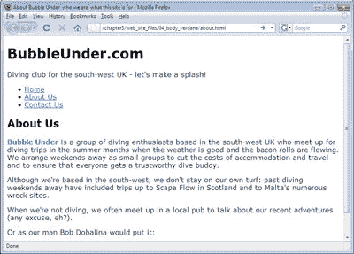
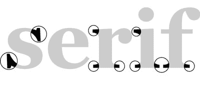
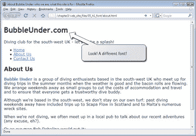

# 学习 HTML 和 CSS:绝对初学者指南

> 原文：<https://www.sitepoint.com/html-css-beginners-guide-14/>

## 开始构建我们的样式表

样式表已经可以使用了:它保存在正确的位置，并且所有的网页(总共三个)都正确地链接到它。我们需要做的就是设置一些样式。

人们通常对网站默认样式的第一个改变是改变所使用的字体。在 Windows 上，大多数浏览器默认使用 Times New Roman 这是我们目前看到的所有屏幕截图中使用的字体。然而，对许多人来说，它有点乏味，可能是因为这种字体比其他字体用得更多。使用 CSS 的`font-family`属性改变字体非常容易。

使用它的最佳位置是在`body`元素中，如下所示:

/*
CSS 为泡沫下的网站
*/
正文{
font-family:Verdana；
}

在这里，我选择使用 Verdana 字体。它被应用于`body`元素，因为`body`包含了你将在网页上看到的所有元素。CSS 应用方式的本质意味着`body`元素中包含的每个元素都将采用相同的字体(除非在`body`中为给定的一个或多个元素指定了另一种字体——稍后会详细介绍)。

太好了:那就 Verdana 吧！但是…如果一些浏览你网站的人没有在他们的电脑上安装 Verdana 怎么办？嗯，这是个棘手的问题。简而言之，浏览器会对应该使用哪种字体做出最好的猜测，但我们不必让浏览器做所有的猜测(T2)。属性允许我们按照自己喜欢的顺序输入多种字体。因此，我们可以键入以下内容:

字体系列:Helvetica，宋体，无衬线字体；
}

意思是:“请将我的网页正文中的所有内容都设计成 Verdana 字体。如果不行，请尝试使用 Helvetica，如果不行，请使用 Arial。如果以上都没有安装，就使用任何可用的无衬线字体。”

我们将在潜水网站中使用这些字体，所以让我们打开样式表文件，使用一些 CSS。

*   将上述 CSS 键入`style1.css`。
*   保存文件，然后在浏览器中打开主页(`index.html`)。

如果一切按计划进行，您的 web 页面(实际上是全部三个页面)的显示应该与之前略有不同。下图显示了我们新设计的主页的外观。

*提示:无衬线字体:更适合在屏幕上观看*

衬线字体是在每个字母的末端都有那些小花饰的字体。这些花饰，如下图所示，“突出一个衬线字体的衬线(格鲁吉亚)”，被称为 *衬线*。它们非常适合阅读印刷材料，因为它们使文字有一点形状，使它们更容易阅读。

然而，在屏幕上，衬线字体可能会变得有点乱，尤其是当它们用于较小的字体时——屏幕上没有足够的像素来完成这些小的华丽。出于这个原因，你会注意到许多网站使用 *无衬线*字体(来自法语，翻译为“无衬线”)，字体大小设置得很小。
 *注意，在 CSS 中引用无衬线字体时，必须用连字符将两个字连起来，即`sans-serif`。*

## 时髦的标题

我们将设计的第一个元素是我们的第一级标题，由`h1`元素表示。让我们在 CSS 文件中添加一些规则，看看对于这些标题有什么可能。在您的文本编辑器中，将以下内容添加到`style1.css`:

h1 {
font-family:“投石机 MS”，Arial，Helvetica，无衬线；
}

保存 CSS 文件并在浏览器中刷新主页视图。你能看出有什么变化吗？所有一级标题现在都以 Trebuchet MS 字体显示，而其他所有内容都以 Verdana 字体显示。

我们选择的字体是另一种无衬线字体，但它的不同足以为段落提供大量的对比。

### 注意:有些字体名称需要加引号

在上面的代码示例中，“Trebuchet MS”出现在引号中。除非字体由几个单词组成，如“Courier New”或“Times New Roman”，否则不需要在字体名称周围加上引号单个单词的字体名称，如 Arial 或 Verdana，不需要用引号括起来。

快速浏览网站的所有三个页面，您会发现您的新样式已经应用到所有的网页。让我们更进一步。

*提示:怎么回事？什么都没变！*

如果您尝试刷新浏览器的页面视图，但没有任何变化，首先检查您是否保存了对 CSS 文件所做的更改。如果您已经保存了修改后的文件，请检查您是否完全按照描述键入了 CSS。如果是这样，您的浏览器可能会遇到缓存问题。

网络浏览器会“缓存”一些内容。 *缓存*是当你访问一个给定的网页时，你的浏览器访问先前保存在硬盘上的文件，而不是每次都下载新文件。例如，您输入 URL，浏览器会提取存储在其缓存中的页面。这加快了显示之前已经加载的网页的过程。不幸的是，您的缓存很快就会过时，当这种情况发生时，您访问的页面可能不会显示最新的数据。

这种情况在图像中最常见，但在 CSS 文件中也会发生。好消息是你可以控制浏览器的缓存设置。因此，在用较新的数据替换缓存内容之前，可以调整缓存在硬盘上占用的空间量。你可以在你的浏览器设置中搜索“缓存”或“临时网络文件”来改变这些设置；然而，大多数用户选择将他们的缓存保留为默认设置。

如果您确信已经正确地对 CSS 文件进行了必要的更改(并保存了它们),您可能需要在浏览器中强制重新加载 CSS 文件。

*要解决缓存问题并强制浏览器检索 CSS 文件的最新版本，只需按住 **Shift** 键并点击浏览器工具栏上的刷新(或重新加载)图标。*

**Go to page:** [1](https://sitepoint.com/html-css-beginners-guide) | [2](https://sitepoint.com/html-css-beginners-guide-2/) | [3](https://sitepoint.com/html-css-beginners-guide-3/) | [4](https://sitepoint.com/html-css-beginners-guide-4/) | [5](https://sitepoint.com/html-css-beginners-guide-5/) | [6](https://sitepoint.com/html-css-beginners-guide-6/) | [7](https://sitepoint.com/html-css-beginners-guide-7/) | [8](https://sitepoint.com/html-css-beginners-guide-8/) | [9](https://sitepoint.com/html-css-beginners-guide-9/) | [10](https://sitepoint.com/html-css-beginners-guide-10/) | [11](https://sitepoint.com/html-css-beginners-guide-11/) | [12](https://sitepoint.com/html-css-beginners-guide-12/) | [13](https://sitepoint.com/html-css-beginners-guide-13/) | [14](https://sitepoint.com/html-css-beginners-guide-14/) | [15](https://sitepoint.com/html-css-beginners-guide-15/) | [16](https://sitepoint.com/html-css-beginners-guide-16/) | [17](https://sitepoint.com/html-css-beginners-guide-17/) | [18](https://sitepoint.com/html-css-beginners-guide-18/) | [19](https://sitepoint.com/html-css-beginners-guide-19/)

## 分享这篇文章