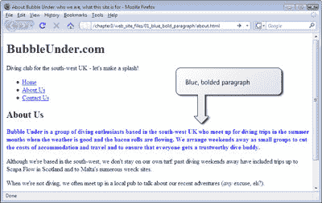
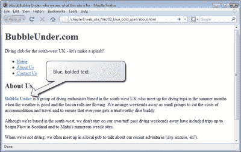
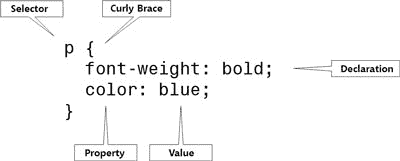

# 学习 HTML 和 CSS:绝对初学者指南

> 原文：<https://www.sitepoint.com/html-css-beginners-guide-12/>

## 添加内联样式

在文本编辑器中打开`about.html`，添加一个内嵌样式。我们希望将“关于我们”标题后的第一段中的文本设为粗体和蓝色。创建样式时，请参考前面的示例。

你的段落的标记看起来像这样吗？

style = " color:blue；font-weight:bold；" > Bubble Under 是一群来自英国西南部的
潜水爱好者，他们在天气
和培根卷流动的夏季几个月里聚在一起
进行潜水旅行。我们把周末安排成小团体，以减少住宿和旅行费用，并确保每个人都有一个值得信赖的潜水伙伴。< /p >

如果您的标记看起来像这里显示的，保存`about.html`并在您的浏览器中查看它。它应该显示如下所示的页面。

## `span`元素

你可以很容易地像这样给整个段落上色，但通常情况下，你会想在一个段落中挑出特定的单词来突出显示。您可以使用一个`span`元素来实现这一点，该元素可以包装您喜欢的任何内容。与表示段落的`p`或表示引用的`blockquote`不同，`span`没有任何意义。一个`span`不过是一个工具，用来突出显示你想要应用样式的部分的开始和结束。[4]与其把整段文字都变成蓝色，不如把开头的两个词“泡在下面”变成蓝色加粗。下面是我们如何使用`span`元素来实现这一点:

**
**是一群居住在英国西南部
的潜水爱好者，他们在夏季
月份天气好、培根卷飘香的时候聚在一起进行潜水旅行。我们以小组形式安排周末外出，以减少住宿和旅行成本，并确保每个人都有一个值得信赖的潜水伙伴。< /p >

当我们在浏览器中查看该标记时，我们会看到如下所示的显示。

让我们快速看一下应用内联样式的其他方法(别担心，这不是我们项目网站的一部分；随意实验)。

敏捷的棕色狐狸跳过了
懒狗。< /p >

毫不奇怪，CSS 声明将使段落中所有文本都变成斜体。下面是另一个例子，其中`span`用于突出显示特定的单词:

快速的棕色狐狸**** 跳过 **< /span >** 懒狗。< /p >

## 嵌入样式

内联样式是将一些 CSS 效果应用到文档特定部分的一种简单快捷的方法，但这不是设计页面样式的最佳方法。如果你能在一个地方设置样式，而不是每次你想用的时候都要把它们打出来，那不是更好吗？

*嵌入式样式表*是一个合乎逻辑的进步。一个*嵌入的样式表*是你添加到网页开始的一个部分，它列出了将在那个页面上使用的所有样式。为此，您需要在`head`中使用`style`元素:

< title >泡下——西南潜水俱乐部
英国</title>
<meta http-equiv = " Content-Type "
Content = " text/html；charset = utf-8 "/>
**`标签结束。实际的样式声明包含在一组*花括号* : `{`和`}`中。出现在第一个花括号前的`p`告诉浏览器样式规则是针对什么元素的；在本例中，我们将每个`p`元素中的文本设为粗体。`p`被称为*选择器*，它是一个很好的工具，可以快速方便地改变页面上许多元素的外观。选择器指示浏览器将花括号之间的所有声明应用于某些元素。选择器、花括号和声明组合在一起形成了所谓的*规则*。

在这种情况下，我们的样式表包含一条规则:“请设置本页所有段落的样式，以便文本以粗体显示。”

如果我们愿意，我们可以在规则中添加更多的声明。例如，如果我们想将文本加粗并变成蓝色，我们可以将声明`color: blue`添加到规则中:

## 行话突破

好吧好吧。到目前为止，已经有很多行话了。让我们回顾一下:

图 3.3。对规则的剖析

## 为什么嵌入样式比内嵌样式更好

在图 3.3 提供的例子中，“规则的剖析”，所有段落中的文本将以蓝色粗体显示。这很有用，因为它让你不必在每次开始一个新段落时都键入`
`——这明显优于内嵌样式。

如果您想将所有段落文本的颜色更改为红色，只需在页面顶部的样式表中进行更改:

这就是你的效率。因此，嵌入式样式表是对内联样式的显著改进。但是如果你有一个包含很多页面的网站呢？如果您想对整个站点进行更改，按照我上面演示的方式使用嵌入式样式表仍然不是完美的解决方案。为什么不呢？因为，要进行站点范围的更改，您必须编辑该站点每个页面上的嵌入样式表。最好的解决方案是使用外部样式表。

**Go to page:** [1](https://sitepoint.com/html-css-beginners-guide) | [2](https://sitepoint.com/html-css-beginners-guide-2/) | [3](https://sitepoint.com/html-css-beginners-guide-3/) | [4](https://sitepoint.com/html-css-beginners-guide-4/) | [5](https://sitepoint.com/html-css-beginners-guide-5/) | [6](https://sitepoint.com/html-css-beginners-guide-6/) | [7](https://sitepoint.com/html-css-beginners-guide-7/) | [8](https://sitepoint.com/html-css-beginners-guide-8/) | [9](https://sitepoint.com/html-css-beginners-guide-9/) | [10](https://sitepoint.com/html-css-beginners-guide-10/) | [11](https://sitepoint.com/html-css-beginners-guide-11/) | [12](https://sitepoint.com/html-css-beginners-guide-12/) | [13](https://sitepoint.com/html-css-beginners-guide-13/) | [14](https://sitepoint.com/html-css-beginners-guide-14/) | [15](https://sitepoint.com/html-css-beginners-guide-15/) | [16](https://sitepoint.com/html-css-beginners-guide-16/) | [17](https://sitepoint.com/html-css-beginners-guide-17/) | [18](https://sitepoint.com/html-css-beginners-guide-18/) | [19](https://sitepoint.com/html-css-beginners-guide-19/)

## 分享这篇文章