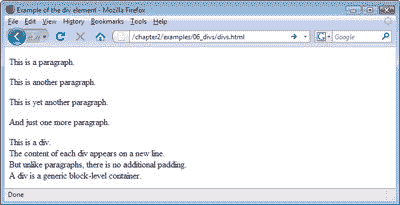
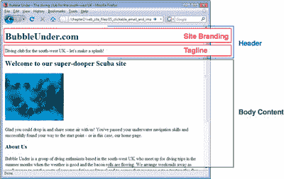

# 学习 HTML 和 CSS:绝对初学者指南

> 原文：<https://www.sitepoint.com/html-css-beginners-guide-9/>

## 添加结构

段落？没问题。标题？你已经把他们牢牢控制住了。事实上，您现在已经熟悉了网页的基本结构。到目前为止，我们所讨论的一小部分标签很容易记住，因为它们的目的很明显(记住:`p` = paragraph)。但是`div`到底是什么？

一个`div`被用来划分一个网页，这样做是为了提供一个明确的结构，当与 CSS 结合使用时，这个结构可以发挥很大的作用。

当您将内容放在`div`中时，它对所包含的文本的样式没有影响，除了它在所包含的文本前后添加了一个分隔符。与`p`元素不同，`div`不添加任何边距或填充。比较以下内容:

这是一段。

< p >这是另外一段。< /p >< /p >
< p >还有一段。

这是一个 div。< /div >
< div >每个 div 的内容出现在新的一行。< /div >
< div >但与段落不同的是，没有额外的填充。

div 是一个通用的块级容器。< /div >

区别可以从下面看出来。

`div`的目的是将一个网页分成不同的部分——一个没有样式的基本结构框架——而`p`应该用来创建一段文本。

*重要提示:按预期使用元素*

不要将 XHTML 元素用于非预期目的。这确实是一条黄金法则。

与其让段落标签保持原样，您可能会决定使用如下内容:

< p >这是一个 div 里面的段落。< /p >
< p >原来如此。< /p >

在那个`div`元素中可以有任意多的段落，但是注意不能将`div`元素放在段落中。把一个`div`想象成一个容器，用来把相关的项目组合在一起，这是不会错的。

如果我们在浏览器中查看我们的主页，就有可能识别出具有特定用途的区域。下面列出了这些。我们有:

*   包含以下内容的标题区域:
    *   网站名称
    *   标语
*   正文内容的区域

以我们一直在做的主页(`index.html`)为例，在你选择的文本编辑器中，在图 2.19 中建议的部分周围添加`
`和`
`标签，“注意基本网页中不同的部分”。当您添加这些`div`时，为每个添加一个`id`属性，适当地分配名称`header`、`sitebranding`、`tagline`和`bodycontent`。请记住，属性名应该用小写字母书写，它们的值应该包含在引号内。

*重要提示:禁止共享`id` s*

*`id`属性在 XHTML 中被用来惟一地标识元素，所以没有两个元素应该共享同一个`id`值。当您通过 CSS 或 JavaScript 处理元素时，您可以稍后使用这些`id`。*

### 注:`h1`、`header`、`head`

设置为`header`的`id`属性不应该与页面上的标题(`h1`、`h2`等等)混淆；它也不同于你的 HTML 页面的`head`。属性`id=`很容易被命名为`topstuff`或`pageheader`。这并不重要，只要属性名描述了该页面部分的*目的*给一个人类伙伴(或者给你 12 个月后的自己，并且已经忘记了当时你在想什么！).

为了让你开始，我在这一页的第一部分做了一些工作。在下面的代码片段中，该部分被更改为具有`id`属性的`div`:

例 2.12。`index.html`(节选)

**
**
<h1>BubbleUnder.com</h1>

英国西南部的潜水俱乐部——让我们来制造轰动吧！

T5
！–标题 div 的结尾->

现在，尝试做同样的事情:将`div` s 应用到我们已经确定为“网站品牌”和“标签行”的内容部分

## 嵌套解释

我们已经知道`div`可以包含段落，但是一个`div`也可以包含多个其他的`div`，这叫做*嵌套*。这并不复杂，只是将一个 div 放入另一个 div 中，并确保您的结束标记正确。嵌套元素有助于在逻辑上将网页的各个部分组合在一起，就像您在现实世界中通过将包含相似项目的小盒子放入一个大盒子中所做的那样。

第一个嵌套 div 内的一个段落。

第二个嵌套 div 内的一个段落。

如图 2.19 所示，“注意基本网页中的不同部分”，一些嵌套正在发生:“网站品牌”和“标签行”嵌套在“标题”中。

## 被分割的页面:全部被分割

一切正常，您的 XHTML 现在应该是这样的:

" https://www . w3 . org/TR/XHTML 1/DTD/XHTML 1-strict . DTD ">
<html>
<head>
<title>泡下——西南潜水俱乐部
英国</title>
<meta http-equiv = " Content-Type "
Content = "下 charset = utf-8 "/>
</head>
<body>
**
**
**div id = " site branding ">**
<h1>BubbleUnder.com</h1>
**
**

**
**

<！–end of header div->
**
**
<H2>欢迎来到我们的超级潜水爱好者潜水地点</H2>

<H3>关于我们</H3>

Bubble Under 是一群总部设在英国西南部
的潜水爱好者，他们在
夏季天气好、腊肉
卷流动的时候聚在一起进行潜水旅行。我们以小组形式安排周末外出，以降低住宿和旅行成本，并确保每个人都有一个值得信赖的潜水伙伴。虽然我们位于西南部，但我们不会呆在自己的地盘上:过去的周末外出潜水包括去苏格兰的斯卡帕湾和马耳他的众多沉船遗址。当我们不潜水的时候，我们经常在当地的酒吧见面谈论我们最近的冒险(任何借口，嗯？).

<H3>联系我们</H3>

如需了解更多信息，请联系俱乐部秘书鲍勃·多巴琳娜，电话:
01793 641207 或
<a href = " mailto:Bob @ bubble under . com ">电子邮件:
bob@bubbleunder.com</a>

**
<！–body content div->**
</body>
</html>

*提示:缩进你的标记*

*当在网页上嵌套元素时，缩进你的标记是一个好主意，正如上面的`div`部分中的项目所演示的。缩进代码有助于以后解决问题，因为您可以更清楚地看到哪些项位于其他项中。请注意，缩进只对查看源代码标记的人(可能只有您)有用。它不影响浏览器解释或显示网页的方式。*

注意，在上面的标记中，注释出现在一些结束的`div`标记之后。这些注释是可选的，但是同样，注释是一个好习惯，因为它有助于您以后解决问题。通常，不可能同时在同一个窗口中查看开始和结束的`
`标签，因为它们包含在大块的 XHTML 中。如果你有几个嵌套的`
`标签，你可能会在你的标记的末尾看到这样的内容:

在这种情况下，您可能会发现很难确定在每个点上哪个`div`被关闭。可能还不清楚为什么这很重要或有用，但是一旦我们开始使用 CSS 来设计我们的页面，XHTML 中的错误就会产生影响。到处添加一些注释确实可以帮助您以后进行调试。

< /div > <–嵌套 div 结束->

<！–外部 div 的结尾—>

网页看起来怎么样？好吧，我们这次不包括屏幕截图，因为添加那些`div`元素不会产生任何视觉差异。我们刚才所做的更改是结构性的，我们将在以后继续进行。

*表现出一点克制*

*不要过分添加`div` s。有些人可能会在他们分割页面时忘乎所以，到处都是`
`标签。过度热情地使用`div`会导致一种被称为`div` -itis 的情况注意不要仅仅因为可以，就在你的标记中添加多余的`
`标签。*

**Go to page:** [1](https://sitepoint.com/html-css-beginners-guide) | [2](https://sitepoint.com/html-css-beginners-guide-2/) | [3](https://sitepoint.com/html-css-beginners-guide-3/) | [4](https://sitepoint.com/html-css-beginners-guide-4/) | [5](https://sitepoint.com/html-css-beginners-guide-5/) | [6](https://sitepoint.com/html-css-beginners-guide-6/) | [7](https://sitepoint.com/html-css-beginners-guide-7/) | [8](https://sitepoint.com/html-css-beginners-guide-8/) | [9](https://sitepoint.com/html-css-beginners-guide-9/) | [10](https://sitepoint.com/html-css-beginners-guide-10/) | [11](https://sitepoint.com/html-css-beginners-guide-11/) | [12](https://sitepoint.com/html-css-beginners-guide-12/) | [13](https://sitepoint.com/html-css-beginners-guide-13/) | [14](https://sitepoint.com/html-css-beginners-guide-14/) | [15](https://sitepoint.com/html-css-beginners-guide-15/) | [16](https://sitepoint.com/html-css-beginners-guide-16/) | [17](https://sitepoint.com/html-css-beginners-guide-17/) | [18](https://sitepoint.com/html-css-beginners-guide-18/) | [19](https://sitepoint.com/html-css-beginners-guide-19/)

## 分享这篇文章