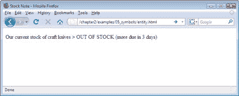
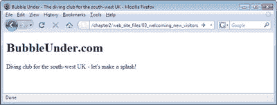
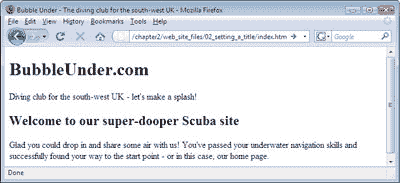

# 学习 HTML 和 CSS:绝对初学者指南

> 原文：<https://www.sitepoint.com/html-css-beginners-guide-7/>

## 标志

有时，您可能需要在网页文本中包含大于号(`>`)或小于号(`<`)。问题是这些符号也被用来表示 XHTML 中的标签。那么，我们能做什么呢？令人欣慰的是，我们可以在文本中使用称为*实体*的特殊小代码来代替这些符号。大于号的实体是`&gt;` —我们可以在文本中用它代替大于号，如下面的简单例子所示。这个标记的结果如下图所示，“浏览器中的`&gt;`实体显示为`>`”。

" https://www . w3 . org/TR/XHTML 1/DTD/XHTML 1-strict . DTD ">
<html>
<head>
<title>股票说明</title>
<meta http-equiv = " Content-Type "
Content = " text/html；charset = utf-8 "/>
</头>
<身>
< p >我们目前库存的工艺刀**&gt；**
缺货(3 天后更到期)

</body>
</html>

在浏览器中"/ >

许多不同的实体可用于各种各样的符号，其中大多数不会出现在您的键盘上。它们都是以&符号(`&`)开始，以分号结束。一些最常见的如下所示:

*   `&gt;`>
*   `&lt;`<
*   `&amp;`&
*   `&pound;`β
*   `&copy;`β
*   `&trade;`

## 潜入我们的网站

到目前为止，我们已经看了一些非常基本的 web 页面，以帮助您轻松地编写自己的 XHTML 标记。也许您已经将它们输入并试用过了，或者您已经从代码档案中提取了页面并在浏览器中运行了它们。也许你甚至尝试过自己做实验——在周围玩耍是件好事。但是，到目前为止，没有一个例子值得保留。你不需要使用这些页面中的任何一个，但是当你开始开发我们将在本书过程中完成的虚构项目时，你将使用我们在其中介绍的思想:一个当地潜水俱乐部的网站。

潜水俱乐部由一群当地的爱好者组成，网站将为俱乐部成员提供一个途径:

*   分享以前潜水旅行的照片
*   随时了解即将到来的潜水旅行
*   提供有关临时会议的信息
*   阅读其他成员的潜水报告和评论
*   宣布俱乐部新闻

该网站还有以下目标:

*   帮助吸引新成员
*   提供其他潜水相关网站的链接
*   提供一个方便的途径来搜寻一般潜水相关的资料

该网站的受众可能并不庞大，但常客和俱乐部成员都非常渴望参与其中。这是一个有趣的网站，人们会想一次又一次地回来，这是一个很好的项目。但是现在还不存在。你现在就要开始建造它。让我们从第一页开始:网站的主页。

## 主页:所有网站的起点

在这一章的最开始，我们看了一个基本的网页，上面什么也没有(没有车身或内饰的汽车底盘)。您将文件保存为`basic.html`。现在在文本编辑器中打开该文件，删除以下内容:

*   包含在开始`<title>`和结束`</title>`标签内的文本
*   开始标签`<body>`和结束标签`</body>`之间的所有内容

将文件另存为`index.html`。

下面是您现在应该看到的标记:

" https://www . w3 . org/TR/XHTML 1/DTD/XHTML 1-strict . DTD ">
<html>
<head>
<title></title>
<meta http-equiv = " Content-Type "
Content = " text/html；charset = utf-8 "/>
</head>
<body>
</body>
</html>

让我们开始建立这个网站，好吗？

## 设置标题

记住我们到目前为止所学的内容，让我们对这个文档做一些修改。试一试以下内容:

*   将页面标题改为“泡泡之下——英国西南部的潜水俱乐部”
*   向页面添加标题，即一级标题，内容为“BubbleUnder.com”
*   紧接着标题之后，添加一段文字:“英国西南部潜水俱乐部——让我们来一次轰动！”(伙计们，这是你们的基本营销口号。)

完成这些更改后，您的标记应该如下所示(更改以粗体显示):

" https://www . w3 . org/TR/XHTML 1/DTD/XHTML 1-strict . DTD ">
<html>
<head>
<title>**泡下—西南潜水俱乐部
英国**</title>
<meta http-equiv = " Content-Type "
Content = " text/html；charset = utf-8 "/>
</head>
<body>
**<h1>BubbleUnder.com</h1>**
**
英国西南部潜水俱乐部——让我们来个
水花四溅！
**
</正文>
< /html >

保存页面，然后双击文件，在您选择的浏览器中打开它。下图显示了它应该是什么样子。

## 欢迎新访客

现在，让我们稍微扩展一下我们的口号。我们将在页面上添加一个欢迎副标题(二级标题)，以及一个介绍性段落:

<h1>BubbleUnder.com</h1>

英国西南部的潜水俱乐部——让我们来制造轰动吧！< /p >
**< h2 >欢迎来到我们的超级潜水爱好者网站</H2>**
**
很高兴你能来和我们一起分享空气！您已经
通过了您的水下导航技能，并成功
找到了到达起点的路——或者在这种情况下，找到了我们的
主页。
**
</正文>

为潜水术语的双关语道歉，它们真的令人畏缩！

*重要:嘿！都去哪了？*

你会注意到，在上面的例子中，我们没有为整个页面重复标记。为什么？因为纸是要花钱的，树是漂亮的，你买这本书也不是为了负重训练。总之，我们不会一直重复所有的标记；相反，我们将把重点放在已经更改或添加的部分。记住:如果你认为你错过了什么，不要担心。您可以在本书的代码档案中找到所有示例。

一旦你添加了副标题和它后面的段落，再次保存你的页面，然后在你的浏览器中再次查看它(或者点击你的浏览器中的刷新/重新加载按钮，或者在你保存它的位置双击文件图标)。您应该会看到如下所示的内容。

所以，这个主页在这个阶段看起来和许多其他主页很像:它有一些基本的介绍性文字来欢迎访问者，但仅此而已。但是这个网站到底是关于什么的呢？或者更准确地说，它建成后会是什么样的？

**Go to page:** [1](https://sitepoint.com/html-css-beginners-guide) | [2](https://sitepoint.com/html-css-beginners-guide-2/) | [3](https://sitepoint.com/html-css-beginners-guide-3/) | [4](https://sitepoint.com/html-css-beginners-guide-4/) | [5](https://sitepoint.com/html-css-beginners-guide-5/) | [6](https://sitepoint.com/html-css-beginners-guide-6/) | [7](https://sitepoint.com/html-css-beginners-guide-7/) | [8](https://sitepoint.com/html-css-beginners-guide-8/) | [9](https://sitepoint.com/html-css-beginners-guide-9/) | [10](https://sitepoint.com/html-css-beginners-guide-10/) | [11](https://sitepoint.com/html-css-beginners-guide-11/) | [12](https://sitepoint.com/html-css-beginners-guide-12/) | [13](https://sitepoint.com/html-css-beginners-guide-13/) | [14](https://sitepoint.com/html-css-beginners-guide-14/) | [15](https://sitepoint.com/html-css-beginners-guide-15/) | [16](https://sitepoint.com/html-css-beginners-guide-16/) | [17](https://sitepoint.com/html-css-beginners-guide-17/) | [18](https://sitepoint.com/html-css-beginners-guide-18/) | [19](https://sitepoint.com/html-css-beginners-guide-19/)

## 分享这篇文章