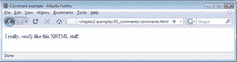
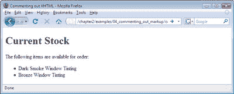

# 学习 HTML 和 CSS:绝对初学者指南

> 原文：<https://www.sitepoint.com/html-css-beginners-guide-6/>

## 评论您的 HTML

回到车库，您正在对您的项目车做一些工作，当您准备用新轮胎替换现有轮胎时，您注意到您的轮毂盖没有用螺栓固定:您只是用强力胶将它们粘在车上。做那件事一定有很好的理由，但是你不记得是什么了。问题是，如果你以前有理由这样安装轮毂盖，你当然应该再次这样做。如果你第一次做的时候给自己留了张便条，解释为什么用强力胶而不是螺栓，那不是很好吗？话又说回来，你的车贴满纸条看起来不会很好看。真是左右为难。

当你创建一个网站时，你可能会发现自己处于类似的情况。你可能建立了一个网站，然后在六个月内不再接触它。然后，当你重新审视这份工作时，你可能会发现自己正经历着再熟悉不过的令人挠头的例行公事。幸运的是，有*有*个解决方案。

XHTML——像大多数编程和标记语言一样——允许使用*注释。*注释非常适合用来记录你所做的事情，尽管它们包含在你的代码中，但是注释不会影响屏幕显示。下面是一个注释示例:

" https://www . w3 . org/TR/XHTML 1/DTD/XHTML 1-strict . DTD ">
<html>
<head>
<title>评论示例</title>
<meta http-equiv = " Content-Type "
Content = " text/html；charset = utf-8 "/>
</head>
<body>

我真的，< em >真的< /em >像这种 XHTML 的玩意儿。
T9**！–使用 em 元素增加了重点。方便的那个。–>**
</body>
</html>

下图显示了在屏幕上看到的页面。

评论必须以`<!--`开头，之后你可以随意键入任何你喜欢的内容作为“自我注释”嗯，你可以自由地键入*几乎*任何东西:你不能键入双破折号。为什么不呢？因为这是评论即将结束的信号——`-->`部分。

哦，你注意到我们是怎么把另一个新元素偷偷放进去的吗？用`<em>`和`</em>`标记表示的强调元素用在……嗯，我真的需要告诉你吗？实际上，最后一个问题是为了说明这一点:你注意到“真的”这个词是用斜体显示的吗？现在给你自己读一下那部分，听听它在你脑海中的声音。现在你知道什么时候使用`em`元素了。

## 使用注释对浏览器临时隐藏标记

你可以放入评论的信息量是没有限制的，这就是为什么评论经常被用来暂时隐藏网页的一部分。注释可能比删除内容更可取，特别是如果您希望以后将该信息放回网页中(如果它在注释中，您就不必重新键入它)。这通常被称为“*注释掉*标记。这里有一个例子:

" https://www . w3 . org/TR/XHTML 1/DTD/XHTML 1-strict . DTD ">
<html>
<head>
<title>注释掉 XHTML</title>
<meta http-equiv = " Content-Type "
Content = " text/html；charset = utf-8 "/>
</head>
<body>
<h1>当前库存< /h1 >
< p >以下项目可供订购:

<ul>
<李>暗烟窗着色</李>
<–<李>喷装</李>
<李>工艺刀(一包 5 把)</李>*–>*
</ul>
</body>
</html>

下图显示了该页面在 Firefox 中的显示方式。

记住，你这样写评论:`<!--Your comment here followed by the comment closer, two dashes and a right-angled bracket-->`。

**Go to page:** [1](https://sitepoint.com/html-css-beginners-guide) | [2](https://sitepoint.com/html-css-beginners-guide-2/) | [3](https://sitepoint.com/html-css-beginners-guide-3/) | [4](https://sitepoint.com/html-css-beginners-guide-4/) | [5](https://sitepoint.com/html-css-beginners-guide-5/) | [6](https://sitepoint.com/html-css-beginners-guide-6/) | [7](https://sitepoint.com/html-css-beginners-guide-7/) | [8](https://sitepoint.com/html-css-beginners-guide-8/) | [9](https://sitepoint.com/html-css-beginners-guide-9/) | [10](https://sitepoint.com/html-css-beginners-guide-10/) | [11](https://sitepoint.com/html-css-beginners-guide-11/) | [12](https://sitepoint.com/html-css-beginners-guide-12/) | [13](https://sitepoint.com/html-css-beginners-guide-13/) | [14](https://sitepoint.com/html-css-beginners-guide-14/) | [15](https://sitepoint.com/html-css-beginners-guide-15/) | [16](https://sitepoint.com/html-css-beginners-guide-16/) | [17](https://sitepoint.com/html-css-beginners-guide-17/) | [18](https://sitepoint.com/html-css-beginners-guide-18/) | [19](https://sitepoint.com/html-css-beginners-guide-19/)

## 分享这篇文章