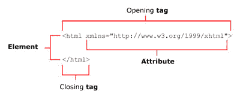
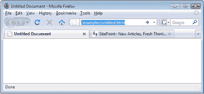
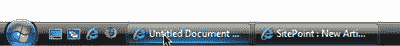
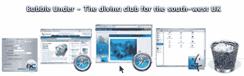
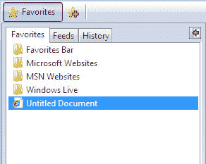

# 学习 HTML 和 CSS:绝对初学者指南

> 原文：<https://www.sitepoint.com/html-css-beginners-guide-4/>

## 文档类型

" https://www . w3 . org/TR/XHTML 1/DTD/XHTML 1-strict . DTD ">

这就是所谓的[文档类型](https://reference.sitepoint.com/html/doctypes/)(文档类型定义的简称)。它必须是网页上的第一项，甚至出现在任何空格或回车之前。

您是否曾经在一台计算机上使用 Microsoft Word 2007 编写了一份文档，并试图在另一台只安装了 Word 2000 的计算机上打开它？令人沮丧的是，如果在保存文件时没有先发制人的处理，这就不能像预期的那样工作。它之所以失败，是因为 Word 2007 包含了比尔·盖茨和他的团队在 2000 年想都没想过的功能，所以微软需要创建一个新版本的文件格式来迎合这些新功能。正如微软有许多不同版本的 Word 一样，HTML 也有不同的版本，最近的是 XHTML 和 HTML 5。幸运的是，不同版本的 HTML 已经被设计成不会像 Word 一样遭受不兼容的困扰，但是识别你正在使用的 HTML 版本仍然很重要。这就是 doctype 的用武之地。doctype 的工作是指定浏览器应该看到哪个版本的 HTML。浏览器使用这些信息来决定如何在屏幕上呈现项目。

上面的 doctype 声明我们使用的是 XHTML 1.0 Strict，并包含一个浏览器可以引用的 URL:这个 URL 指向 W3C 的 XHTML 1.0 Strict 规范。明白了吗？好了，我们来个行话休息！这一段有太多的缩写。

### 注意:html 5——这个街区的新成员

请注意，在撰写本文时，HTML5 规范尚未最终确定，浏览器对它的支持也不完整(考虑到不断变化的目标，这是可以理解的)。因此，我们不会在本书中讨论 HTML5。然而，你至少应该意识到它的存在。

### 注意:术语破坏

***网址***

URL 代表统一资源定位器。这就是一些(公认的更令人讨厌的)人在谈论网站地址时所指的。不过，知道 URL 绝对是一个有用的术语，因为它变得越来越普遍。

***W3C***

W3C 是万维网联盟的缩写，万维网联盟是一群遍布全球的聪明人，他们共同提出了关于网络上使用的计算和标记语言应该如何编写的建议。W3C 定义了规则，提出了使用建议，然后发布了商定的文档供感兴趣的各方参考，无论他们是像您这样的网站创建者(也就是说，一旦您看完了这本书)，还是正在编写需要理解这些语言的程序的软件开发人员(如浏览器或创作软件)。

W3C 文档是起点，事实上，本书中的所有内容都基于原始文档。但是在很长一段时间内，你都不会想看任何 W3C 文档。对于我们这些没有计算机科学学位的普通人来说，这简直太可怕了。暂时坚持读这本书，我会指导你的。

## html 元素

因此，doctype 已经告诉浏览器期待 HTML 的某个版本。接下来是什么？一些 HTML！

XHTML 文档是使用元素构建的。记住，元素是构建网页结构的砖块。但是元素到底是什么呢？一个元素看起来像什么，它的目的是什么？

*   XHTML 元素以标签开始和结束——开始标签和结束标签。
*   标签由一个左尖括号()组成。
*   在标签内部，有一个标签名；也可能有一个或多个属性。

让我们来看看页面中的第一个元素: [html](https://reference.sitepoint.com/html/html/) 元素。下图显示了我们所拥有的。

下图描述了标记元素开始的开始标记:

`<html >`

在这下面我们看到了结束标记，它标志着它的结束(并且正好出现在文档的末尾):

这又是那一行，标记名是粗体的:

< **html** >

在开始标记中有一个属性:

<root>></root>

### 注意:什么是属性？

HTML 元素可以有一系列不同的属性；可用的属性根据您正在处理的元素而有所不同。每个属性都由一个名称和一个值组成，它们总是被写成 name="value "。有些属性是可选的，有些是强制的，但是它们一起给浏览器提供了元素无法提供的重要信息。例如，image 元素(我们将很快了解到)有一个强制的“image source”属性，它的值给出了图像的文件名。属性只出现在任何给定元素的开始标记中。随着我们在这个项目中的工作，我们将会看到更多的属性出现，并且，至少在最初，我会确保指出它们，以便您熟悉它们。

回到 html 元素的用途。这是我们网页最外层的“容器”；其他所有东西(除了 doctype)都保存在外部容器中。让我们剥掉外层，看看里面的东西。

html 元素中有两个主要部分:头部和主体。记住这些物品出现的顺序并不困难，除非你碰巧喜欢做倒立。

## 头部元件

[head](https://reference.sitepoint.com/html/head/) 元素包含关于页面的信息，但不包含将在页面上显示的信息。例如，它包含 [title](https://reference.sitepoint.com/html/title/) 元素，该元素告诉浏览器在其标题栏中显示什么(标题栏是浏览器窗口的最顶部，带有最小化、最大化和关闭按钮):

**<标题>无标题文档</标题>**
<meta http-equiv = " Content-Type "
Content = " text/html；charset = utf-8 "/>T6</head>

## 标题元素

开始标签`<title>`和结束标签`</title>`在上面的标记中的“无标题文档”周围。注意，`<title>`表示标题的开始，而结束的`</title>`表示标题的结束。这就是结束标签的工作方式:它们在第一个`<`尖括号后面有正斜杠。

无标题文档标题是 HTML 创作软件提供的典型内容，当您选择创建新网页时，它是一个起点；这取决于你来改变这些词。如下图所示，把一些有意义的东西作为标题是值得的，而不仅仅是为了那些访问我们网页的人。

title 元素的内容还用于许多其他目的:

*   It’s the name that appears in the Windows Taskbar — that strip along the bottom of your Windows desktop that show all the currently open windows — for any open document. It also appears in the dock on a Mac. When you have a few windows open, you’ll appreciate those people who have made an effort to enter a descriptive title!

    

    

*   If users decide to add the page to their bookmarks (or favorites), the title will be used to name the bookmark.

    

*   搜索引擎大量使用 title 元素来确定页面包含的内容，以及应该在搜索结果中显示的相关信息。只是为了好玩，看看有多少人忘记输入有用的标题，试着在你选择的搜索引擎中搜索无标题文档。

## `meta`元素

在我们的简单示例中的 head 元素内，我们可以看到一个`meta`元素，它在下面以粗体显示:

<标题>无标题文档</标题>
**<meta http-equiv = " Content-Type "
Content = " text/html；charset = utf-8 "/>**
/head>

出于许多不同的原因，网页中可以使用元元素。有些用于向浏览器或搜索引擎提供屏幕上没有显示的附加信息；例如，页面作者的名字或版权声明可能包含在`meta`元素中。在上面的例子中，`meta`标签告诉浏览器使用哪种字符集(特别是 UTF 8，它包括了几乎所有书面语言的网页所需的字符)。

`meta`元素有许多不同的用途，但是它们中的大多数对你的页面外观没有明显的影响，因此你不会感兴趣(至少在这个阶段)。

*自动关闭元件*

*meta 元素是自结束元素(或空元素)的一个例子。与`title`不同，`meta`元素不需要包含任何内容，所以我们可以这样写:*

content = " text/html；charset=utf-8" > < /meta >

*XHTML 包含了大量的空元素，开发 XHTML 的科学家们认为编写所有这些结束标签会很快变得令人讨厌，所以他们决定使用自结束标签:以`/>`结尾的标签。所以我们的`meta`例子变成了:*

content = " text/html；charset=utf-8"/ >

*记忆游戏:记忆难记的标记*
 *如果您认为 doctype 和`meta`元素很难记忆，并且您想知道人们究竟是如何记住它们的，不要担心，大多数人都不会。即使是最顽固、最厌世的编码人员也很难准确记住这些元素，所以大多数人都做同样的事情——他们从他们知道是正确的来源复制(很可能是从他们最后的项目或工作中复制)。您可能会像处理本书的项目文件一样做同样的事情。*

成熟的网络开发程序，如 Dreamweaver，通常会处理这些困难的编码部分。但是如果你正在使用一个简陋的文本编辑器并且需要一些帮助，你只需要记住在 SitePoint.com 有一个[完全可搜索的 HTML 参考，可以随时访问。](https://reference.sitepoint.com/html/)

## 其他`head`元素

其他项目，如 CSS 标记和 JavaScript 代码，可以出现在 head 元素中，但我们将在需要时讨论它们。

## `body`元素

最后，我们到达了一切发生的地方。页面的`body`元素几乎包含了你在屏幕上看到的所有东西:标题、段落、图像、任何需要的导航以及位于网页底部的页脚:

" https://www . w3 . org/TR/XHTML 1/DTD/XHTML 1-strict . DTD ">
<html>
<head>
<title>无标题文档</title>
<meta http-equiv = " Content-Type "
Content = " text/html；charset = utf-8 "/>
</head>
**<body>
</body**
</html>

**Go to page:** [1](https://sitepoint.com/html-css-beginners-guide) | [2](https://sitepoint.com/html-css-beginners-guide-2/) | [3](https://sitepoint.com/html-css-beginners-guide-3/) | [4](https://sitepoint.com/html-css-beginners-guide-4/) | [5](https://sitepoint.com/html-css-beginners-guide-5/) | [6](https://sitepoint.com/html-css-beginners-guide-6/) | [7](https://sitepoint.com/html-css-beginners-guide-7/) | [8](https://sitepoint.com/html-css-beginners-guide-8/) | [9](https://sitepoint.com/html-css-beginners-guide-9/) | [10](https://sitepoint.com/html-css-beginners-guide-10/) | [11](https://sitepoint.com/html-css-beginners-guide-11/) | [12](https://sitepoint.com/html-css-beginners-guide-12/) | [13](https://sitepoint.com/html-css-beginners-guide-13/) | [14](https://sitepoint.com/html-css-beginners-guide-14/) | [15](https://sitepoint.com/html-css-beginners-guide-15/) | [16](https://sitepoint.com/html-css-beginners-guide-16/) | [17](https://sitepoint.com/html-css-beginners-guide-17/) | [18](https://sitepoint.com/html-css-beginners-guide-18/) | [19](https://sitepoint.com/html-css-beginners-guide-19/)

## 分享这篇文章