# 学习 HTML 和 CSS:绝对初学者指南

> 原文：<https://www.sitepoint.com/html-css-beginners-guide-2/>

如果您使用的是稍旧的 Mac，您可能还安装了 Internet Explorer。我们对 Mac 版 Internet Explorer 的建议？把它扔进垃圾箱。IE 的 Mac 版本在很多年前就被微软放弃了，所以它已经相当过时了，很少得到支持或在更广泛的世界中使用；没有新的 MAC 电脑预装了这个应用程序。对于那些更习惯使用 IE 浏览器的人来说，它和 Windows 也没有真正的相似之处。

## 除了基本的工具

使用上面提到的工具，你一定可以有一个好的开始。然而，一旦你处理一些网页和其他资源，你可能想超越这些基本工具。我们将在本书的后面向您展示如何使用一些稍微高级一些的应用程序。

无数其他文本编辑器和网络浏览器可供下载，其中许多都是免费的。显然，我们没有时间一一描述它们，所以我选择了几个在过去对我有用的选项，您可能想下载这些选项供自己使用。记住，它们都是免费的！

##### Windows 工具

**注释标签**

NoteTab 的选项卡式界面让你可以同时打开许多不同的文件，而不会弄乱你的屏幕。您打开的文件会被记住，即使在您关闭程序并在以后再次打开它时也是如此，这在您连续多天处理一批文件时非常有用。你可以从 http://www.notetab.com/下载免费的 NoteTab 或者它的简易版本。

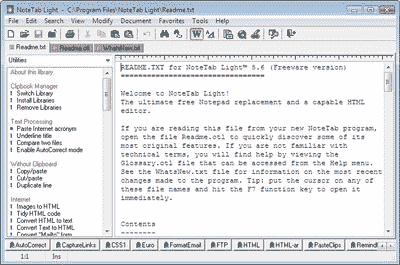

**火狐**

正如在序言中提到的，Firefox 是 Internet Explorer 的一个非常受欢迎的替代品，在我们阅读这本书时，它将成为我们的首选浏览器，原因有很多。和 NoteTab 一样，Firefox 提供了一个标签式界面，帮助你的电脑摆脱窗口混乱。[可以从 http://www.mozilla.com/firefox/下载火狐](http://www.mozilla.com/firefox/)；浏览器如下图所示。

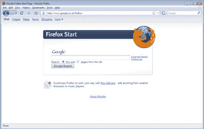

## 麦克 OS X 工具

的确，Mac 操作系统上的免费程序比 Windows 少。然而，当你超越基础的时候，有几个程序你可能想考虑。

**TextWrangler**

TextWrangler 是一个由准系统软件开发的免费简单的文本编辑器。与 Windows 的 NoteTab 一样，TextWrangler 可以通过同时打开多个文本文件进行编辑来整理您的工作空间(文档列在界面一侧的可拉出抽屉中，而不是在选项卡中)。你可以从准系统软件网站下载免费的文本编辑器 TextWrangler。

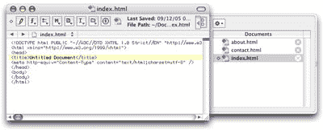

**火狐**

Firefox 不仅在 Windows 用户中很受欢迎，也受到 Mac 用户的欢迎，他们中的许多人更喜欢使用它而不是 Safari(通常是因为额外的功能——被称为**插件**——可以附加到浏览器上)。无论浏览器是安装在运行 Windows XP 或 Vista 的电脑上，还是运行 OS X 的 Mac 电脑上，还是免费的开源操作系统 Linux(通常受到喜欢摆弄电脑的高科技人士的青睐)上，在 Firefox 中浏览的网页都应该显示相同的内容。Firefox 的可预测性是一个受欢迎的改变，与过去无休止的浏览器竞争相比，这也是我们在本书的例子中主要使用 Firefox 的一个很好的原因。

## 不只是文字，文字，文字

你可以只用上面提到的工具建立一个完整的网站，但它不会是网络上最性感的网站。这里缺少的元素是图像:到目前为止，我们提到的程序都是用来操作纯文本或浏览网页的。如果您的网站要在视觉上吸引人，您需要能够创建和操作图像，或者使用您拍摄的照片从头开始，或者使用您有权在您的网站上使用的图像。

不幸的是，当谈到图像编辑软件时，那句老话“你得到你所支付的”适用。一个专业的图像编辑程序，如 Photoshop 或 Fireworks，需要数百美元。虽然这些程序提供了一些优秀的功能，但我们并不真的建议你出去购买，除非你确定它们适合你。如果你已经有一个这样的软件，或者一个类似的图像编辑程序，那就想尽一切办法使用它，并尝试它。像 Paint Shop Pro 或 Photoshop Elements(Photoshop 的精简版)这样的程序定价更合理。然而，出于本书的目的，我们将只关注那些可以免费下载并提供足够功能的工具，以便让您了解什么是可能的。

留意互联网、计算和设计杂志封面附带的磁盘上的免费图像编辑器。软件供应商经常放弃他们软件的旧版本，希望用户以后可能会被诱惑升级到新版本。留意 Paint Shop Pro，或任何支持**层**的图像编辑器，这是一种通过堆叠两层或更多层来构建图像的方法。虽然我们将在本书中保持我们的图像编辑相当简单，但它肯定值得关注免费(和全功能)的图像编辑软件，因为这些产品并不总是可用的。

### 带着大男孩们去兜风

最常用的图像编辑包可供试用下载。它们下载量很大(数百兆字节)，可能需要通宵下载，即使是在宽带连接上。

这些试用版通常可以使用 30 天；在那之后，你可以决定是购买完整软件还是停止使用该程序。然而，这 30 天的时间可能刚好够你在阅读这本书的时候使用这个软件。

**Adobe Photoshop**

Photoshop 最新版本的试用版可以下载。如果你更愿意尝试更轻松的 Photoshop Elements，那么 [Windows](http://www.adobe.com/products/photoshopelwin/) 和 [Mac](http://www.adobe.com/products/photoshopelmac/) 都有试用版。

**土坯烟花**

你可以从 Adobe 网站下载 Fireworks 的试用版。

**专业油漆店**

Paint Shop Pro 仅适用于 Windows。要下载试用版，[请访问 Paint Shop Pro 网站，并点击免费试用链接](http://www.corel.com/paintshoppro/)。

## Windows 工具

标准的 Windows 安装并不总是有图像编辑软件。当然，Windows XP 就是这种情况(尽管如果你把电脑和个人电脑、扫描仪或数码相机捆绑在一起购买，你可能会幸运地在交易中发现一些图像编辑软件；在你的**开始>所有程序**菜单中四处搜寻，看看你能发现什么。

在 Windows Vista 中，照片库应用程序较之前的 XP 版本有了很大的改进，现在包括一些基本但仍然有用的图像处理工具，包括裁剪、颜色和对比度调整。照片库应用程序可以直接在**开始**菜单中找到。

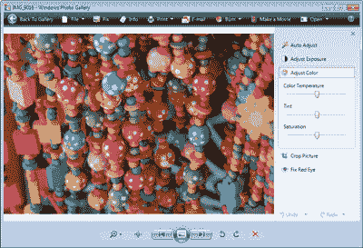

**Picasa**

如果您使用的是 Vista，照片库中提供的工具可以满足您的所有需求；如果你使用 XP，你几乎肯定需要使用一个额外的应用程序。考虑到这一点，您可能想尝试一下 Google 提供的免费下载的优秀图像管理工具。这个程序叫做 Picasa，它非常适合处理你在管理网站图片时可能遇到的大多数任务。[从 Picasa 网站](http://picasa.google.com/download/)下载一份拷贝，很快你就可以用这个程序对储存在你电脑上的图像进行裁剪、旋转、添加特殊效果和分类。下图给你一个程序界面的概念。

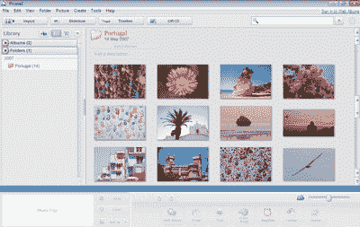

## 麦克 OS X 工具

Mac 以受到设计师和创意类型的青睐而闻名，该平台为崭露头角的艺术家提供了许多工具。然而，它们通常是有价格的，而且价格通常比 Windows 的同类产品要高。那么，假设我们想要比 Photoshop 或 Fireworks 的 30 天试用版更永久的东西，我们可以在 Mac 上使用什么免费软件呢？

**图形转换器**

GraphicConverter 的功能比它的名字所暗示的要强大得多。它有时会与新的 MAC 电脑捆绑在一起，也可以下载(我们鼓励你支付适度的注册费，但你可以免费试用)。虽然这主要是一个转换图形文件的工具，但它也可以用于简单的编辑任务。使用 GraphicConverter，如下图所示，您将能够对任何图像进行裁剪、调整大小、旋转和添加文本。

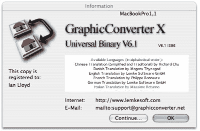

**iPhoto**

Mac OS X 还包括一个程序:iPhoto，对于有经验的 Mac 用户来说，这个程序可能不需要介绍。这个优秀的程序并不打算成为一个功能齐全的图像编辑器；它实际上是为管理和查看存储在计算机上的大量照片而设计的。它非常适合组织相册，但 iPhoto 也有一些非常有用的编辑工具，使它不仅仅是一个编目工具。

如下所示，iPhoto 可以在“应用程序”文件夹或 dock 中找到。

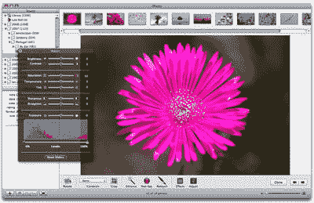

## 为您的网站创建一个位置

到目前为止，我们已经了解了创建网站所需的一些工具。我们已经看了容易获得的程序，以及在你的计算机上哪里可以找到它们。如果你的电脑附带的免费工具不能胜任工作，我们建议你下载并使用其他程序。在我们继续之前，我们必须完成的下一项任务是在硬盘上为您的网站创建一个空间。

## Windows 操作系统

保存网站文件最简单、最合理的地方是在**文档**文件夹(或 Windows XP 中的**我的文档**文件夹)中的一个专用文件夹中。在您的用户文件夹中可以找到**文档**文件夹。“但是这个用户文件夹是什么？”我听到你哭泣。这也是一个公平的观点，因为它不会被标记为**用户**，而是根据你第一次安装 Windows 时提供的用户名来标记。在 Windows Vista 中，你会在 **C:Users** 下找到所有本地计算机帐户持有人的用户文件夹(在 Windows XP 中是在 **C:Documents and Settings** 下)，并且会有一个与你的用户名匹配的文件夹名称。更方便的是，你可以在你的电脑桌面上找到它，如下图所示。

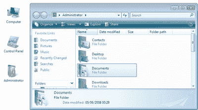

如果您的用户文件夹不在桌面上，也不用担心:很容易让它出现在桌面上(关于如何为 Vista 和 XP 添加该文件夹的详细信息，请参见下面的提示)。双击打开你的用户文件夹，然后双击**文档**，最后选择**文件>新建>文件夹**创建一个名为 Web 的新文件夹

### 提示:在 Vista 中显示用户文件夹，在 Windows XP 中显示我的文档文件夹

在 Vista 桌面上找不到您的用户文件夹？在 XP 中丢失了“我的文档”文件夹？为了清理你的桌面，你可能不小心移除了图标——这很容易做到。这是您将文件夹返回桌面的方式:

*   从**开始菜单**中选择**控制面板**。
*   选择**外观和个性化**(或者 XP 中的**外观和主题**)。
*   **Vista 用户**:选择**个性化**，列在左上角，标题**任务**下是**改变桌面图标**的选项。将出现一个新的对话框:选中桌面图标部分中标题为用户文件的选项，然后按 **OK** 。您现在也可以关闭**外观和个性化**窗口。
*   **XP 用户**:在选项列表中选择**改变桌面背景**，然后点击底部的**自定义桌面……**按钮。在出现的对话框中勾选**我的文档**选项，然后点击**确定**。按下 **OK** 关闭**外观和主题**窗口。
*   您的用户文件夹/我的文档文件夹现在应该回到桌面上，如下所示。

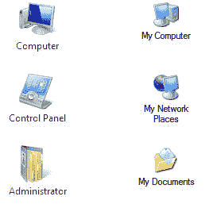

## 麦克·OS X

在 Mac OS X，已经有了一个方便的地方来存储你的网站文件:下图所示的 **Sites** 文件夹。打开你的主目录(从**搜索器**，选择**转>主目录**，就有了。

将“站点”文件夹添加到边栏以便快速访问很容易:只需将文件夹拖到边栏，就像将项目添加到 dock 一样。

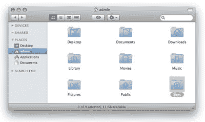

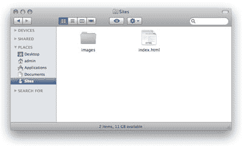

## 获得帮助

书籍可能是一种很好的学习方式:你坐在那里，一台电脑在运行，也许一杯咖啡让你的大脑保持运转，一个书签标志着你迄今为止的进步。太好了。但是书上的东西你不懂怎么办？接下来你会做什么？对着这本书大喊大叫不会有什么帮助，尽管它可能有一些治疗价值！

希望你在阅读这本书的时候不会发现自己有太多的问题，但是如果你是好奇型的——或者是快速学习型的——你可能想超越我们在这里要教你的东西。

不管你是被卡住了还是想了解更多，你的第一站应该是 [SitePoint 论坛](https://www.sitepoint.com/forums/)。注册只需要几分钟的时间，一旦完成，你就可以登录并在一系列不同的论坛中提问。无论你有关于为你的网站写内容的问题，你需要营销技巧，或者你正面临一些棘手的图形设计问题，每天为这些网页做贡献和调节的数百名专家将很乐意帮助你。

立即在 SitePoint 的论坛注册；然后，当我们建议进一步阅读或研究时，你就可以开始了。哦，我们有没有提到所有这些友好、有益的建议都是免费的？我们认为这可能会鼓励你！

## 摘要

信不信由你，我们现在已经拥有了建立自己网站所需的一切——而且不花一分钱！我们不仅有基本的工具——我们的文本编辑器(记事本或文本编辑)和网络浏览器(Internet Explorer 或 Safari)——而且我们还研究了一些替代工具。

我们回顾了一些简单且免费的图片编辑程序，它们可以帮助我们美化我们的网站:Picasa for Windows，GraphicConverter 和 iPhoto for Mac。最后，我们提到了一些更强大——也更昂贵——的选项，比如 Photoshop 和 Paint Shop Pro。

现在我们有了工具，让我们来学习如何使用它们吧！

**Go to page:** [1](https://sitepoint.com/html-css-beginners-guide) | [2](https://sitepoint.com/html-css-beginners-guide-2/) | [3](https://sitepoint.com/html-css-beginners-guide-3/) | [4](https://sitepoint.com/html-css-beginners-guide-4/) | [5](https://sitepoint.com/html-css-beginners-guide-5/) | [6](https://sitepoint.com/html-css-beginners-guide-6/) | [7](https://sitepoint.com/html-css-beginners-guide-7/) | [8](https://sitepoint.com/html-css-beginners-guide-8/) | [9](https://sitepoint.com/html-css-beginners-guide-9/) | [10](https://sitepoint.com/html-css-beginners-guide-10/) | [11](https://sitepoint.com/html-css-beginners-guide-11/) | [12](https://sitepoint.com/html-css-beginners-guide-12/) | [13](https://sitepoint.com/html-css-beginners-guide-13/) | [14](https://sitepoint.com/html-css-beginners-guide-14/) | [15](https://sitepoint.com/html-css-beginners-guide-15/) | [16](https://sitepoint.com/html-css-beginners-guide-16/) | [17](https://sitepoint.com/html-css-beginners-guide-17/) | [18](https://sitepoint.com/html-css-beginners-guide-18/) | [19](https://sitepoint.com/html-css-beginners-guide-19/)

## 分享这篇文章