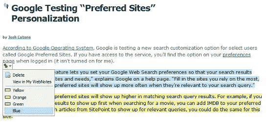
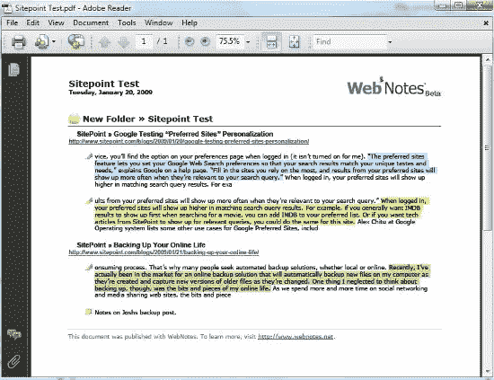

# WebNotes 给注释游戏带来了麻烦

> 原文：<https://www.sitepoint.com/sticky-simple/>

你的工具栏上还能再放一个注释工具吗？WebNotes 是一个只接受邀请的测试版，旨在成为一个简单、整洁的研究平台。这项开发有几个优势，使其成为 Diigo 和其他注释工具的有力竞争者。由于狭隘地专注于研究，并且基本上是从学术氛围中产生的，WebNotes 可能只是拥有其他人尚未利用的“跳跃式发展”。 **WebNotes 已邀请 SitePoint 的读者参加测试版——点击本文末尾的链接领取邀请函。**

去年我为 Diigo 做咨询，并认为它是一个伟大的注释工具。但是，尽管 Diigo、 [Fleck](http://www.fleck.com/) 和其他一些公司显示出了希望，但没有一家公司被市场广泛接受。研究仍然主要是关于人们将个人方法(阅读、写作、关联)应用到任务中。缓解这个痛点是一个研究工具必须做的，而且做得很好。

##### 一、二方法

理想情况下，研究过程应该高效、准确地完成，这正是 Diigo 和 WebNotes 等工具应该提供帮助的地方。添加社交方面或其他功能应该是次要考虑因素。改变人们习惯的高级工具，或者专注于某个特定领域，是实现这一目标的唯一好方法。与 Diigo now 不同，WebNotes 专注于这个“工具”方面。过度设计附属功能，而不生产出一个优秀的工具，这不仅仅是一个 Diigo 问题。

任何用户，不管他们的专业知识如何，都可以简单地加入 WebNotes，下载插件，开始注释，然后组织和发布他们的工作。这是一个没有多余费用的提议。WebNotes 首席执行官兼联合创始人 Ryan Damico 在昨晚的一次聊天中为我们解决了这个问题:

> “WebNotes 非常关注生产力。我们首先确定学者和专业研究人员最需要哪些功能，并着手围绕这些功能构建我们的核心产品。其他服务集中于社会书签和社区建设，而我们专注于创建一个无与伦比的质量和可靠性的专业研究工具。随着我们继续开发具有这些相同价值的 WebNotes，我们期待着发布带有高级工具的高级版本，以进行深入研究。”–联合创始人兼首席执行官瑞安·达米科

下载插件并开始高亮显示

添加便笺、通过电子邮件或永久链接分享以及其他有用的工具会有所帮助，但在实践中，捕捉所需的文本并将其压缩成压缩形式是研究助手首先应该做的。WebNotes 就像是小学里那些又丑又胖的黄色铅笔。当所有的机械笔、笔和小巧的笔都失灵或丢失时，旧的备用笔会在你需要的时候书写。

domain=”category” nicename=”community-web”

通过管理器侧栏拖放

通过侧边栏工具或用户的 WebNotes 工作区组织数据后，只需点击一下鼠标，就可以发布到 PDF 或 HTML。正如你从这些图片中看到的，这不是火箭科学。这只是一个优雅简单的工具，帮助收集和关联数据到多功能笔记。

最后，一个漂亮的 PDF 文件发布了

##### 简单就够了吗？

显然不会，除非 WebNotes 可以利用他们的学术关系来推广我前面提到的“边缘”研究工具。显然，从简单开始，构建一个非常精炼的核心工具将有助于吸引更大的用户群，但 WebNote 的变体——尽管简单有效——显然不是占领研究社区所需的“终极目标”。

许多创业公司面临的问题是“付钱给吹笛者”，或者有一个可行的赚钱模式。WebNotes 似乎专注于付费服务，考虑到这里的利基用户问题，这是明智的。然而，我认为目前的工具还不具备这样的能力，即使是非常精细的工具也必须得到相当广泛的接受，它才是可行的。实际上，所有这些工具都不比将注释复制并粘贴到工作区或其他编辑器中更有用。在我看来，如果没有“新时代”的界面、高级编辑、面向对象或其他组织方面，甚至更高级的“工具”功能，任何注释平台都可能滞销。

##### 关于 WebNotes

麻省理工学院在剑桥的校友团队马开创了 WebNotes，彻底改变了人们在互联网上收集、组织和分享信息的方式。开发的客户端利用 JavaScript 和 Flash 与 ASP.NET web 服务进行通信。在那里，用户数据利用 NHibernate 存储在 Microsoft SQL Server 数据库中。关于 WebNotes 的更多信息，读者可以通过电子邮件联系他们[。](mailto:contact@webnotes.net)

**在这里获得您的热门 [WebNotes 代币](http://www.webnotes.net/Register/Invite.aspx?inviteCode=sitepoint)！**

## 分享这篇文章