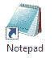
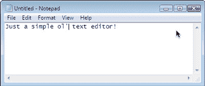
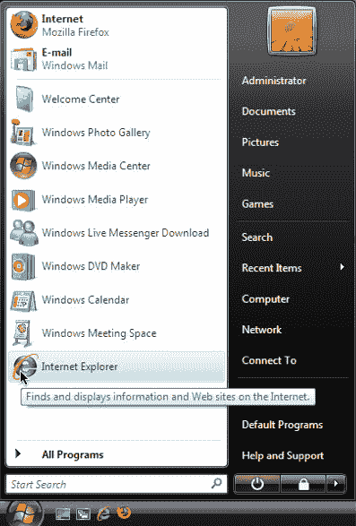
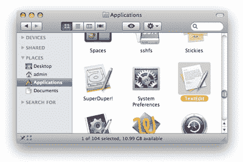

# 学习 HTML 和 CSS:绝对初学者指南

> 原文：<https://www.sitepoint.com/html-css-beginners-guide/>

这篇文章写于 2009 年，至今仍是我们最受欢迎的帖子之一。如果你渴望了解更多关于 HTML 和 CSS 的知识，你可能会对这篇关于 HTML 未来的文章很感兴趣。

那么，你准备好冒险开始学习如何建立自己的网页和网站了吗？太棒了。我们还有很长的路要走，所以我希望你喜欢冒险。

这些信息摘自我最近出版的书《用 HTML & CSS，第二版 T3 用正确的方式建立你自己的网站》。

在接下来的几页中，我将向你展示如何设置你的电脑——无论是 PC 还是 Mac——以便你准备好建立一个网站。

然后，我们将了解 XHTML，并浏览如何正确构建网页的细节。在这个过程中，我们将研究元素、注释和符号，并且我们将讨论嵌套的概念。这听起来可能很复杂，但事实并非如此！事实上，在讨论结束时，您将拥有一个显示文本、链接、图像甚至报价的工作网页！

最后，我们将转向级联样式表的主题，我们将使用它来改变网页元素的外观。在创建我们自己的页面之前，我们将讨论使用样式来控制页面外观的不同方法。css 文件并使用它——以及选择器和 spans 之类的工具——来美化我们的网页标题、文本等等。

如果有些术语不熟悉，也不要担心——这个节选和这本书本身一样，假设你没有关于构建网页的知识。我将在这里展示的信息基本上包括这本书的前三章——后面的章节将继续向您展示如何构建表单、优化 Web 图形、发布您的站点，以及使用插件工具(如博客、图片库等)来丰富它——目录包含了所有细节。

但是现在，让我们开始设置您的计算机，以便您准备好创建您的第一个网页。别忘了:如果你想保存下来离线阅读，你可以[获取这些 PDF 格式的说明](https://www.sitepoint.com/books/html2/samplechapters.php)。

## 第一章。开店

在您开始构建您的网站之前，我们需要花一点时间来设置您的计算机，并为接下来的工作做好准备。这就是本章的全部内容:确保您已经安装了所有需要的工具，并准备好投入使用。

如果你看到当地书店出售的数百本计算机书籍，你会认为你需要投资许多不同的程序来建立一个网站，这是情有可原的。然而，现实是你需要的大多数工具可能就在你的电脑上，藏在你不会想到去找它们的地方。如果你没有完成这项工作的工具，几乎可以肯定有一个或多个免费程序可以完成这项任务。

我们假设您已经有互联网连接，很可能是宽带(或类似的)。如果您的连接速度较慢，不要担心:这不会影响我们在本书中承担的任何任务。然而，这将意味着一些建议的下载或上传可能需要更长的时间来完成，但你可能已经知道了。

### 注意:计划，施曼宁

在这一点上，它可能会诱使你审视自己建立网站的动机。你有项目计划吗？你对这个网站有什么目标？

虽然你可能有一些目标，以及你想花多长时间创建你的网站的一些想法，我们将在某种程度上掩盖项目规划的本质。这并不是说项目规划不是一个需要考虑的重要方面，但是我们将假设因为你已经拿起了一本名为*以正确的方式构建你自己的网站*的书，你可能想直接进入构建部分。

因为这是你的第一个网站，而且相当简单，所以我们可以忽略一些网站规划的细节。后来，一旦你学会了——并超越了——建立一个网站的基础，你可能会觉得已经准备好处理一个更大的、更具技术挑战性的网站了。当那个时刻到来时，适当的计划将是工作中更重要的一个方面。但是现在，让我们开始构建我们的第一个简单的站点。

## 你需要的基本工具

正如我前面提到的，你建立第一个网站所需的许多工具已经在你的电脑上了。那么，你需要什么工具呢？

*   你需要的主要的——也是最基本的——工具是一个**文本编辑器**；一个允许你编辑纯文本文件的程序。您将使用它来编写您的网页。
*   一旦你写了一个网页，你就可以看到它在**网络浏览器**中的样子——那是你用来浏览网站的应用程序。
*   最后，当你对你的新网页感到满意时，你可以用一个 **FTP 客户端**把它放到互联网上——这个实用程序允许你使用文件传输协议在互联网上传输文件。使用 FTP 可能一开始看起来有点复杂，但谢天谢地，你不需要经常这么做。我们将在第 8 章，启动你的网站中详细讨论 FTP 客户端。

你已经在你的电脑上安装了大部分的程序，所以让我们去找到它们。

## Windows 基本工具

在接下来的部分——实际上也是本书的其余部分——当我们提到 Windows 操作系统时，这实际上是 Windows Vista 的一种简称(在其所有令人困惑的变体中)。任何指示和屏幕截图将与 Vista 铭记。然而，我们不会把你们所有的 Windows XP 用户拒之门外——有很多人使用 XP 而不是 Vista，这让微软很不高兴——所以如果为 Vista 提供的说明与 XP 不一样，我们会为你们解释其中的差异。

## 您的文本编辑器:记事本

我们要考虑的第一个工具是文本编辑器。Windows 附带了一个非常简单的文本编辑器，叫做记事本。很多使用复杂软件包的专业网页设计师，很多年前就开始使用记事本；事实上，许多拥有昂贵软件的专业人士仍然求助于使用记事本来完成许多任务，而这些软件本可以节省时间。为什么？因为它非常简单，所以很少会出错。它的加载速度也比全功能的 web 开发程序快得多。铃铛和哨子肯定不是特色。

你可以在**开始**菜单中找到记事本:进入**开始>所有程序>附件**。

### 提示:记事本的快捷方式

为了避免每次打开记事本时都导航到该位置，请在桌面上创建一个快捷方式。打开“开始”菜单以显示记事本的位置，按住 Ctrl 键，单击并按住鼠标按钮，然后将记事本图标拖到桌面上。释放鼠标按钮时，应用程序的快捷方式将出现在您的桌面上。

记事本是最基本的应用程序，如下图所示。

## 您的网络浏览器:Internet Explorer

一旦你用记事本创建了一个网页，你需要一种方法来查看你的工作成果。你会记得在这本书的序言中，我们提到了 IE 浏览器。那是你的观众。Internet Explorer 就在**开始**菜单中，也在**程序**文件夹中(通过**开始**菜单中的**所有程序**访问)，在**快速启动**区域(开始菜单的左下方，靠近 Windows 徽标)，一个快捷方式也可能潜伏在你的桌面上。

## Mac OS X 基本工具

像 Windows 一样，Mac 操作系统(特别是 OS X；我们不会查看 Mac OS 的以前版本)有许多工具，您可以开箱即用。这些工具实际上相当于上面提到的 Windows 程序。

## 您的文本编辑器:文本编辑

Windows 有记事本，Mac 有文本编辑，可以在**应用程序**文件夹中找到。

与记事本不同,“文本编辑”在默认情况下作为富文本编辑器工作，这意味着我们可以处理字体，使文本加粗和倾斜，等等。但是，我们想将“文本编辑”作为纯文本编辑器使用，所以您需要调整“文本编辑”的一些偏好设置。启动文本编辑，然后从菜单中选择**文本编辑>偏好设置**，调出**偏好设置**屏幕。在**新文档属性**中选择纯文本，然后关闭**首选项**屏幕。下次在“文本编辑”中创建新文件时，它将是一个纯文本文稿。

## 您的网络浏览器:Safari

Mac 用户的默认浏览器是 Safari。您通常可以在 **dock** 中找到 Safari(dock 是屏幕底部的图标栏)，但您也可以通过 Applications 文件夹访问它。

*提示:把它插在底座上*

*就像您可以将程序的快捷方式拖到 Windows 桌面上一样，您也可以在 Mac OS X 中将程序添加到 dock 中。要将程序添加到 dock 中，只需将其图标从“应用程序”文件夹拖到 dock 中，然后就行了！现在，只要您需要，就可以轻松访问该应用程序。*

**Go to page:** [1](https://sitepoint.com/html-css-beginners-guide) | [2](https://sitepoint.com/html-css-beginners-guide-2/) | [3](https://sitepoint.com/html-css-beginners-guide-3/) | [4](https://sitepoint.com/html-css-beginners-guide-4/) | [5](https://sitepoint.com/html-css-beginners-guide-5/) | [6](https://sitepoint.com/html-css-beginners-guide-6/) | [7](https://sitepoint.com/html-css-beginners-guide-7/) | [8](https://sitepoint.com/html-css-beginners-guide-8/) | [9](https://sitepoint.com/html-css-beginners-guide-9/) | [10](https://sitepoint.com/html-css-beginners-guide-10/) | [11](https://sitepoint.com/html-css-beginners-guide-11/) | [12](https://sitepoint.com/html-css-beginners-guide-12/) | [13](https://sitepoint.com/html-css-beginners-guide-13/) | [14](https://sitepoint.com/html-css-beginners-guide-14/) | [15](https://sitepoint.com/html-css-beginners-guide-15/) | [16](https://sitepoint.com/html-css-beginners-guide-16/) | [17](https://sitepoint.com/html-css-beginners-guide-17/) | [18](https://sitepoint.com/html-css-beginners-guide-18/) | [19](https://sitepoint.com/html-css-beginners-guide-19/)

## 分享这篇文章