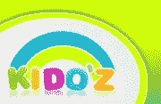
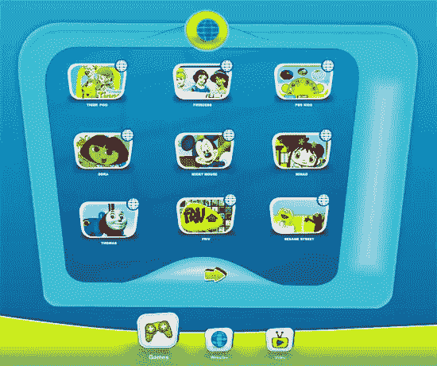
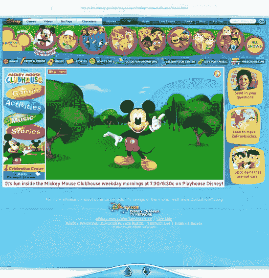
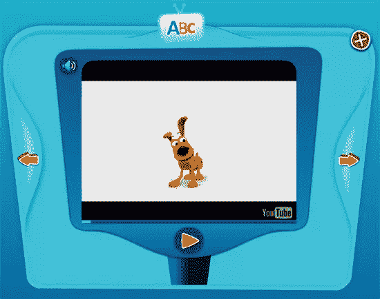

# 基多兹成功的两万亿个理由

> 原文：<https://www.sitepoint.com/kidoz/>

Phil Butler 加入 SitePoint 博客团队，报道最新的测试版网络应用。

 **儿童浏览器 [KIDO'Z](http://kidoz.net/beta/) 能否帮助爸爸妈妈保证孩子安全上网？或者更重要的是，从开发的角度来看，狭隘的利基工具能有效地为网络消费者提供最大的价值吗？在我看来，答案是*是的*，原因如下。**

对于我们这些从事网络工作的人来说，在某种程度上，过去的三年是关于利基开发和营销——有针对性的广告和一系列寻求吸引网络观众的创新。从极客到怪老头，营销人员和网站所有者都在努力获得页面浏览量，并最终获得客户，用看似无穷无尽的小工具、工具、策略、令人惊叹的技术和彻头彻尾的马戏团魔术。但不知何故，这个世界上最重要、最赚钱的利基市场在很大程度上被忽视了。

## 妈妈，我可以吗？

毫无疑问，儿童是货币化网络的圣杯，但没有人在这个估计为 2.1 万亿美元的市场中占有相当大的市场份额(仅美国)。这个事实回避了这个问题；“什么样的应用程序或服务能够吸引孩子们的广泛关注，并保持这种关注？”根据现有的各种专家资源，大多数家庭的消费决策都是由妈妈们做出的，而孩子的“想要”渴望是父母强有力的刺激因素。在一个 [(*。pdf)2007 年由](http://www.marketingtomomscoalition.org/doc/SummaryofStateofAmericanMom.pdf)[营销妈妈联盟](http://www.marketingtomomscoalition.org/)进行的研究显示，妈妈支出群体的五大优先事项是:

1.  她和孩子的关系
2.  教育质量和教师
3.  安全——在物理和数字世界中
4.  预防吸毒和酗酒
5.  健康饮食和锻炼

当然，网络上有很多面向儿童的网站，但没有一个提供中枢——没有一个如此著名以至于我们每天都会想到它们——更没有一个儿童浏览器。直到现在，那是。进入 KIDO'Z，这是一个儿童专用的网络浏览器，由特拉维夫的一家初创公司用 Adobe AIR 编写。至少在我看来，如果有一个营销“不用动脑筋”，那就是吸引孩子和家庭。

## 一块小小的冲浪板

在我过去三年参与的 500 多个测试中，KIDO'Z 无疑是最简单、最容易向他人传达的概念。Google 告诉我们极简主义很流行，简单和可发现是 beta 测试者描述的教条。KIDO'Z 浏览器可以简单地概括如下:

*   用户界面(UI)--简单、优雅，对用户(可能是孩子)来说是完美可用的
*   **可发现性**——一个孩子都能做到(抱歉，无法抗拒！)
*   **导航**——一个小缺陷，导航回“主页”只有一个按钮
*   **美观**——漂亮又可爱，就像任何孩子的工具一样
*   **用户体验** -指向并点击以找到酷且有教育意义的东西是有趣的
*   **用户价值**——只提供最高质量的内容网站，尽管目前数量有限。
*   **安全和保障**——在 KIDO'Z 的浏览器网站矩阵中，没有什么是对儿童不安全的

正如下面的截图所示，对于 KIDO'Z 浏览器来说，*少就是多*。根本不需要打字，孩子们可以简单地点击进入由世界上一些最好的儿童目的地提供的合适的游戏、网站或视频。

KIDO'Z 浏览器简单界面

通过 KIDO'Z 的一个熟悉的朋友

作为一个额外的附加功能，KIDO'Z 浏览器还可以作为一个提示性的搜索引擎。所以“可能的小冲浪板”很可能是建议引擎相关性优势的典范转移催化剂。我知道微软 Powerset 背后的团队(毫无疑问还有谷歌的人)正在解决重组搜索的本质问题，但这是另一项研究的主题。

## 结论

基多兹是安全的，就这样。用户不能在 KIDO'Z 环境之外冒险。然而，可能需要解决的一个方面是，父母完全出于偏好屏蔽他们不想让孩子访问的网站的能力。除了这个不错的功能，KIDO'Z 团队还专注于根据用户反馈调整浏览器，并添加一些功能，如允许用户将更多网站添加到白名单中。

具有讽刺意味的是，我最近一直在和著名的 web 开发人员谈论像 KIDO'Z 这样的利基工具的价值。这些“网络创新者”都同意，儿童浏览器和搜索引擎是可行的和必要的工具，但除了他们简单的兴趣和好奇心，他们看不到这个概念有多大价值。地球上的每个人都在寻找一个“谷歌黑仔”，数亿潜在用户和数万亿美元怎么可能不对世界上最伟大的创新者产生吸引力——更不用说投资者了？

也许 KIDO'Z 和类似的想法太简单了？

通过酷酷的视频教学朋友喜欢跳舞的狗

## 分享这篇文章