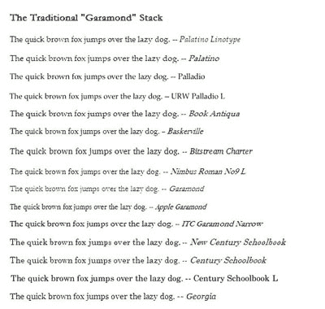
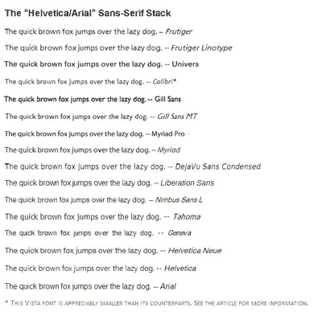
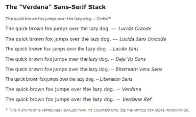
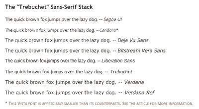

# 8 权威网络字体堆栈文章

> 原文：<https://www.sitepoint.com/eight-definitive-font-stacks-2/>

**一个更传统的基于 Garamond 的衬线堆栈:**
`font-family: "Palatino Linotype", Palatino, Palladio, "URW Palladio L", "Book Antiqua", Baskerville, "Bookman Old Style", "Bitstream Charter", "Nimbus Roman No9 L", Garamond, "Apple Garamond", "ITC Garamond Narrow", "New Century Schoolbook", "Century Schoolbook", "Century Schoolbook L", Georgia, serif;` 

**一个基于 Helvetica/Arial 的衬线堆栈:**
`font-family: Frutiger, "Frutiger Linotype", Univers, Calibri, "Gill Sans", "Gill Sans MT", "Myriad Pro", Myriad, "DejaVu Sans Condensed", "Liberation Sans", "Nimbus Sans L", Tahoma, Geneva, "Helvetica Neue", Helvetica, Arial, sans-serif;`

**一个基于 Verdana 的衬线堆栈:**
`font-family: Corbel, "Lucida Grande", "Lucida Sans Unicode", "Lucida Sans", "DejaVu Sans", "Bitstream Vera Sans", "Liberation Sans", Verdana, "Verdana Ref", sans-serif;`

**一个基于 Trebuchet 的衬线堆栈:**
`font-family: "Segoe UI", Candara, "Bitstream Vera Sans", "DejaVu Sans", "Bitstream Vera Sans", "Trebuchet MS", Verdana, "Verdana Ref", sans-serif;`

***“一个很好的经验法则是，不同级别的字体大小越接近，整体印象就越优雅。如果你想要一种脱节或现代的感觉，试着使用更大的字体大小。”*
–[安迪谟](https://www.sitepoint.com/anatomy-web-fonts/)** 

##### 堆栈背后的基本原理

诚然，在大多数书库中有异常多的字体，但这是有原因的:人们在他们的机器上可能会有巨大的差异。最好使用一种更常见的字体作为近似，而不是回到通用的、备用的衬线或无衬线字体。在大多数书库的底部也有很多 Linux 字体，主要是因为不同风格的 Linux 为它们的用户提供了不同的字体。

许多字体在不同的操作系统下会发生名称变化，这就是我把它们都列出来的原因；例如， *Palatino，Palatino Linotype，Palladio，URW Palladio L，*和 *Book Antiqua* 都是(或多或少)相同的字体。

此外，还考虑了哪些变体具有更大的 Unicode 字符家族，以及哪些变体在其堆栈中排在它的表亲之前(感谢我的朋友， [Tommy Olsson](https://www.sitepoint.com/forums/member.php?u=59436) 提醒我这个重要的字体元素)。

如上所述，一般的顺序是:不太普遍的 Windows 字体，然后是 Mac 字体，然后是 Linux 字体，然后是通用字体，最后是通用系列名称。这就是为什么更知名的字体( *Arial，Verdana，Georgia* )排在最后——它们几乎是你能拥有的通用字体。当然，你会想重新排序这些堆栈，以满足你的网站和它的普通用户的需要。

当然，你的字体堆栈很大程度上取决于你实际设计的样式。对于标题来说很好的东西很可能会在正文中被删除。是的，这是显而易见的，但是我们访问过(或者说实话，创建过)多少网站违反了这条警告呢？

我曾经为一个高中神话班设计了一个网站，使用了一种古希腊印刷字体(我现在想不起它的名字了)。我认为既然标题中的希腊字体看起来很好，它也可以补充正文。这个决定持续了整整三十秒。我记得，正文最后出现在了 Verdana 上，这是一个可读性更好的选择。

**Go to page:** [1](https://sitepoint.com/eight-definitive-font-stacks) | [2](https://sitepoint.com/eight-definitive-font-stacks-2/) | [3](https://sitepoint.com/eight-definitive-font-stacks-3/)

## 分享这篇文章