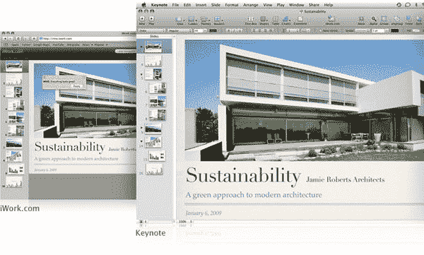

# 苹果的 iWork.com 令人失望——不是谷歌文档的竞争对手

> 原文：<https://www.sitepoint.com/apple-announces-google-docs-competitor-iworkcom/>

今天，在旧金山 MacWorld 大会的年度主题演讲中，苹果全球产品营销高级副总裁菲尔·席勒宣布了他们基于云的生产力套件 iWork.com 的测试版，上周[有传言称](https://www.sitepoint.com/web-applications-reset-the-playing-field/)。iWork 允许苹果 iWork 用户将文档上传到该应用程序的网络版本，以便与包括 Windows 用户在内的其他方进行协作。

一旦上传，文档保持其视觉完整性，并可由任何数量的用户在网站上编辑或修改。

目前，iWork.com 将提供免费的封闭测试，但最终它将成为一项付费服务。

当有更多的信息时，我们会更新这篇文章，但现在，苹果似乎正在采取与微软类似的方法来开发网络应用程序。iWork 09+iWork.com 感觉很像微软的[客户端+云](https://www.sitepoint.com/microsoft-talks-up-client-cloud-future/)愿景，其中桌面软件由在线版本的应用程序补充，允许跨平台协作和基于网络的存储。

**更新:**苹果在 iWork.com 的[网站现已上线](http://www.apple.com/iwork/iwork-dot-com/)，乍看之下，iWork.com 似乎更多地是与像 [Adobe Share](http://www.adobe.com/acom/share/) 或[微软 Office Live Workspace](http://workspace.officelive.com/) 这样的服务竞争，而不是与谷歌文档竞争。iWork.com 不是一个成熟的生产力应用软件服务套件。iWork.com 不包含 Pages、Numbers 或 Keynote 的 web 应用程序版本。

相反，苹果创造的是内置于 2009 年桌面版 iWork 的一项服务，允许用户通过网络界面与其他用户共享文档。文稿可以 iWork 格式、Microsoft Office 格式和 PDF 格式下载，用户可以在共享项目上留下评论，而不是由原作者作为共享文稿的一部分下载。

然而，iWork.com 没有完整的在线编辑功能。所以它不会与谷歌文档竞争——至少目前不会。目前，iWork.com 是一家软件+服务公司，专门专注于非常基本的共享和协作。这是对 iWork 的一个很好的补充，但并不能真正让世界为之疯狂。

最初宣布的时候，iWork.com 听起来可能会非常酷。但仔细研究后，它实际上并不那么令人兴奋。

**更新 2:** 微软的 Mac 业务部门[也在今天的 MacWorld 大会上宣布了软件+服务的发布](http://blog.seattlepi.nwsource.com/microsoft/archives/158675.asp?source=rss)。“微软表示，Office for Mac 用户现在可以更轻松地使用 SharePoint 和 Office Live 工作区。在 Office for Mac 中，用户很快就可以通过 SharePoint 和 Office Live Workspaces 上传和下载他们正在协作的文档，”微软观察博客作者 Joseph Tartakoff 写道。

换句话说，Office for Mac 将或多或少地与 iWork 的新 iWork.com 功能相匹配。

**更新 3:** 来自 SitePoint 自己的凯文·杨克的评论:

“正如在主题演讲中宣布的，iWork.com 实际上包括与谷歌文档的集成。你可以从 iWork.com 发送一份文档到谷歌文档进行编辑。随着 iPhoto’09 中对 Flickr 和脸书的新支持，这是一个令人鼓舞的迹象，表明苹果公司内部愿意参与开放的网络生态系统，而不是维持建立一个只适用于苹果产品的封闭服务和文件格式的集合。"

然而，因为 iWork.com 需要 iWork，随后是额外的服务费，而且目前还不包括在线编辑组件，所以我现在仍然会把这个叫做失望。

## 分享这篇文章