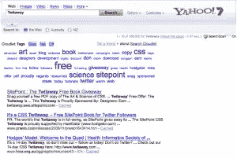

# 使用 Search Cloudlet 将标签云添加到 SERPs

> 原文：<https://www.sitepoint.com/add-tag-clouds-to-serps-with-search-cloudlet/>

我最喜欢标签云的一点不是用它们来导航，而是它们是获取一些**背景**的好方法。如果我偶然看到一个新的博客，想快速了解它的内容，标签云可以让我鸟瞰正在讨论的内容。如果我正在查看某人的 Flickr 个人资料，我可以使用他们的标签云来了解他们最喜欢拍摄什么。

这就是为什么我很高兴发现这个新的火狐插件，[国际软件和生产力工程研究所](http://www.intspei.com/) (INTSPEI)开发的 [Search Cloudlet](http://getcloudlet.com) 。它在谷歌或雅虎搜索结果页面的顶部添加了一个标签云，其中包含其他术语和选项，您可以使用这些术语和选项来帮助缩小搜索范围——单击标签云中的术语将再次执行查询，并将该术语添加到原始集合中。但从上下文的角度来看，这也很令人兴奋——如果我搜索一个不熟悉的术语，标签云可以帮助我了解相关的其他概念和术语，也许我在搜索时只需要知道一点上下文。或者，我可以跳到 cloudlet 中的 Sites 选项卡，看看哪些站点在谈论这个术语。对于新闻和博客搜索，还可以根据位置和作者形成云，以帮助进一步缩小搜索范围。

这里有一个例子——使用 Cloudlet 插件，雅虎搜索下面的“twitaway”会显示相关的术语，如“SitePoint”和“book”:

这也是对搜索引擎的查询建议功能的一个有趣的尝试。谷歌和雅虎都非常擅长建议你可能想尝试的术语，但将它们压缩成一个标签云——带有关于重要性和相关性的所有明显的视觉线索——*可能会使*搜索 Cloudlet 比列表更有帮助。在可用性测试中比较这两者，看看会有什么结果，这将是非常有趣的。如果这意味着人们不必键入像 *site:example.com* 这样的查询，他们会更愿意通过网站或位置进行搜索吗？它会让高级搜索功能不那么晦涩难懂吗？

你可以在[getcloudlet.com 亲自试用搜索 Cloudlet 插件。](http://getcloudlet.com)你怎么看？请在评论中告诉我们！

## 分享这篇文章