# 15 个必须为设计灵感制作书签的网站

> 原文：<https://www.sitepoint.com/15-must-bookmark-sites-for-design-inspiration/>

我是一名作家，不是设计师，当我遇到创作障碍时，最好的治疗方法通常是开始写作。我可能会写一页又一页的废话，但最终我会再次开始写好东西。也就是说，作为一名作家，阅读他人的优秀作品总是有帮助的。对于设计师来说，没什么不同。看好的设计只会有助于激发你在自己的设计工作中做得更好。下面是 15 个可以获得设计灵感的地方。

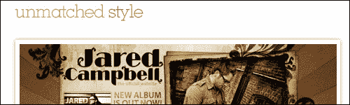

## [无与伦比的风格](http://www.unmatchedstyle.com/)

CSS 画廊多如牛毛，所以只有一对夫妇进入了我们的设计师灵感网站列表。在我们看来，无与伦比的风格是最好的风格之一。设计总是很漂亮，用户被鼓励去评价和评论它们。如果你对其他网页设计库感兴趣，那么看看[网页库列表](http://www.webgallerylist.com/)，它列出了 200 多个网页设计库。

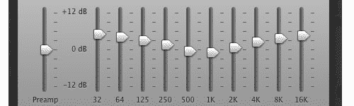

## [FactoryJoe Flickr 流](http://www.flickr.com/photos/factoryjoe/)

开源倡导者克里斯·梅西纳，又名“factoryjoe”，有一个最好的 Flickr 流供设计师们遵循。他不断更新用户界面、应用程序设计、设计元素、用户交互流程等的截图。这是一个很棒的地方，你可以在这里找到设计页面或应用程序时应该做什么和不应该做什么的例子。

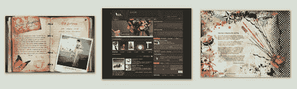

## [DeviantArt](http://www.deviantart.com/)

DeviantArt 成立于 2000 年，可能是互联网上最大的艺术和设计展示网站。根据维基百科的数据，该网站已经有超过 6200 万条提交信息，并以每天 8 万条的速度接收新信息。简单地说，有很多伟大的艺术、摄影和设计可以从中寻找灵感。

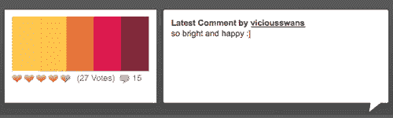

## [色彩爱好者](http://www.colourlovers.com/)

ColourLovers 是一个由热爱颜色的人组成的社区。用户在网站上分享色彩创意、调色板和图案，使其成为一个为网页设计项目汲取灵感的理想场所。Adobe 运营着一个类似的网站，名为 Kuler。

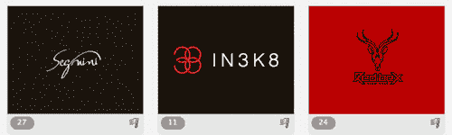

## [LogoPond](http://logopond.com/)

正如我们所说，有大量的网页设计画廊可以从中汲取灵感，但 LogoPond 是少数几个致力于标志设计的画廊之一。该网站提供了大量惊人的标志，可以帮助你的创意汁液流动。

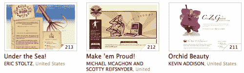

## [CSS 禅宗花园](http://www.csszengarden.com/)

CSS Zen Garden 是最鼓舞人心的设计展示之一，因为展示中的每个页面都是一样的。从相同的基本 HTML 开始，设计师修改实际 CSS Zen Garden 站点的 CSS 和图像，以创建令人惊叹的原始新版本。

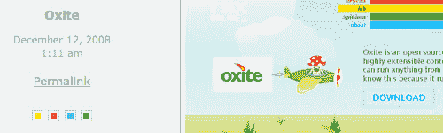

## [网霜](http://www.webcreme.com/)

我们名单上唯一的其他传统设计画廊，Web Creme 因其独具慧眼而闻名。在 Web Creme 上获得一个站点并不容易，我们可以看到其中的原因。这个高度节制的网站只选择最好的设计中的最好的。

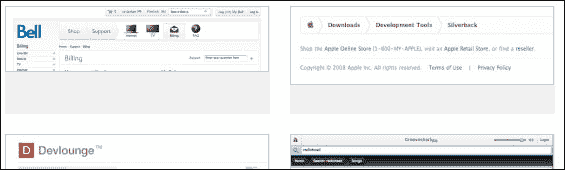

## [模式点击](http://patterntap.com/)

Pattern Tap 是一个界面库。它侧重于设计元素的有组织的集合，如评论显示样式、面包屑、按钮和 404 页面。这是一个很好的地方来获得灵感，有时被低估的网页设计的细节。

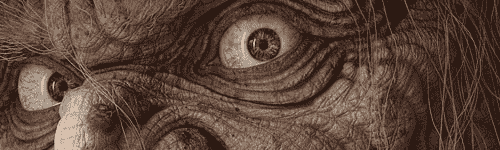

## [CG 协会画廊](http://forums.cgsociety.org/forumdisplay.php?f=138)

CG 协会是世界上最优秀的 3D 艺术家的家园。他们的画廊论坛既提供华丽的成品，也提供正在进行的令人兴奋的作品，让你看到这些才华横溢的人是如何把他们的杰作放在一起的。这是鼓舞人心的东西，相信我们。

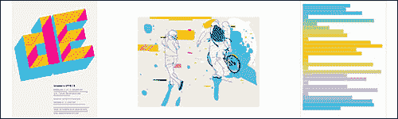

## [FFFFound](http://ffffound.com/)

链接之于美味，图片之于美味。图像书签网站是一个名副其实的令人惊叹的摄影和设计作品的宝库，由品味无可挑剔的会员收集。

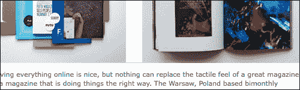

## 乔希·斯皮尔

乔希·斯皮尔的博客是关于趋势的。斯皮尔已经围绕他的好品味和为他工作的人的品味建立了一项业务，他们挖掘出来的东西往往看起来令人惊叹。斯皮尔和他的作家们链接的艺术、设计、产品和网站绝对值得一探艺术灵感。

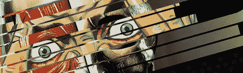

## [转变观念](http://ideas.veer.com/)

股票设计元素网站 Veer 提供了一个伟大的想法网站，给设计师灵感。尤其值得注意的是，看看“Lightboxing”，他们的 Photoshop 网球版，以及壁纸库。

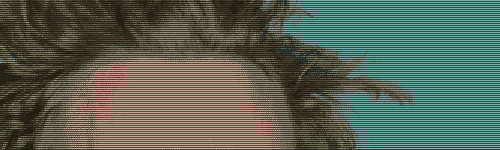

## [Moodstream](http://moodstream.gettyimages.com/)

Moodstream 是世界上最大的图片公司 Getty Images 的一个实验性网站，它将视频、图像和音乐混合在一起，创建一个背景场景，旨在帮助有创造力的人进行头脑风暴。用户可以调整变量来改变体验(例如，黑白或彩色，歌词或乐器，快乐或悲伤等)。).“什么是 Moodstream？这是一个构思工具。现代版的壁炉。互动艺术作品。未来的电视，”野蛮人集团的设计师里克·韦伯说，他为盖蒂设计了 Moodstream。

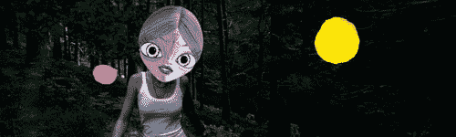

## [贝汉斯画廊](http://www.behance.net/Gallery)

贝汉兹的策展画廊收藏了令人惊叹的艺术作品。从产品设计，到印刷，到摄影，再到视频广告工作，Behance 的画廊页面应有尽有。该网站定期展示由设计领域顶级设计师亲自挑选、策划的作品，包括前面提到的[乔希·斯皮尔](http://www.behance.net/?curator=283)的作品。

## [功能:Logo 重新设计博文](http://wefunction.com/2008/10/50-stunning-examples-of-a-great-redesign/)

是的，好吧，这是一篇博客文章，而不是一个网站。但这是一个非常好的帖子，可以让任何经历过创意障碍的人看看。设计师经常被要求更新别人的旧设计，而不是从头开始新的设计。这篇来自设计公司 Function 的博客文章展示了 50 个产品、网站和标识的更新，这些更新能够为旧的设计增添新的风格。

## 分享这篇文章