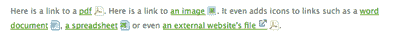
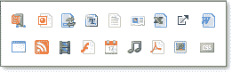

# 有用的 JavaScript 超链接

> 原文：<https://www.sitepoint.com/helpful-hyperlinks-javascript/>

你正在愉快地浏览一个网站；你点击一个链接，突然发现自己在另一个网站被要求下载一个文件。那里发生了什么？很烦吧？必须有一种更好的方式来告诉你的访问者链接到哪里，链接到什么类型的文件。因此，为了帮助解决这个小麻烦，我写了一点 JavaScript 和 CSS，根据文件扩展名和位置，在链接后添加漂亮的小图标，以向用户指示他们将要加载的文档类型。



你可以在这里[下载代码，](https://i2.sitepoint.com/examples/iKonize/iKonize-1.0.zip)和[见示例](http://ikonize.com)。

##### 案情摘要

创建此功能时的主要考虑因素是:

1.  简单——它必须易于使用

3.  适度降级——在 CSS 或/和 JavaScript 被禁用的情况下

5.  最少使用文件–只有一个 JavaScript 和一个 CSS 文件

7.  尽可能做到即插即用，这样就可以快速添加到网站中

9.  限制代码的总量

11.  兼容所有现代浏览器，包括 IE6

##### 为什么要放弃仅使用 CSS 的解决方案？

使用属性选择器，您已经可以在 CSS 中做到这一点。这里有一个例子:

```
a[href$='.doc'] { 

  display: inline-block; 

  padding-left: 16px; 

  background: transparent url(images/icon_doc.gif) center right no-repeat; 

}
```

那么，当大多数现代浏览器只使用 CSS 显示图标时，你为什么要用脚本来做呢？

答案很简单:IE6。所有像样的浏览器都支持 CSS3 属性选择器…除了 IE6。用 CSS 编写的这段脚本让 IE6 运行得很好；事实上，它甚至可以在 IE5.5 中工作。

##### 灵感和信用

在我们开始之前，我想感谢马克·詹姆斯在 [famfamfam](http://www.famfamfam.com/) 上展示的优秀且免费的丝绸图标，我们将在本文中使用这些图标。



还有，该表扬的地方要表扬:这篇文章的灵感来自于 Alexander Kaiser 的文章 [Iconize Textlinks with CSS](http://pooliestudios.com/projects/iconize/) ，而这篇文章的灵感又来自于 Ask the CSS Guy 的文章[显示 CSS 的超链接提示](http://www.askthecssguy.com/2006/12/showing_hyperlink_cues_with_cs_1.html)。此外，我还使用了几个由 SitePoint 自己的[詹姆斯·爱德华兹](https://www.sitepoint.com/blog/)编写的优秀函数，以及几个取自 Kevin Yank 和 Cameron Adams 编写的[核心 JavaScript 库](https://www.sitepoint.com/simply-javascript-the-core-library/)的函数，这些函数在 SitePoint 的书中名垂千古，简称为[JavaScript](https://www.sitepoint.com/books/javascript1/)。

##### 那么它是如何工作的呢？

简而言之:我们获取页面中的所有链接，计算出它链接到的文件扩展名，然后在链接后添加适当的图标。很好。

要使这一切正常工作，需要三个文件:

1.  包含链接的 HTML 页面，index.html

3.  包含图标类 iKonize.css 的 CSS 文件

5.  将 CSS 类和图标添加到链接的 JavaScript 文件 iKonize.js

##### 快速启动方法

现在，如果你想回避为什么，只是想把它添加到你的页面上，这里有一个简短的版本:

2.  在页面标题中添加 JavaScript 和 CSS 文件的链接(更改文件引用以适应您的站点设置)。
    `<link type="text/css" rel="stylesheet" href="iKonize.css"/>
    <script type="text/javascript" src="iKonize.js"></script>`

4.  把你的图标文件夹放到你的站点上，确保 iKonize.css 文件中的`url`引用是正确的。

6.  从包含在结束 body 标签之前的脚本标签中调用 JavaScript 函数`iKonize`，比如:
    `<script type="text/javascript">iKonize();</script>`

看，我告诉过你它很容易使用！

为了简单起见，我选择在 DOM 加载后从 HTML 中调用该函数。使用 JavaScript 还有其他方法可以实现这一点，但是它们超出了本文的范围。

##### 完整的解释

请自便，我们将深入研究内部运作。

**配置**

本着保持事情简单的精神，大部分设置已经为您完成了。如果您需要更改图标或文件扩展名，您只需更改配置。有两个地方可以进行这些更改:JavaScript (iKonize.js)和 CSS 文件(iKonize.css)。

**配置 iKonize.js**

在文件的顶部，你会看到所有的配置变量:`classPrefix`、`classExternal`和`classIconLoc`。

```
classPrefix is the prefix you want to give the individual CSS classes. Use this to prevent any conflicts with any existing CSS classes. The default is iKon_.
```

```
classExternal is the name of the CSS class you want to use to show a link to an external site.
```

```
externalIconLoc is the location of the image to use for the external icon.
```

哪些链接会收到图标？

为了定义链接指向的文件类型，我们将查看文件扩展名。文件类型分为两组:具有独特图标的文件，如 torrent 文件，以及共享相同图标但具有不同文件扩展名的文件，如 Flash 文件。fla 和。swf)。

对共享相同图标的文件扩展名进行分组，可以节省数百个 CSS 类和图标。为此，我创建了两个数组。

第一个数组`IndividualClassArray`，保存所有带有单独图标的链接的文件扩展名。CSS 类名的基本名称与文件扩展名相同。也就是说，用'`txt`'引用一个文本文件，CSS 类名是`classPrefix`(之前设置的)，而' txt '是基本 CSS 类名，在这种情况下，CSS 类称为' iKon_txt '。

```
IndividualClassArray = Array('txt', 'xls', 'css', 'torrent');
```

第二个数组`classArray`，实际上是一个多维数组，但是不要因此而分心。基本上，它是一组单独的数组，根据我们想要使用的图标类型进行分组。这个数组的第一项是`IndividualClassArray`(这个数组必须总是第一个数组)。下面的数组与前面的数组相似，但有一个重要的区别:每个数组的第一项是将要使用的 CSS 类的名称，下面的项是需要该类的文件扩展名。在下面的示例中。主权财富基金和。fla 文件扩展名将与“flash”CSS 类相关联。

```
classArray = Array(  

IndividualClassArray,  

Array('flash', 'swf', 'fla')  

);
```

注意:文件扩展名不包括点号，即 xls 而不是. xls。

为了获得最大的可移植性，实际使用的 CSS 类名将有一个前缀，如‘iKon _ ’,这是我们之前配置的——但是在这些数组中，我们总是*排除前缀。所以 Flash CSS 类总是被称为“Flash”而不是“iKon_flash”。*

**外部链接**

要判断一个链接是否是外部站点，我们需要知道当前页面的主机名。

为此，我们使用:

```
url = parseURL(qualifyHREF(document.location.href)).hostname;
```

这将获取当前文档的位置，并使用`qualifyHREF`函数获取域名，以确保我们有一个完全合格的地址，并使用`parseURL`函数获取主机名。(这两个函数都是由我们的常驻 JavaScript 大师 Brothercake 和他的博客文章中提到的[编写的)。稍后，当我们添加外部链接的类时，我们将使用这个主机名来判断该链接是否在我们站点的外部。](https://www.sitepoint.com/dealing-with-unqualified-href-values-part-2)

**实际执行工作的代码**

现在我们需要使用`document.getElementsByTagName("a"),`从页面中获取所有链接，并确定链接的文件扩展名。

我们通过再次使用函数`parseURL`和`qualifyHREF`来做到这一点。

先取 a 元素的 href 值:
`linkHref = aElements[iv].href;`

接下来，解析该值以获得关于链接的更多信息:
`oUrl = parseURL(qualifyHREF(linkHref));`

然后获取链接的扩展名:
`fileExt = oUrl.extension;`

然后，我们需要遍历这些链接，确定它们是否需要一个图标。这是开始变得有点棘手的地方。我们需要遍历`classArray`和它包含的每个数组。我们通过在循环中运行循环来实现这一点。是的，那是一个循环，循环，循环！这段令人毛骨悚然的代码如下所示:

```
aElements = document.getElementsByTagName("a");  

iElements = aElements.length;  

for (iv = 0; iv < iElements; iv++) {  

  iLen = classArray.length;  

  for (ii = 0; ii < iLen; ii++) {  

      iArr = classArray[ii].length;  

        for (i = 0; i < iArr; i++) {  

            // Do we need to add an icon?  

          }  

     }  

}
```

此链接需要图标吗？

为了确定我们是否需要添加一个图标，我们将比较链接的文件扩展名和数组中列出的每个扩展名。

```
if (fileExt == classArray[ii][i]) {      

    if (ii === 0) {  

       linkClass = fileExt;  

    }  

    else {  

       linkClass = classArray[ii][0];  

    }  

    bFound = true; 

Now we know if the link needs an icon, and which class it needs. We'll add that class using the addClass function we've grabbed from the Core JavaScript Library.
```

```
if (bFound && linkClass !== '') {  

    addClass(aElements[iv], classPrefix + linkClass);  

} 
```

**外部网站链接**

确定该链接是否指向外部站点只是将我们之前确定的 URL 主机名与我们在配置区域中设置的 URL 进行比较的一个例子。

```
if (oUrl.hostname.indexOf(url) == -1) { // not our url  

    bExternal = true;  

}
```

如果为真，我们将在锚中追加一个新的图像元素，添加一个源和 ID，然后为图像添加一个 alt 和 title 属性。我们添加了额外的图标，而不仅仅是分配一个类来清楚地显示这个链接指向另一个站点，以及为图标添加标题和 alt 属性。

```
if (bExternal) { //  an external link  

   img = document.createElement('img');  

   img.id = 'Newimg' + iv;  

   img.src = externalIconLoc;  

   img.alt = 'external site';  

   img.title = 'links to an external web site';  

   void (aElements[iv].appendChild(img));  

   oimg = document.getElementById("Newimg" + iv);  

   addClass(oimg, classExternal);  

}
```

**CSS 类**

现在让我们回到 CSS 文件。

这是我们要添加图标的 CSS 类。doc 文件。请注意，类名以“`iKon_`”为前缀，然后是文件扩展名“`doc`”。这个类基本上在链接的顶部和底部以及右侧放置了一些填充。然后，它将图标的背景图像添加到该空间中。

```
.iKon_doc {  

  padding: 5px 20px 5px 0;  

  background: transparent url(icons/icon_doc.gif) no-repeat center right;  

}
```

对于我们的外部链接图标，我们将使用稍微不同的类结构。我们添加一些填充顶部和底部，以确保我们的图标是无边界的。

```
.iKon_external{   

  padding: 5px 0 0 5px;  

  border: 0;  

}
```

如果您更改了`classPrefix`变量，不要忘记更改这些类名来匹配。

##### 限制

链接必须有文件扩展名，才能为链接分配图标(除非是外部站点)。该脚本也不能识别基于查询字符串的导航链接。如果 CSS 被禁用，那么只有外部链接图标会显示，如果 JavaScript 被禁用，那么页面没有可见的变化。

##### 结论

iKonize 是在链接后添加视觉上有意义的图标的一种快速简单的方法。该脚本在 IE5.5+中工作，可以独立于 CSS3 属性选择器工作。如您所料，该脚本降级良好，并且易于配置。希望你觉得有用！

## 分享这篇文章