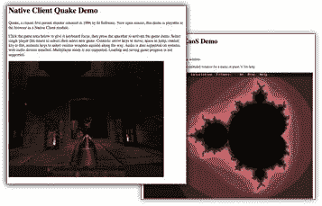

# 谷歌致力于解决 Flash、Silverlight 和 Java 的问题

> 原文：<https://www.sitepoint.com/google-working-on-answer-to-flash-silverlight-java/>

web 应用程序的问题是它们动力不足。他们只能使用现代计算机提供的一点点计算能力。谷歌[宣布本周在](http://google-code-updates.blogspot.com/2008/12/native-client-technology-for-running.html)发布一个新的开源研究项目，名为 [Native Client](http://code.google.com/p/nativeclient/) ，旨在改变这种情况。Native Client 是一组技术，允许开发人员创建可以在浏览器中运行本机 x86 代码的 web 应用程序。

Native Client 由一个运行时、一个浏览器插件和一组基于 GNU 编译器集合的编译工具组成，这些工具允许创建能够访问本机代码模块的 web 应用程序。谷歌的目标是创造一种技术，可以增强网络应用程序的功能，同时保持“浏览器中立性、操作系统可移植性和安全性，这是人们对网络应用程序的期望。”

*上图:在本地客户端的浏览器中运行的演示应用程序的屏幕截图。*

目前，Native Client 可以在 Firefox、Safari、Opera 和 Google Chrome 上运行，可以在任何配备 x86 处理器的现代 Windows、Mac 或 Linux 系统上运行。这也绝对是目前面向开发者的演示。Native Client 的运行时时钟大约为 88MB，需要安装 Python 因此，不适合胆小的人。

不过，最终，Native Client 可能会演变成谷歌对 Flash、Silverlight 和 Java 的回应。这无疑是他们 Web OS 战略的一部分，其中还包括 Chrome ( [我们的覆盖范围](https://www.sitepoint.com/once-extensions-arrive-on-chrome-firefox-should-worry/))和 Gears ( [我们的覆盖范围](https://www.sitepoint.com/use-google-gears-for-fast-client-side-search/))。这三者结合在一起，为谷歌在网络操作系统竞赛中的股份奠定了令人印象深刻的基础。

Chrome 允许 web 应用程序在一个单独的窗口中使用自己独立的进程启动；Gears 允许这些应用程序访问本地数据存储；Native Client 允许他们利用 CPU 的能力来改进图像处理。

除了推动另一个 runtime+plugin 的采用，Google 面临的最大障碍是保证原生客户端的安全。每个人都记得曾经是 ActiveX 的噩梦。谷歌表示，他们开源原生客户端的原因之一是，研究和安全社区可以帮助它变得更加稳定和安全。

## 分享这篇文章