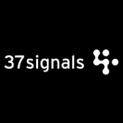

# 37signals 发布新的商业书籍

> 原文：<https://www.sitepoint.com/37signals-announces-new-business-book/>

几天前，我们[通过 Twitter](http://twitter.com/sitepointdotcom/status/1025406121) 询问我们的粉丝最近读过的商业或销售书籍是什么。我们收到了大量的回复，并找到了一些我们以前从未听说过的好书。我们很快会将这些内容提炼到他们自己的帖子中，但我们收到的最受欢迎的回复之一是“[变得真实](http://gettingreal.37signals.com/)”，这是软件开发商 37signals 的一本改变游戏规则的商业书籍。

这本书于 2006 年自行出版，最初作为可下载的电子书出售，概述了这家总部位于芝加哥的公司的业务和软件开发哲学，包括敏捷开发、引导、使用小团队，以及对新功能说“不”(创建他们所谓的“自以为是的软件”)。《变得真实》对 37signals 来说是一个巨大的成功，卖出了价值 35 万美元的 PDF 版本，当它通过按需印刷出版商 Lulu.com 发行时，又卖出了 6.5 万美元。该公司还根据这本书创建了一系列小型会议，又赚了 25 万美元。

这本书现在通过该公司的网站免费赠送。

对于一本自己出版的商业书籍来说，收入超过 50 万美元，销量超过 3 万册是相当令人印象深刻的，所以难怪许多人都期待着续集。今天，37signals 的主唱杰森·弗里德宣布了他们的下一本书，暂定名为《不整合》这本书实际上是软件开发商店的第三本，它也是 2004 年的“[网络防御设计](http://www.amazon.com/Defensive-Design-Web-improve-messages/dp/073571410X/)”的作者

《不整合》将由皇冠图书公司出版，尽管第一稿已经提交给他们的编辑，但传统的出版过程可能需要长达 12 个月，所以我们不应该指望这本书很快就会上架。这本书将以传统方式印刷，并在商店出售，但电子书和有声读物版本以及配套的视频内容正在计划中。免费在线版本还没有准备好，至少最初没有(然而,《变得真实》从付费下载到免费网络阅读花了大约一年时间，所以一切皆有可能)。

弗里德说，新书是关于“企业家精神，简单和小作为一种竞争优势，我们用来建立我们的业务的技术，以及我们在这个过程中学到的各种东西”。“这与软件或技术无关。这是一本商业书籍。”

据 Fried 说，他希望能够在未来几周或几个月内在公司的流行博客上发布他们的图书提案，他们决定与传统图书出版商合作出版“不整合”，因为他们希望超越他们的固定读者。“我们想卖出几十万或几百万册这本书。我们认为，所有行业的所有企业家(或企业主/产品经理)都应该听到这些内容和信息，”他说。“我们认为，传统出版商可以扩大我们的覆盖范围，远远超出我们自己的能力。”

Fried 今天在公司博客上发布了一篇有趣的文章，详细介绍了寻找代理、向出版商推销和签署协议的过程。从上周对我们推特的回应来看，我们确信会有很多 SitePoint 读者急切地等待“不整合”

## 分享这篇文章