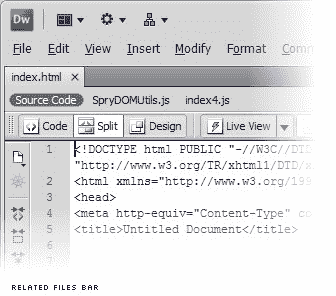
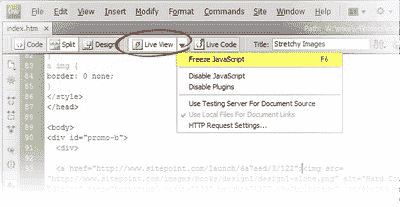

# Dreamweaver CS4:不完美世界的强大工具

> 原文：<https://www.sitepoint.com/dreamweaver-cs4-a-powerful-tool-for-an-imperfect-world/>

随着 Dreamweaver CS4 的发布，Adobe 承认网页设计已经向前发展了。设计师不再满足于将自己局限于所见即所得的工具；相反，Dreamweaver CS4 将重点转移到为像你我这样精通代码的前端设计人员提供强大的工具上！Dreamweaver CS4 以 WebKit 渲染引擎为核心，在客户端设计的每个方面都采用了最佳实践。如果在服务器端也是如此就好了。

包括 Dreamweaver CS3 在内，该程序显然是为了保护网页设计者免受构建网站时所有可怕代码的影响。它允许您使用工具栏按钮和属性检查器而不是标签和属性来生成 HTML 标记。它允许您使用向导和面板而不是 CSS 规则和属性来设置标记样式。如果你需要的话，代码视图就在那里，但是程序尽力确保你不需要。

近年来，随着越来越多的设计师需要控制他们的代码，这已经成为一场失败的战斗。成品看起来怎样并不重要；设计者也开始关心代码看起来像什么。Dreamweaver 将代码隐藏在简单工具后面的有益尝试变成了障碍而不是帮助。

显然，Adobe 一直在关注这个问题。尽管 WYSIWYG 设计视图以及面板和向导仍然存在，但 Dreamweaver CS4 增加了对一种全新工作方式的支持，这种方式主要是面向代码的。

在 Dreamweaver CS4 中打开一个 HTML(或 PHP、ColdFusion、JSP、ASP、ASP.NET)文件，新的**相关文件栏**会立即显示您站点中用于在浏览器中显示该页面(或在服务器上汇编该页面)的所有其他代码文件。打开**实时预览**，你将看到完整呈现的页面，所有服务器端和 JavaScript 支持的功能保持不变，而不是你的页面的愚蠢的所见即所得视图。

由 Safari 和 Google Chrome 等浏览器核心的开源 WebKit 引擎提供支持，实时预览不仅仅是一个预览，而是一个代码导航工具:双击页面上的任何元素，代码面板将跳转到负责生成它的 HTML 代码。如果该代码包含在另一个文件中，则该文件会在相关文件栏中被自动选中，这样您就可以在不离开主文件(或其实时预览)的情况下编辑它！

更好的是:按住 Alt 键(在 Mac 上是⌘⌥-click)单击实时预览中的任何元素，弹出**代码导航器**，其中包含了对元素外观有贡献的 CSS 规则的明细！单击其中任何一项，直接跳转到相关的代码行，在那里您可以进行调整，并立即观看实时预览更新。

## 另一类人的生活方式(尤指比自己富有得多的人)

Dreamweaver CS4 强调核心前端编码，值得整整一代认为自己已经超越了它的网页设计师的关注。多年来，Dreamweaver 第一次再次成为处于领先地位的开发人员的工具，而不是那些落在后面的人。

这并不是说 Dreamweaver CS4 是完美的。随着它拥抱和赋能当前一代前端编码人员，领先的服务器端开发人员被远远甩在后面。据我所知，这是由于应用程序中的一个基本假设:你的站点的 URL 结构对应于它的文件结构。

在更简单的时间里，网站上的每一个独特的页面设计都由一个 HTML 文件表示，或者由一个生成 HTML 的服务器端脚本文件表示。如果您想在浏览器中查看该页面，请在 URL 中键入文件名。如果您想要编辑页面，可以在 Dreamweaver 中打开该文件。

我不知道你，但我已经有几年没有这样建立网站了。如今，网站是使用强大的服务器端框架构建的，这些框架动态地将 URL 转换为要采取的操作、要查询的数据，或者在某些情况下，要显示的 HTML 视图模板。在这样的系统中，负责生成 HTML 页面的文件名通常与请求它们的 URL 没有什么共同之处。例如，URL 路径`/article/12/page/3`可能映射到名为`/templates/article.tpl`的模板文件。

开箱即用，Dreamweaver 无法处理这种代码库。如果你打开(比方说)一个实际处理浏览器请求的 PHP 脚本，Dreamweaver 的相关文件栏将找不到构成你的站点页面的任何 HTML、CSS 或 JavaScript 代码。如果您打开一个 HTML 模板，Dreamweaver 的实时视图将无法计算出正确的 URL 来请求获取使用该模板的页面。

## 注意第一步…

Dreamweaver 一直是不完美世界的工具。在以前的版本中，它的目标是支持那些坚持用老方法做事的开发人员，他们回避那些进入他们构建的网站的代码。

有了 CS4，Dreamweaver 已经走出海洋，踏上了现代 web 开发的陆地。它认识到今天的领先开发人员关心代码，并且想要帮助他们编写代码的工具，而不是对他们隐藏代码。如果您有幸在静态网站上工作，为以后与服务器端代码的集成准备初始模型，或者如果您也只是迈出了现代 web 开发的第一步，Dreamweaver CS4 可能是您的完美工具。遗憾的是，我不得不等待奥多比现在就站稳脚跟。

真的很遗憾。Dreamweaver CS4 的前端编码工具如此强大，我希望每个 web 开发人员都能使用它们！我可以诚实地说，自从我自己考虑使用 Dreamweaver 以来，已经过去了将近十年，但是我真的很想使用 Dreamweaver CS4。

也许这个差距可以用一个巧妙的 Dreamweaver 扩展来弥补。称之为动态 URL 映射器。有了它，开发人员可以配置实时预览用来请求 HTML 模板文件的 URL，以及它们引用的静态资源(图像、CSS 和 JavaScript 文件)。这是否可能取决于 Dreamweaver CS4 的实时预览机制的可扩展性。

否则，使用当今尖端服务器端框架的开发人员将不得不等待 Dreamweaver CS5。有了这样一套强大的客户端工具，Adobe 将注意力转向现代服务器端框架是有意义的。如果 Adobe 在这方面做得像它支持现代前端开发一样好，它将会吸引很多人——包括我。

## 分享这篇文章