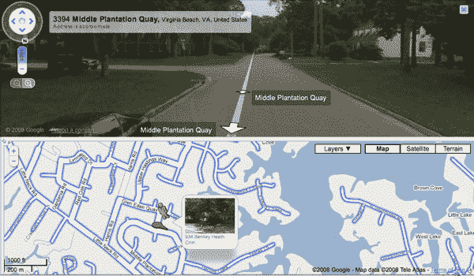

# 谷歌让街景在地图中更加突出

> 原文：<https://www.sitepoint.com/google-makes-street-view-more-prominent-in-maps/>

自 2007 年 5 月推出以来，谷歌街景已经覆盖了世界上足够多的城市，谷歌现在可以放心地将其与他们的地图产品进行更深入的整合。本周，他们宣布了街景功能的许多增强功能，使其成为地图体验的前沿，并与地图的其他功能更紧密地集成。

最大的变化是你现在访问街景的方式。地图右上角的切换按钮不见了。相反，可以通过将地图左上角缩放工具中的“Pegman”图标(也经过了重新设计)拖到任何具有街道视图数据的地图上来启动街道视图(发生这种情况时，街道仍会显示蓝色轮廓)。当你将 Pegman 悬停在一条街道上时，谷歌会弹出该街道的缩略图，我猜这有助于确定这是否是你想要启动的视图。

真正重要的变化发生在你进入街景模式后，现在是全屏模式。除了更大的默认视图，还可以加载双窗格视图，街道照片在顶部窗格，地图在底部。这允许你在地图上拖动 Pegman，并在顶部显示区域立即加载视图。一个新的 360 度切换控制可以让你在视图中旋转。你仍然可以点击并拖动照片来实现，但是切换更加流畅。

由于在每张照片上嵌入了一个新的举报链接，举报令人反感的内容也变得更加容易。

我们猜测，谷歌做出这些改变是基于两件事，街景的覆盖范围足以开始更努力地将其作为地图产品的核心功能，以及可能的可用性测试和用户反馈。在我们今天的测试中，我们发现现在访问和使用街景更加容易。全屏视图更容易理解，并且在双窗格视图中从一条街道导航到另一条街道要比街景视图在自己的小窗口中弹出并遮住地图本身容易得多。

在我们看来，街景是一项伟大的创新，在帮助我们找到以前从未去过的地方方面，它的作用超乎我们的想象。

谷歌制作了这个愚蠢的视频来介绍新的变化:

<object width="425" height="344"><param name="movie" value="https://www.youtube.com/v/f0y-q-pI2pQ&amp;hl=en&amp;fs=1"> <param name="allowFullScreen" value="true"> <param name="allowscriptaccess" value="always"> <embed src="https://www.youtube.com/v/f0y-q-pI2pQ&amp;hl=en&amp;fs=1" type="application/x-shockwave-flash" allowscriptaccess="always" allowfullscreen="" width="425" height="344"></object>

## 分享这篇文章