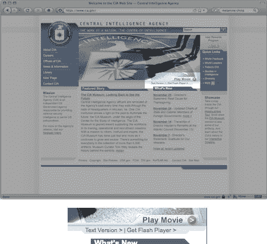
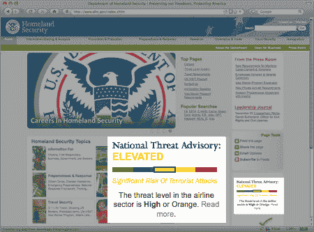

# 第 508 节:山姆大叔的网页可访问性指南

> 原文：<https://www.sitepoint.com/section-508-web-accessibility/>

对于许多 web 开发人员来说，可访问性是一个很难的话题，提出了是否必须删除功能或改变调色板的问题。事实是，可访问性*增强了*你的网站，允许你的访问者按照他们的条件访问——如果你遵循创建可访问网站的其他准则，美国政府的[第 508 条](http://section508.gov)应该感觉非常熟悉。

Section 508 是美国政府康复法案的修正案，旨在规范信息技术的可访问性。该修正案于 1998 年通过，要求所有美国联邦机构向所有用户提供他们的产品。此外，这些机构必须购买符合 508 标准的商品和服务，这使得该法律对任何为联邦政府签约的人都很重要。

虽然像 Section 508 这样的规范有助于推动开发人员走上正确的道路，但可访问性是找到充分利用您的站点的最佳方式的问题。第 508 条是美国一项更大的法律的一部分，涉及信息技术的所有方面，而不仅仅是网络。但是这条法律中的段落有助于真正定义开发网站的最佳实践。

这项法律最直接的部分，因为它适用于网络，非常类似于[网络无障碍倡议的 WCAG 1.0](https://www.w3.org/TR/WCAG10/)；事实上，第 508 条的 16 个段落中有 13 个在 WCAG 有对等的内容。然而，为了符合 508 条款，你的网站也必须满足最后三段。

让我们来看看这两套标准所涵盖的一些基础知识，并看看一些政府网站目前的情况。

##### 文本替代

理解网站可访问性的一个基本原则是，所有非文本内容都应该有一个**文本等价物。在大多数情况下，您可以将这个文本版本包含在同一个文档中，并且通过一些预先考虑应该需要最少的额外工作。**

理想情况下，您已经熟悉了提供最基本的文本等价物之一:图像标签上的`alt`属性中的替换文本。要检查图像的替代文本是否有用，请在下次访问您的网站时禁用图像。你看到的文字应该有助于你理解图像或它所代表的内容:如果你展示了任何与页面内容相关的东西，包括图像中的文字，它应该出现在这里。

替代文本应该是有帮助的。如果一个图形元素仅仅用于装饰，替换文本是不必要的(在 XHTML 中，它确实需要一个空的`alt`属性！).[白宫网站](http://whitehouse.gov)使用了几个具有“钻石图像”属性的`alt`图形元素，这很难适应。

如果你的图片要形成一个超链接，我建议你在描述图形时，在图片中提供特定的文字，而不是链接的意图。因此，与其说“总统非洲之行的图片——点击查看幻灯片”,不如说文字可以传达图片实际上所说的内容:“非洲幻灯片:2008 年 2 月 15 日至 21 日。”因此，将原始文本移动到 title 属性中。

富媒体，如 Flash 和视频，为开发人员提供了一系列独特的问题。无法访问 Flash 或选择不使用 Flash 的用户仍然可以访问您在 Flash 中展示的信息。

如果您有 Flash 导航，您应该在页面上提供文本文件中的所有链接作为文本链接。例如，当使用 [SWFObject](http://blog.deconcept.com/swfobject/) 时，您可以轻松地提供一个链接列表，这些链接可以被您的 Flash 电影替换。

更复杂的 Flash 示例应该显示一些不用 Flash 也能访问的信息——可以说是相同的内容。提供一个链接，链接到包含电影中所有关键信息的页面。

当你在网站上使用视频时，提供一份基于文本的对话记录是很重要的。也鼓励在可能的情况下使用字幕。中央情报局的网站有一个很好的例子，展示了如何简单地链接到文字版的 Flash 视频。

提供跳过导航链接和其他链接来浏览页面。如果你为用户提供一种机制来绕过重复的信息(比如你网站的菜单)，他们可以更容易地(更少地)访问你的内容。

##### 颜色

在设计网站时，颜色和可访问性是棘手的问题。第 508 条指导开发者创造设计，通过颜色之外的其他方式传达意义。这是为了避免屏幕上给定元素的含义模糊。例如，如果你正在显示一个错误消息，应该有一些线索表明这是一个错误消息，或者至少是一个重要的消息。

同样重要的是要注意，第 508 条规定你的网站必须在没有样式表的情况下可读。如果你正在使用 CSS，这意味着通过使用语义标记或上下文，你应该能够传达任何信息，不管颜色是否传达意思。这是因为当你的用户浏览你的网站时，你的颜色选择可能是不可用的——也许他们有不同的浏览器偏好，或者是色觉缺陷。

一个简单的例子是国土安全咨询系统，它传达了美国的威胁等级。国土安全网站使用形容词和颜色来传达当前的威胁等级。

当设计一个网站时，你可能会觉得颜色的选择有限，但是颜色选择和可访问性的重要问题是色调对比。幸运的是，近年来，设计师们一直在创建易于访问的网站，这些网站在图形上仍然很有吸引力。最近在英国举行的一场比赛展示了设计良好的网站，这些网站达到了可访问性水平。这里对比色的使用仍然为所有视力正常的用户提供了有用的体验。

##### 数据表

在表格中显示信息可能很乏味，但是使用适当的语义标记和一些深谋远虑确实可以帮助访问者访问您的站点。需要注意的几点是:

*   确保在适当的地方使用表格标题(`th`)，而不仅仅是样式化的文本。上图所示的[运输安全管理局](http://www.tsa.gov/)站点等站点使用表格显示信息；例如，你可以带什么，不可以带什么上飞机。然而，TSA 对标题的使用很差，这使得访问这些信息更加困难。
*   当使用标题时，考虑向表元素添加类似于`scope`的属性。这有助于提高表格在屏幕阅读器中的可读性。通常，表格标题与一列相关(`scope="col"`)，但是您也可以将标题用于表格行(`scope="row"`)。HTML 还提供了将表格数据绑定到特定标题的更高级的方法。
*   如果您需要限制一个表格的标题来适应一个页面的信息，可以考虑在`th`元素上使用`abbr`属性来显示一个更短的选项。

##### 剧本

508 条款和 WCAG 都同意脚本可能是辅助技术的一个问题，所以当你在你的网站上使用它们的功能时，你可能需要格外小心。当你提供的应用程序只支持 JavaScript 时要小心。向你的访问者解释这种情况，如果 JavaScript 不是一个选项，将他们链接到使用应用程序的任何替代方法。

Section 508 解释了在使用辅助技术时，所有信息都应该是可访问的，甚至是由脚本创建的内容。通知访问者页面会动态更新，并在必要时为他们提供停止更新的方法。

##### 剩余部分

Section 508 与 WCAG 1.0 的不同之处在于处理脚本、表单和导航的三个项目。关于 508 条款的信息声称最后五段不同于 WCAG 1.0，但实际上它们与 WCAG 现有的指导方针或检查点非常相似。为此，以下是遵守 508 条款时应该考虑的事项:

*   如果一个页面或一个表单需要一个定时响应，确保用户意识到这一点，以及他们有多少时间。这对于时间可能会影响可用性的系统来说非常重要，比如一些在线购票系统。对于像测验或游戏这样的场景，如果需要的话，给用户延长时间的能力。
*   如果您使用 Flash 或任何其他小程序，您必须链接到用户可以获得这些插件的页面。这包括 Flash、Java 甚至是阅读 pdf 的插件或阅读器。
*   表单应该是实用的，并使用适当的语义标记来创建。必要时，使用文本或适当的图像技术，清楚地标注必填字段，并使所有方向或其他提示易于理解。

##### 测试:行业工具

要测试你的网站的可访问性，最简单的工具就是你的浏览器。火狐浏览器的扩展，如 [Web Developer Toolbar](https://addons.mozilla.org/en-US/firefox/addon/60) 允许你操作你的网站，关闭浏览器的功能，如 JavaScript、图片或 CSS。它包括测试标准符合性和可访问性符合性的简单方法。

像辛西娅所说的和[功能易访问性评估工具](http://fae.cita.uiuc.edu/)这样的在线工具使得一些基本的检查变得容易，同时指出你需要手动测试的地方。像 [Vischeck](http://www.vischeck.com/vischeck/vischeckURL.php) 这样的网站允许你模拟某些类型的色盲，但是我推荐使用基于桌面的解决方案，比如[Color Oracle](http://colororacle.cartography.ch/)；这样，您可以将工具集成到整个设计过程中，而不仅仅是生产过程。

遵循可访问性的最佳实践通常类似于创建网站的最佳实践。只要稍加考虑，您就可以帮助确保所有用户都能以他们喜欢的方式访问您的网站。

## 分享这篇文章