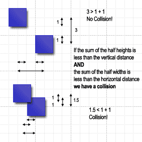
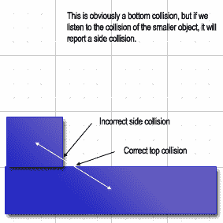

# 为了乐趣和利益而入侵 JavaScript:第二部分

> 原文：<https://www.sitepoint.com/javascript-fun-profit-part-2/>

**[在本系列的第一部分中，](https://www.sitepoint.com/article/javascript-fun-profit-part-1/)你已经学习了足够多的 JavaScript 和 CSS 来让一个动画角色在你的浏览器中移动。在这篇文章中，我将探索一些电脑游戏技术，这些技术将允许我们制作多个精灵的动画，并让它们彼此互动。**

如果您想在家里试验这些代码，请随意下载本文的代码档案。

##### 循环回路

上一篇文章中展示的演示有一个简单的计时器，每秒钟触发两次；这移动了背景图形的位置，使我们能够动画精灵。这个计时器就是游戏开发者所说的循环，它让事情发生。显然，我们可以给每一个我们渲染的精灵一个自己的计时器，但是这可能会导致一些同步问题，当我们开始测试冲突时，我们需要同步所有的游戏对象。

首先，我们需要一个主对象来管理我们的循环。在这个例子中，对象被称为`GameCanvas`。和主计时器一样，这个对象将负责管理游戏屏幕，并处理诸如完整游戏中的得分之类的事情。示例游戏循环的基本代码如下:

```
var GameCanvas = Class.create({ 

   sprites: null, 

   loopTimer: null, 

   initialize: function(element) { 

     this.sprites = new Array();  

     this.element = $(element); 

     this.start(); 

  }, 

  loop: function() { 

    this.checkCollisions(); 

    for(var i = 0; i < this.sprites.length; i++) { 

      sprite = this.sprites[i]; 

      sprite.render(); 

    }  

  }, 

  checkCollisions: function() { 

    // This will be implemented soon. 

  },  

  start: function() { 

    this.loopTimer = setInterval(this.loop.bind(this), 1); 

  } 

});
```

基本上，循环运行的是`checkCollisions`函数，我们很快就会谈到。然后，它遍历 sprites 数组，并为每个 sprite 调用 render 函数。你们中的一些人可能已经注意到,`loopTimer`每秒钟被触发 1000 次，如果 JavaScript 被线程化，这将使一切运行得非常快。正如我在上一篇文章中提到的，JavaScript 不是线程化的，所以循环中的代码将有效地阻止执行，直到它完成，引入了比我们要求的更长的延迟。我们将间隔设置为 1，以确保代码尽可能快地运行。

##### 是时候拿出数学了

我已经拖得够久了。不幸的是，为了下一个任务:碰撞引擎，你可能不得不拿出那些几何和三角学课本。这个想法是检查屏幕上的精灵是否重叠；如果是的话，我们就有碰撞了。当这种情况发生时，我们可以运行一些代码来处理这种情况。这可能包括阻止子画面沿其当前方向进一步移动、启动动画序列或完全移除子画面。

我们将要看到的系统是基于矩形元素的，因为我们正在处理的大多数精灵都是矩形的。如果我们知道这两个元素的坐标，我们就能很容易地算出它们彼此之间有多远。我们通过检查到两个精灵中心的距离小于每个精灵的一半宽度和一半高度的总和来做到这一点。

什么？我认为需要一个图表来使这一点更容易理解:



冲突检测的伪代码是:

```
 distance_x = absolute_value_of(centre_x_coordinate_of_obj_1 - centre_x_coordinate_of_obj_2) 

 distance_y = absolute_value_of(centre_y_coordinate_of_obj_1 - centre_y_coordinate_of_obj_2) 

 if(distance_x is <= width_of_obj_1 / 2 + width_of_obj_2 / 2 and distance_y <= height_of_obj_1 / 2 + height_of_obj_2 / 2) 

   // Collision! 

 }
```

所以，这个公式让我们知道是否有碰撞，但是我们真的需要知道方向。这是因为在顶部碰撞时执行的动作可能需要不同于左侧碰撞。对于那些记得向量算术的人，你会知道如果我们减去两个向量，我们可以得到一个量级(或距离)和一个角度；这正是我们所需要的。vector.js 文件包含允许我们执行一些基本矢量运算的类，包括转换到极坐标，这在我们稍后需要计算一些角度时会变得很重要。

`Math.atan2`函数将给出我们需要的角度值。这也被称为反正切，其中，[根据 Mozilla 参考:](https://developer.mozilla.org/En/Core_JavaScript_1.5_Reference:Objects:Math:atan2)

<q>这是正 x 轴和点(x，y)之间的逆时针角度，单位为弧度。</q>

如果我们有两个代表两个精灵中心点的向量，我们用一个向量减去另一个向量来代表两个中心点的位移。一旦你确定了这一点，用弧度计算角度就很简单了:

```
angle = Math.atan2(vector.y, vector.x);
```

对于那些不记得如何将弧度转换成角度的人，你可以乘以 180，再除以 pi。要执行相反的操作，您需要乘以圆周率并除以 180，因此:

```
degrees = radians * 180 / pi 

radians = degrees * pi / 180
```

如果我们把每个精灵(好像它们是正方形的)从一个角到另一个角分成四份，就像我们的三明治是为学校切的一样，我们就有了每个方向的界限。

| 度 | 碰撞方向 |
| --- | --- |
| 45-135 度 | 顶端 |
| 135-225 度 | 左边的 |
| 225-315 度 | 底部 |
| 315-45 度 | 对吧 |

collision_engine.js 文件包含用于检查碰撞条件和确定碰撞角度的`CollisionEngine`类。有一个基类`CollisionEngine`和两个子类:`SquareCollisionEngine`和`CircleCollisionEngine`。对于不同形状的精灵，它们有不同的方法来计算中心坐标和碰撞角度。

现在可能是解释这个系统的一个特性的好时机。每个 sprite 都有许多自定义事件处理程序:`onTopCollision`、`onRightCollision`、`onBottomCollision`和`onLeftCollision`。如果你仔细阅读代码，你会注意到`CharacterSprite`有一个不做任何事情的碰撞引擎！因此，它依赖于周围的对象向它发送碰撞事件。起初这听起来可能有悖常理，但如果我们看看数学，这是有道理的。下图说明了这个问题:



正如你所看到的，如果精灵的大小不同，角度会报告错误的方向，除非我们翻转它。

在这样一篇文章中很难解释矢量数学的所有复杂性，所以如果你感兴趣并想做进一步的阅读，有一个很棒的教程叫做“[3D 计算机图形矢量数学](http://chortle.ccsu.edu/VectorLessons/vectorIndex.html)”。

##### 我们已经做了数学，现在一些物理

从事 web 开发，我希望尽可能避免物理，但偶尔会派上用场。如果我们在屏幕上移动一个角色，跳跃和下落会让事情看起来更真实——这就是物理学可以帮助我们的地方。给定一个恒定的加速度(重力)，一个初速度和一个时间单位，我们可以算出最终速度。

```
final_velocity = initial_velocity - gravity * time
```

我们可以通过将 time 设置为值 1(任意时间单位)来简化公式:

```
final_velocity = initial_velocity - gravity
```

在游戏中，速度数字变成了加到精灵的当前 y 坐标上的量，以计算新的 y 坐标。我们还需要包括值为 1、0 或-1 的方向，这取决于精灵是向上移动、静止还是向下移动。初始速度然后乘以这个方向值。对于循环的每个周期，我们可以在 y 轴上绘制精灵的新位置。

如果你想到马里奥精灵是如何跳跃的，这就更清楚了。如果子画面跳跃，速度数字最初被设置为一个较高的数字，然后逐渐降低；这意味着精灵沿 y 轴移动的量在每个循环中减少了重力常数。视觉上，精灵在接近跳跃的顶点时似乎在减速。当速度达到 0 时，已经到达跳跃的顶部，并且方向相反。在相反的方向上，从精灵的 y 坐标中扣除的量随着每个周期增加，模拟精灵下落时的加速。底部与另一个适当的精灵碰撞，例如砖块，会立即停止下落。

所有的物理代码都可以在 sprite.js 中的各个 sprite 类中找到，好好看看`CharacterSprite`类和 render 函数，看看马里奥 sprite 是怎么移动的。

##### 滚动屏幕

游戏的最后一部分是滚动窗口。我们有一个从左到右平铺的背景图像。事实上，整个“级别”超过 6,000px 宽。为了获得侧边滚动效果，我们需要使用`window.scrollTo` JavaScript 函数使屏幕围绕 sprite 居中。简单地说，我们检查 sprite 的当前 x 值，并将 scroller 设置为这个值加上屏幕宽度的一半:

```
 window.scrollTo(this.getX() - (window.innerWidth / 2), 0);
```

当我第一次使用这种技术时，屏幕上出现了可怕的闪烁。我追溯到左右箭头键触发了一个事件，导致屏幕滚动——这是有意义的；不幸的是，它滚动的方向错了！幸运的是，有一个简单的解决方法:简单地捕捉事件并忽略它。不幸的是，我不知道如何动态地应用事件监听器，所以我只能用老方法。不要恨我:

```
 <script type="text/javascript"> 

 function stopScroll(e) { 

   keynum = window.event ? e.keyCode : e.which; 

   return keynum != Event.KEY_LEFT && keynum != Event.KEY_RIGHT; 

 } 

 </script> 

 <body onkeydown="return stopScroll(event);">
```

好了，这基本上涵盖了用 JavaScript 构建一个侧滚平台游戏的概述。我们已经讨论了很多，其中一些只是被掩盖了，但是你现在应该能够浏览完整的源代码并理解发生了什么。我们已经看了动画，游戏循环，一个基本的碰撞引擎和物理引擎，以及一些使一切顺利移动的浏览器技巧。所以你现在面临的挑战是拿着代码，制作你自己的 80 年代风格的侧滑游戏。

这期间去和[玩游戏](https://i2.sitepoint.com/examples/js_game/game/index.html)。请注意，尽管 Prototype 在消除浏览器不兼容性方面做了合理的工作，但它并不能保证在所有浏览器中都完美地工作。我能说什么呢——你不可能赢得所有人。欢迎来到流血边缘！

## 分享这篇文章