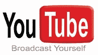

# YouTube 的 PPC 广告是明智之举，而不是孤注一掷

> 原文：<https://www.sitepoint.com/youtube-ppc-ads-are-smart-move-not-desperate-one/>

昨天， [YouTube 宣布](http://www.youtube.com/blog?entry=geqKl0QNkkw)将以赞助视频的形式向网站添加点击付费广告。用户和广告商现在可以对与网站搜索结果并排的定向广告进行竞价，并将用户推向特定的剪辑。TechCrunch 的 Erick Schonfeld 认为 YouTube 的新广告是弱势的表现。但是我们不同意。

“这就是在线视频的严酷现实:没有人赚很多钱，” [Schonfeld 写道](http://www.techcrunch.com/2008/11/13/online-video-wheres-the-money/)。“写作已经在墙上。YouTube 正在向最性感的投标人出售视频搜索结果，并于今天宣布将 YouTube 合作伙伴视频中的叠加广告扩展到其他网站的嵌入视频(以前这些广告只会出现在 YouTube 本身)。它正竭尽全力让这些收入流动起来。”

Schonfeld 指出，尽管 YouTube 在线播放的视频占了最大份额，但只有大约 3-4%有广告。这是一个巨大的数字，但他认为，像 Hulu 这样专注于专业制作内容的较小竞争对手，通常对广告商更有吸引力，实际上比谷歌更适合产生收入。

但是如果谷歌知道怎么做的话，那就是从搜索引擎中赚钱——而 YouTube 恰好是其中最大的一个。正如硅谷内部人士指出的那样，YouTube 实际上是世界第二大搜索资产，产生的搜索量是微软的两倍，甚至超过雅虎！

我们也看到了 YouTube 视频在传递广告信息方面的重要性。最近有两个很好的例子。一个是美国总统大选，巴拉克·奥巴马和约翰·麦凯恩在 YouTube 上争夺免费播放时间——奥巴马的频道[在最后一周](http://newteevee.com/2008/11/11/statshot-greys-anatomy-obama/)激增，随你便。另一个例子是微软的宋飞/盖茨商业广告活动，它在电视上失败了，但通过 YouTube 等病毒式渠道获得了大量的[播放量](http://www.visiblemeasures.com/news-and-events/blog/bid/6828/Microsoft-s-Viral-Video-Adventure-Seinfeld-Gates-vs-I-m-a-PC)。

在我们看来，YouTube 开辟广告频道，将人们推向广告视频是一个明智之举。该网站免费提供广告时段，但允许广告商付费，以推动该内容的流量——这是同样的模式，在他们的其他搜索引擎上运行良好。到目前为止，一些广告的针对性非常差，但我们预计一旦更多的广告客户在系统上活跃起来，这种情况就会改变。

有多少唱片公司会付钱让更多用户观看他们最新艺人的音乐视频？有多少电影制片厂会付费来获得他们最新电影预告片的更多观看次数。可以想象，公司可以通过支付视频的初始流量，利用广告来启动病毒式视频广告活动。一旦发生这种情况，如果内容是好的，YouTube 的病毒式动态将会接管。我们还认为，这将是小型独立电影和视频制作人推广其项目的绝佳渠道。

YouTube 上的 PPC 广告远非绝望之举，而是明智之举。谷歌可能最终找到了一种在视频长尾上赚钱的方法，就像他们以前发现如何在网站长尾上赚钱一样。

## 分享这篇文章