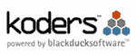

# 找到您需要的代码的 7 个地方

> 原文：<https://www.sitepoint.com/7-places-to-find-the-code-you-need/>

SitePoint 论坛上最近的一个帖子讨论了如何最好地从别人的代码中学习。对于许多人来说，通过实例学习是掌握一门新的编程语言、思想或技术的最佳方式。但是找到理想的代码片段来查看和学习并不总是容易的。这就是代码搜索引擎和代码片段库发挥作用的地方。

下面列出的七个地方是我们能找到的最能帮助你找到你一直在寻找的那段代码的地方。但是和往常一样，如果我们遗漏了什么，请在下面的评论中告诉我们。

流行的开源代码库和版本控制 web 服务 GitHub 今天推出了新的[代码搜索](http://github.com/codesearch)功能。尽管 GitHub 还是个新手，但它在很短的时间内就变得非常受欢迎，并托管了大量的公共存储库。在[的一篇博客文章](http://github.com/blog/202-github-code-search)中，GitHub 的斯科特·沙孔将搜索到的代码量归类为“很多”

Krugle 声称搜索了超过 25 亿行开源代码，使其成为网络上最大的源代码搜索引擎之一。他们声称覆盖了全球超过三分之一的开发者，他们的企业搜索产品为 Amazon Web Services、IBM developerWorks、Collab.net、SourceForge.net 和 Yahoo！开发者网络。

号称能搜索超过十亿行代码的 Koders ，似乎是 Ruby 程序员的最爱。在[上个月宣布公司被 Black Duck Software 收购的新闻稿](http://www.blackducksoftware.com/news/releases/2008-10-14)中，该网站透露 Ruby 搜索在过去四年中增长了 20 倍，并且已经超过了 PHP、Perl 和 Python。Ruby 现在是网站上第四大搜索语言，仅次于 Java、C/C+和 C#。

据该网站称，Codase 是这个平台上的小家伙，仅被搜索了 2.5 亿行代码。这可能是因为搜索引擎的发展似乎在几年前就停滞了。Codase 主要关注 Linux C/C++开源项目，似乎已经过时了，所以除非这是您正在寻找的，否则还有更好的选择。

超过 13，000 名用户贡献了超过 5，000 个代码片段， [DZone Snippets](http://snippets.dzone.com/) 库是寻找优秀代码示例的好地方。这当然不是最容易浏览的网站，但对于那些浏览的人来说，还是有一些好处的。耐心一点，你可能会在 DZone 的网站上找到你需要的东西。

Snipplr 是一个设计精美的代码片段库，它的用户比 DZone 少(不到 10，000 人)，但是可以抓取更多的代码片段——将近 8，000 个。而且看起来势头越来越猛——超过一半的网站片段是在去年添加的，尽管这个网站已经有两年多的历史了。哦，他们有方便的[插件](http://snipplr.com/developer/)用于 Textmate、Gedit 和 WordPress，还有用于 Firefox 和 Safari 的书签。执行得非常好。

最后，但肯定不是最不重要的是[谷歌代码搜索](http://www.google.com/codesearch)，所有代码搜索引擎的始祖。虽然 Krugle 和 Koders 的人可能会争论这一点，谷歌也没有说他们搜索了多少行代码，但当你谈论搜索时，谷歌总是要击败的团队。他们的代码搜索引擎搜索大量的公共源代码库——包括 GitHub、Sourceforge 和他们自己的 Google 代码站点。谷歌支持大量的 T2 语言。

**奖励:[奥赖利代码搜索](http://labs.oreilly.com/code/)** :图书出版商奥赖利让你搜索超过 123，000 个例子，涵盖从他们的书中摘录的超过 260 万行代码。差不多 700 个。

## 分享这篇文章