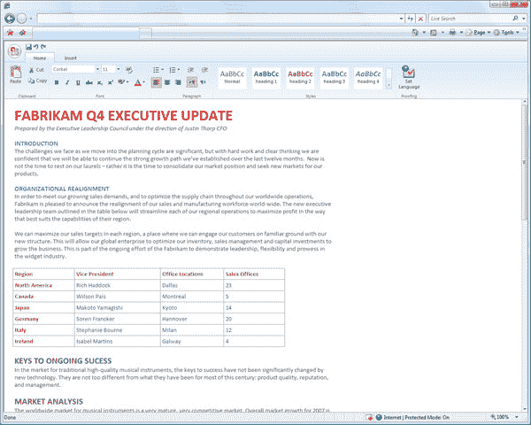
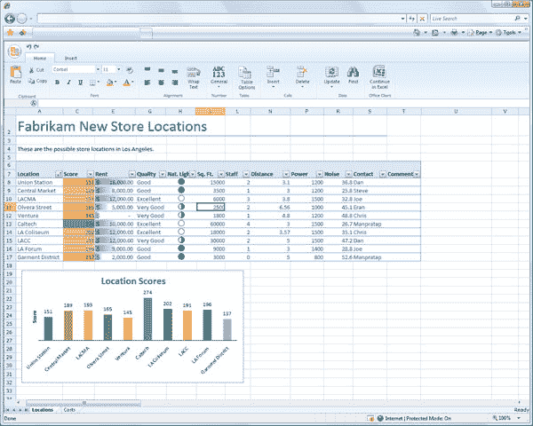

# 微软计划(最终)推出网络办公套件

> 原文：<https://www.sitepoint.com/microsoft-plans-to-finally-launch-web-office-suite/>

自 2006 年谷歌发布其基于网络的办公应用套件 Docs 以来，一直有关于微软网络办公套件的传言。一般来说，谣言围绕着微软的 slimmer Works 产品套件的广告支持、富互联网应用版本的可能性。然而，这些传言都没有结果，微软的网络办公战略变得越来越混乱。

有 [Office Online](http://office.microsoft.com/) ，用户可以在那里下载微软 Office 产品的模板；有 [Office Live Workspace](http://workspace.officelive.com/) ，用户可以在那里存储和共享文件；有 [Office Live Small Business](http://smallbusiness.officelive.com/) ，小企业可以在那里创建网站；还有 [Groove](http://office.microsoft.com/) 和 [SharePoint](http://www.microsoft.com/sharepoint/) ，分别是消费者和企业产品，允许用户使用微软产品进行协作。然而，这些都不是专门用来与谷歌文档竞争的在线办公套件。

然而，今天在洛杉矶举行的微软年度专业开发者大会改变了这一切。微软宣布将提供 Word、Excel、PowerPoint 和 OneNote——学生版和教师版 Office 的组件——作为网络应用程序。该公司将即将推出的网络办公套件描述为其当前办公系列的“轻量级”版本，将补充桌面版本，并符合他们的软件+服务愿景。

微软业务部门 SVP·克里斯·卡波塞拉表示，对消费者来说，网络应用将通过 Office Live 交付，他暗示将有免费广告支持和付费版本。对于商业用户，Office web 应用程序将作为托管订阅服务交付。

这些网络应用程序将拥有一个类似于新版 Office 2007 Windows 版本的界面，只是在“功能区”导航模式上有所变化。今天早上发布的 Office 在浏览器中运行的截图显示了几乎相同的用户体验。该应用程序应该是跨平台的，可以在 IE、Firefox 和 Safari 上运行。读写网的一篇帖子上有一条[未经证实的评论](http://www.readwriteweb.com/archives/microsoft_office_comes_to_browser.php#comment-115206)指出，在线版本将使用“100% HTML+AJAX”而不是 Silverlight 创建。我们假设后端是. NET。

预计微软将在今年晚些时候发布新版 Office 的有限技术预览版。

我们最近刚刚报道，对微软 Office [的真正威胁可能来自开源 OpenOffice.org](https://www.sitepoint.com/the-real-threat-to-microsoft-office-maybe-not-web-apps/)，它是一种桌面替代品，而不是谷歌文档。关键是大多数用户还没有准备好使用一个完整的基于 web 的套件。但是，微软明显感受到了来自双方的压力，Google Docs 一天比一天好。微软终于采取行动，开始推出基于网络的最受欢迎产品，这是有道理的。软件完全移植到 SaaS 模式可能需要数年时间，但这显然是大势所趋。

PDC 标志着微软的重大转变。随着昨天微软云计算平台 Windows Azure 的发布，以及今天基于网络版 Office 的发布，微软显然已经过渡到了雷·奥茨时代，在这个时代，在线竞争是重中之重。微软的未来显然是[软件+服务](https://www.sitepoint.com/microsoft-talks-up-client-cloud-future/)愿景。

## 分享这篇文章