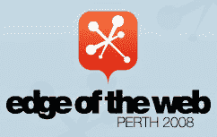

# 在 Twitter 上关注我们；免费参加网络边缘！

> 原文：<https://www.sitepoint.com/follow-us-on-twitter-attend-edge-of-the-web-for-free/>

渴望参加[*Web 边缘*](http://www.edgeoftheweb.org.au) 的会议，但你的老板不肯掏钱买票？或者，也许，随着所有这些即将到来的经济衰退的谈论，为这样的活动支付自己的现金是很难证明是正当的？也许你已经买好了票，但是还想带上一个朋友？

没问题——site point 将赠送一张免费的会议门票——但你得快点！为了与大会正在进行的现有基于 Twitter 的竞赛保持一致，以下是获胜方法:*

1.  如果你还没有注册推特账户，请注册推特账户
2.  关注新的 [SitePoint twitter 账户](http://twitter.com/sitepointdotcom)(用户:sitepointdotcom)
3.  告诉我们(通过 Twitter)为什么你值得赢得一张免费的《网络边缘》门票。您的推文应该采用以下形式: **@sitepointdotcom 我想参加 Edge 是因为……**

就是这样！它应该需要你，哦，大约 2 分钟。在 10 月 30 日(澳大利亚 WST)周四午夜前完成此活动，然后**您将有资格赢得一张参加*Web Edge*会议**的门票，其中 [SitePoint 很荣幸成为支持赞助商](http://www.edgeoftheweb.org.au/sponsors/)。我们将选择我们最喜欢的回答，并将票授予那个人。

这次会议的阵容非常强大——国际巨星如[克里斯·梅西纳](http://www.edgeoftheweb.org.au/speakers/chris-messina/)和
德里克·费瑟斯通与一群令人敬畏的本地人才一起出席——包括过去和现在的 SitePoint 作者如[丽莎·赫罗德](http://www.edgeoftheweb.org.au/speakers/lisa-herrod/)和[蒂姆·卢卡斯](http://www.edgeoftheweb.org.au/speakers/tim-lucas/)。

如果你不能来珀斯参加活动，那么你仍然应该关注我们——我们的一位幸运的 Twitter 关注者(新老)将赢得一本大家都在谈论的新的 SitePoint 书籍， [*你所知道的关于 CSS 的一切都是错误的！*](https://www.sitepoint.com/books/csswrong1/)

本次比赛的获胜者将于 10 月 31 日(T1)星期五(T0)在本博客上公布。

祝大家好运，我们在推特圈再见！

## 分享这篇文章