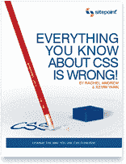

# 你对 CSS 的了解都是错的！

> 原文：<https://www.sitepoint.com/everything-you-know-about-css-is-wrong/>

**如果你认为你已经利用了 CSS 所提供的一切，那你就错了——不要落后！**

我们非常自豪地宣布 SitePoint 库的最新成员…

**[你对 CSS 的了解都是错的！](https://www.sitepoint.com/books/csswrong1/)**——作者瑞秋·安德鲁&凯文·杨克

准备好体验一下你今天所知道的令人大开眼界的 CSS 知识吧。您将发现一种编码级联样式表的新方法，让旧的方法和变通方法成为遥远的记忆。

**什么？关于 CSS 的新东西！**

没错；在这本全新的书中，你将学习如何开始使用最新的 CSS 技术——同时仍然迎合那些讨厌的老浏览器。您将发现是什么给基于 HTML 表格的布局埋下了最后一颗钉子，并从两位专家那里了解为什么 CSS 有一个非常光明的未来。

本书中一些有价值的见解包括:

*   让你重新发现你最初喜欢 CSS 的地方
*   如何将 CSS 表格发挥到极致
*   探索通往 CSS3 的道路
*   如何准备 IE8
*   让你永远告别老黑客和变通办法！

我们聚集了世界上最好的 CSS 专家的全明星阵容来出版一本书，这本书将永远改变你使用 CSS 的方式。

由雷切尔·安德鲁和凯文·杨克撰写，卡梅隆·亚当斯、安迪·克拉克、乔纳森·斯努克和德里克·费瑟斯通作出了特别贡献，你不会找到一个更好的 CSS 智慧的集体来源。

这不是*‘只是另一本关于 CSS 的书’*这是一本直接针对网页设计者和开发者的书，他们希望确保自己掌握最新的、最佳实践的 CSS 技术。

以下是安迪·克拉克和伊恩·劳埃德对这本书的看法:

> 让我对 CSS 表格有不同的看法是 Rachel 的目标，你所知道的关于 CSS 的一切都是错的！正如我们将看到的，她做得非常好。

[查看安迪·克拉克的完整评论](http://forabeautifulweb.com/blog/about/are_css_tables_ready_for_prime_time/)

> 越早采用 IE8 越好，并且这些技术可以开始得到正确的解决。谁知道呢，由于这些 CSS 表格布局属性，可能会出现一系列全新的技巧…

[查看伊恩·劳埃德的完整评论](http://www.accessify.com/features/reviews/css-wrong/)

**[今天就给自己拿一份](https://www.sitepoint.com/premium/library)** 让瑞秋和凯文告诉你为什么你所知道的关于 CSS 的一切都是错的！

## 分享这篇文章